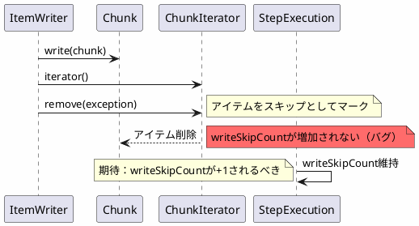
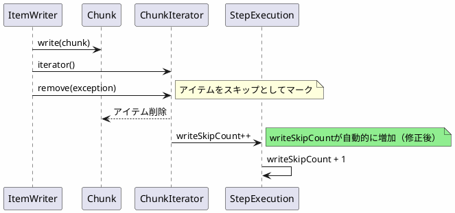

*(このドキュメントは生成AI(Claude Sonnet 4.5)によって2026年1月6日に生成されました)*

## 課題概要

Spring Batchのチャンク指向処理において、書き込み（Writer）処理中にアイテムをスキップした場合、`StepExecution`の`writeSkipCount`が正しく増加されないバグです。

**Spring Batchのチャンク処理とは**: Spring Batchは大量データを効率的に処理するために、データを「チャンク（塊）」単位で処理します。Reader（読み取り）→ Processor（加工）→ Writer（書き込み）の3ステップで構成され、指定したチャンク数（例：100件）ごとにトランザクションをコミットします。

**Chunkクラスの役割**: `Chunk`クラスは処理対象のアイテムリストと、スキップすべき失敗アイテムのリストを管理します。`ChunkIterator.remove()`メソッドを呼び出すことで、アイテムをスキップ対象としてマークできます。

### 問題の詳細

### 現状の動作

| 操作 | StepExecutionの状態 | 期待される動作 |
|------|-------------------|--------------|
| `ChunkIterator.remove()` 実行 | `writeSkipCount` が増加しない ❌ | `writeSkipCount` が +1 されるべき ✅ |
| スキップリスナー呼び出し | `onSkipInWrite()` は正常に動作 ✅ | 同左 |

## 原因

`Chunk`クラスのドキュメントには「スキップされたアイテムごとに対応する`StepExecution`オブジェクトの`writeSkipCount`が増加される」と記載されていますが、実際の実装では`ChunkIterator.remove()`メソッドが`StepExecution.writeSkipCount`を更新する処理が欠落していました。

内部実装で`writeSkipCount`のインクリメント処理が抜けていたため、統計情報が正しく記録されませんでした。

## 対応方針

**コミット**: [1fe91eb](https://github.com/spring-projects/spring-batch/commit/1fe91eb6fc80f79720c6036d1fc257d7217832ae), [61d446e](https://github.com/spring-projects/spring-batch/commit/61d446e71f63c6b1d15826fb5e68aef7403b8702)

`ChunkIterator.remove()`メソッド内で`StepExecution.writeSkipCount`を自動的にインクリメントする処理を追加しました。これにより、アイテムをスキップ対象としてマークすると、自動的にスキップカウントが増加されるようになります。

### 修正後の動作

これにより、`SkipListener`と`StepExecutionListener`を組み合わせた回避策が不要となり、Spring Batchの標準動作だけで正しくスキップカウントが記録されるようになりました。
