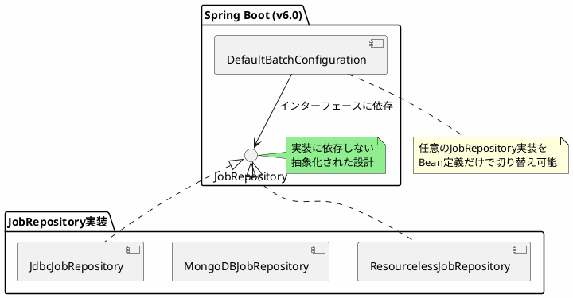

*(このドキュメントは生成AI(Claude Sonnet 4.5)によって2026年1月6日に生成されました)*

## 課題概要

Spring BatchでJDBC以外のジョブリポジトリ（MongoDBやリソースレスJobRepositoryなど）を使用する際、`DefaultBatchConfiguration`および`@EnableBatchProcessing`がJDBCインフラストラクチャを前提としているため、代替のJobRepositoryを設定することが困難でした。

**JobRepositoryとは**: Spring Batchのジョブ実行履歴やステータスなどのメタデータを永続化するためのコンポーネントです。従来はJDBCデータベース（RDBベース）のみをサポートしていましたが、v5でMongoDB実装やリソースレス実装（メタデータを保存しない）が追加されました。

**@EnableBatchProcessingとは**: Spring BatchのJava設定を有効化するアノテーションで、内部的に`DefaultBatchConfiguration`を使用してJobRepository、JobLauncher等のインフラストラクチャを自動設定します。

### 問題の構造

```plantuml
@startuml
skinparam backgroundColor #FEFEFE

package "Spring Boot" {
  [DefaultBatchConfiguration] as Config
  [DataSource (JDBC)] as DS
  Config --> DS: 必須依存
  note right of DS #FF6B6B
    JDBCデータソースが
    必須となっている
  end note
}

package "代替JobRepository" {
  [MongoDBJobRepository] as Mongo
  [ResourcelessJobRepository] as Resourceless
}

Config -[#red]x Mongo: 利用不可
Config -[#red]x Resourceless: 利用不可

note bottom of Mongo
  MongoDBを使いたいのに
  H2/JDBCが必要になる
end note

@enduml
```

### 具体的な問題点

| 設定方法 | v5.2の状況 | 問題点 |
|---------|-----------|--------|
| `DefaultBatchConfiguration`を使用 | JDBCデータソースが必須 | MongoDBやリソースレス実装が使えない |
| `JobRepository` Beanのみ置き換え | 動作しない | すべてを一から再設定する必要がある |
| `@EnableBatchProcessing`を除外 | 設定が複雑化 | TablePrefix、IsolationLevel等を個別に設定 |

## 原因

`@EnableBatchProcessing`は、Spring BatchのXML設定時代のbatch名前空間要素`<batch:job-repository>`のJava対応として設計されました：

```xml
<batch:job-repository id="jobRepository" 
                      data-source="dataSource" 
                      transaction-manager="transactionManager"/>
```

この設計がそのまま引き継がれ、`DefaultBatchConfiguration`もJDBCの`DataSource`を前提とした実装になっていました。しかし、v5でMongoDBやリソースレスのJobRepository実装が追加されたことで、この前提が適切でなくなりました。

## 対応方針

**コミット**: [f7fcfaa](https://github.com/spring-projects/spring-batch/commit/f7fcfaa4fdb1f762a3bc16c30750d646dc52a6ed)

v6.0で`DefaultBatchConfiguration`と`@EnableBatchProcessing`の設計を見直し、特定のストレージ実装（JDBC）に依存しない形に変更しました。

### 改善後の設計



### 主な変更点

1. **インフラストラクチャの抽象化**: `DefaultBatchConfiguration`が特定のストレージ技術に依存しないよう変更
2. **Bean置き換えの簡素化**: `JobRepository`型のBeanを1つ定義するだけで代替実装を使用可能
3. **柔軟な設定**: JDBCデータソースがなくてもバッチ処理が実行可能

これにより、ユーザーは使用したいJobRepository実装のBeanを定義するだけで、Spring Batchの全機能を利用できるようになりました。
