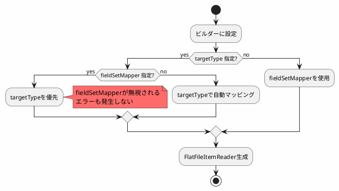
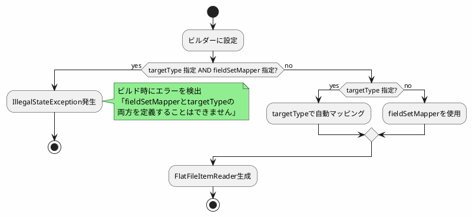

*(このドキュメントは生成AI(Claude Sonnet 4.5)によって2026年1月6日に生成されました)*

## 課題概要

`FlatFileItemReaderBuilder`において、相互に排他的な設定項目である`fieldSetMapper`と`targetType`の両方を指定した場合、ビルド時にエラーが発生せず、実行時に誤った動作（`fieldSetMapper`が無視される）となる問題です。

**FlatFileItemReaderとは**: CSVやTSVなどの固定長/区切り文字形式のテキストファイルを読み込むためのItemReaderです。各行をJavaオブジェクトにマッピングする機能を持ちます。

**FieldSetMapperとtargetType**: ファイルの各行をオブジェクトに変換する2つの方法です：
- `fieldSetMapper`: カスタムロジックで行データをオブジェクトに変換
- `targetType`: クラスを指定して自動マッピング（プロパティ名と列名が一致する場合）

### 問題のあるコード例

```java
FlatFileItemReaderBuilder<X>()
    .name("reader")
    .resource(resource)
    .delimited()
    .names("col1", "col2")
    .targetType(X.class)           // ①自動マッピング指定
    .fieldSetMapper(myFieldSetMapper) // ②カスタムマッパー指定（①と排他的）
    .build()
```

### 期待される動作 vs 現在の動作

| シナリオ | 期待される動作 | 実際の動作 |
|---------|--------------|-----------|
| `targetType`のみ指定 | 自動マッピングで正常動作 ✅ | 正常動作 ✅ |
| `fieldSetMapper`のみ指定 | カスタムマッパーで正常動作 ✅ | 正常動作 ✅ |
| 両方指定 | ビルド時にエラー発生 ✅ | `fieldSetMapper`が無視され、誤動作 ❌ |

## 原因

`FlatFileItemReaderBuilder.build()`メソッドで、`fieldSetMapper`と`targetType`が同時に指定されているかをチェックするバリデーション処理が実装されていませんでした。そのため、設定の矛盾を検出できず、内部的に`targetType`の設定が優先され、ユーザーが意図した`fieldSetMapper`が無効化されていました。



## 対応方針

v6.0.0-M1で`FlatFileItemReaderBuilder.build()`メソッドにバリデーション処理を追加し、`fieldSetMapper`と`targetType`の両方が指定された場合に`IllegalStateException`をスローするようにしました。

### 修正後の動作



### メリット

| 項目 | 修正前 | 修正後 |
|------|--------|--------|
| エラー検出タイミング | 実行時（誤動作で気づく） | ビルド時（即座に検出） |
| デバッグ容易性 | 低い（なぜ動作しないか不明） | 高い（明確なエラーメッセージ） |
| 開発効率 | 低い（問題発見に時間がかかる） | 高い（早期にミスを発見） |

この修正により、設定ミスを早期に発見でき、開発者の意図しない動作を防止できるようになりました。また、v5.2.xへのバックポート対象としてマークされています。
