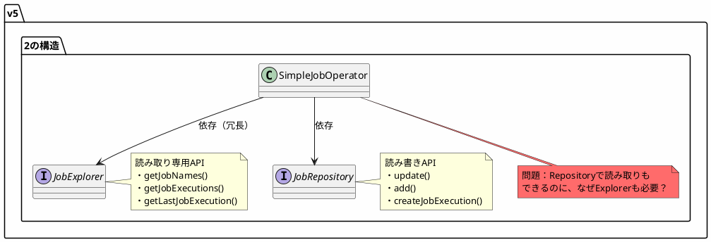
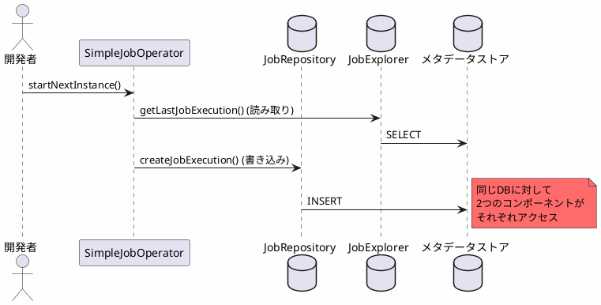
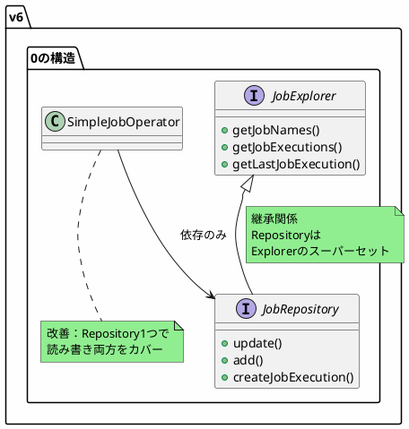
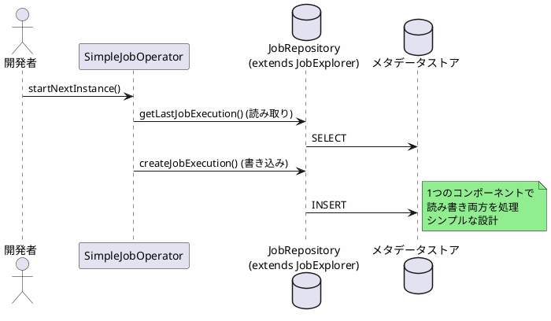

*(このドキュメントは生成AI(Claude Sonnet 4.5)によって2026年1月6日に生成されました)*

## 課題概要

`SimpleJobOperator`が`JobRepository`と`JobExplorer`の両方に依存している設計の問題です。`JobExplorer`は`JobRepository`の読み取り専用サブセットとして設計されているため、`JobRepository`に依存している`SimpleJobOperator`が追加で`JobExplorer`に依存することは冗長です。

**SimpleJobOperatorとは**: Spring Batchのジョブを起動・停止・再起動するための高レベルな操作を提供するクラスです。

**JobRepositoryとJobExplorerの関係**:

### 設計上の問題点

| コンポーネント | 提供機能 | SimpleJobOperatorの依存 |
|-------------|---------|----------------------|
| `JobRepository` | 読み取り + 書き込み | ✅ 必要（書き込みのため） |
| `JobExplorer` | 読み取りのみ | ❌ 不要（Repositoryで代替可能） |

## 原因

v5.2の設計では、`JobRepository`と`JobExplorer`が別々のインターフェースとして定義され、継承関係がありませんでした。そのため、読み取り専用操作のために`JobExplorer`を使用することが推奨されていましたが、これが以下の問題を引き起こしていました：

1. **依存関係の冗長性**: 読み書き可能な`JobRepository`があるのに、読み取り専用の`JobExplorer`も必要
2. **設定の複雑化**: ユーザーは両方のBeanを設定する必要がある
3. **柔軟性の欠如**: 非JDBCのJobRepository（MongoDB、リソースレス等）を使う際、Explorer用の設定も必要

## 対応方針

**コミット**: [6992b79](https://github.com/spring-projects/spring-batch/commit/6992b79b8dc6f6e87f1dd75548328f9011ec699e)

課題 [#4824](https://github.com/spring-projects/spring-batch/issues/4824) で`JobRepository`を`JobExplorer`の拡張として設計し直したことを前提に、`SimpleJobOperator`から`JobExplorer`への依存を削除しました。

### v6.0での改善後の構造

### 改善後のシーケンス

### メリット

| 項目 | v5.2 | v6.0 |
|------|------|------|
| 必要なBean数 | 2個（Repository + Explorer） | 1個（Repositoryのみ） |
| 設定の複雑さ | 高い | 低い |
| 非JDBC対応 | 困難（両方の設定が必要） | 容易（Repository1つのみ） |
| コードの可読性 | 低い（2つの依存） | 高い（1つの依存） |

この変更により、デフォルトのバッチ設定が任意のJobRepository実装（JDBC、MongoDB、リソースレス等）で動作するようになり、ユーザーの設定負担が大幅に軽減されました。
