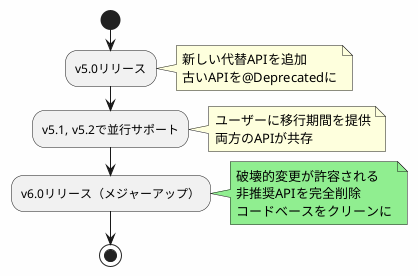
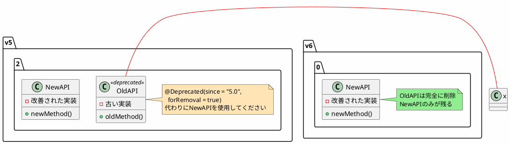
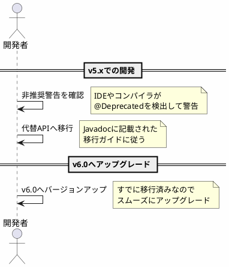

*(このドキュメントは生成AI(Claude Sonnet 4.5)によって2026年1月6日に生成されました)*

## 課題概要

Spring Batch v6.0のメジャーリリースに向けて、v5.xで非推奨（`@Deprecated`）としてマークされたAPIを削除する作業です。

**非推奨API（Deprecated API）とは**: 将来のバージョンで削除予定の機能やAPIのことです。Spring Batchでは、より良い代替機能が提供された場合や、設計上の問題がある機能に`@Deprecated`アノテーションを付けて、ユーザーに移行を促します。

### メジャーバージョンアップでのAPI削除の意義

### セマンティックバージョニングとの関係

Spring Batchは[セマンティックバージョニング](https://semver.org/)（`MAJOR.MINOR.PATCH`）に従っています：

| バージョンタイプ | 変更内容 | 例 |
|--------------|---------|-----|
| **MAJOR**（メジャー） | 破壊的変更を含む大規模更新 | v5.2 → v6.0 |
| **MINOR**（マイナー） | 後方互換性を保つ機能追加 | v6.0 → v6.1 |
| **PATCH**（パッチ） | バグ修正のみ | v6.0.0 → v6.0.1 |

v6.0はメジャーバージョンアップのため、後方互換性を破る変更（非推奨APIの削除）が許されます。

## 原因

時間の経過とともに、以下の理由で非推奨APIが蓄積されていました：

1. **より良い設計の代替APIの登場**: 新しい実装パターンや技術の進化により、既存APIよりも優れた代替が提供された
2. **設計上の問題**: 初期設計で発覚した問題を修正した新APIが追加された
3. **複雑性の削減**: 類似機能を持つ複数APIの統合

これらの非推奨APIをそのまま残すと：
- コードベースのメンテナンスコストが増加
- ユーザーがどのAPIを使うべきか混乱
- フレームワークの学習曲線が悪化

## 対応方針

**コミット**: [43ac1f1](https://github.com/spring-projects/spring-batch/commit/43ac1f12cfd651abe68a94c3fdde235e3ca5135f)

v6.0で削除予定とマークされていたすべての非推奨APIを削除しました。

### 削除プロセスの例

### 削除対象の例（推定）

以下は典型的な削除対象の例です（実際の削除内容はコミットを参照）：

| カテゴリ | 削除対象の例 | 代替API |
|---------|------------|---------|
| Job起動 | 古い`JobLauncher`の一部メソッド | `JobOperator` |
| リポジトリ | `JobExplorer`の独立使用 | `JobRepository`（Explorerを拡張） |
| 設定 | 古いファクトリクラス | ビルダーパターンの利用 |
| DAO | 非推奨のDAO実装 | 統合されたDAO実装 |

### ユーザーへの影響と移行パス

### メリット

1. **コードベースの簡素化**: 重複機能が削除され、保守性が向上
2. **学習コストの削減**: 選択肢が減り、ベストプラクティスが明確化
3. **パフォーマンス改善**: 不要なコードパスが削除され、フレームワークが軽量化
4. **将来への投資**: クリーンなコードベースで新機能開発が容易に

この課題は、Spring Batch v6.0を健全で持続可能なフレームワークにするための重要な基盤作業です。
