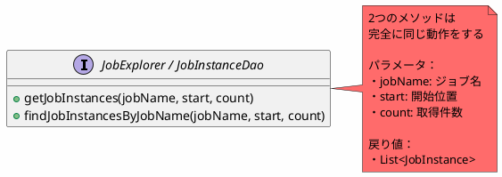
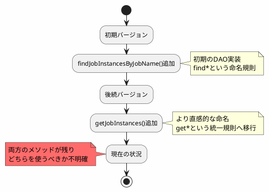
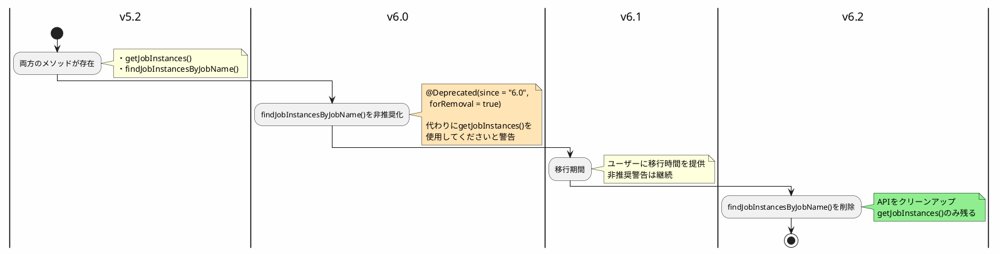
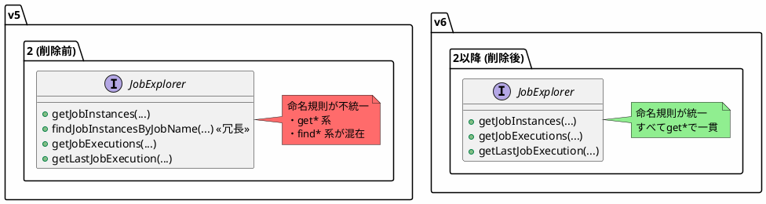

*(このドキュメントは生成AI(Claude Sonnet 4.5)によって2026年1月6日に生成されました)*

## 課題概要

`JobExplorer`インターフェースと`JobInstanceDao`インターフェースに、同じ機能を持つ冗長なメソッドが2つ存在する問題です。

**JobExplorerとは**: Spring Batchのジョブ実行履歴を照会するための読み取り専用APIです。過去のジョブインスタンスやジョブ実行情報を検索する機能を提供します。

**JobInstanceDaoとは**: ジョブインスタンス（ジョブの論理的な実行単位）のデータベースアクセスを抽象化したDAOインターフェースです。

### 冗長なメソッド

```java
// 機能的に同一のメソッドが2つ存在
List<JobInstance> getJobInstances(String jobName, int start, int count);
List<JobInstance> findJobInstancesByJobName(String jobName, int start, int count);
```



### 利用状況

| メソッド | 使用状況 | 問題 |
|---------|---------|------|
| `getJobInstances` | フレームワーク内で広く使用 | - |
| `findJobInstancesByJobName` | ほとんど使用されていない | 冗長で混乱を招く |

## 原因

Spring Batchの歴史的な経緯により、異なる時期に似た機能のメソッドが追加されたため、重複が発生しました。

### API進化の経緯（推定）



このような冗長性は以下の問題を引き起こします：

1. **混乱**: どちらのメソッドを使用すべきか明確でない
2. **保守コスト**: 同じ機能を2箇所で実装・テストする必要がある
3. **学習コスト**: フレームワーク利用者が不要なAPIを覚える負担

## 対応方針

**コミット**: [bf53794](https://github.com/spring-projects/spring-batch/commit/bf53794d6a1f1ab08d3fbc18cc40e1048e376e9c)

使用されていない`findJobInstancesByJobName`メソッドを段階的に削除します。

### 段階的な削除プラン



### APIの一貫性向上



### ユーザーへの影響

| ユーザー種別 | 影響 | 対応 |
|-----------|------|-----|
| `getJobInstances()`を使用 | 影響なし | 対応不要 |
| `findJobInstancesByJobName()`を使用 | v6.0で警告、v6.2でエラー | `getJobInstances()`に置き換え |
| 両方使用していない | 影響なし | - |

### 移行例

```java
// 変更前（v5.2）
List<JobInstance> instances = jobExplorer.findJobInstancesByJobName("myJob", 0, 10);

// 変更後（v6.0以降）
List<JobInstance> instances = jobExplorer.getJobInstances("myJob", 0, 10);
```

### メリット

1. **API明確化**: 1つの機能に1つのメソッドという原則を実現
2. **保守性向上**: 実装とテストが1箇所に集約
3. **学習容易性**: 覚えるべきAPIが削減され、ドキュメントもシンプルに
4. **命名一貫性**: `get*`という統一された命名規則

この変更により、Spring BatchのAPIがより直感的で使いやすくなります。
