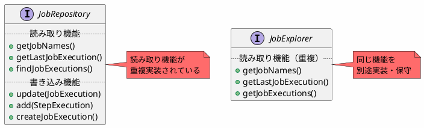
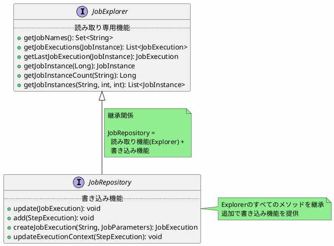
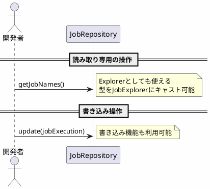

*(このドキュメントは生成AI(Claude Sonnet 4.5)によって2026年1月6日に生成されました)*

## 課題概要

`JobRepository`と`JobExplorer`に類似・同一のメソッドが重複して存在し、実装も重複している問題を解決するため、`JobRepository`を`JobExplorer`の拡張（サブインターフェース）として再設計する提案です。

**JobRepositoryとは**: ジョブの実行状態を永続化・更新するための読み書き可能なAPIです。

**JobExplorerとは**: ジョブの実行履歴を照会するための読み取り専用APIです。

### 重複メソッドの例

| 機能 | JobRepository | JobExplorer | 備考 |
|------|--------------|------------|------|
| ジョブ実行一覧取得 | `findJobExecutions` | `getJobExecutions` | シグネチャが異なるが同じ機能 |
| 最終実行取得 | `getLastJobExecution` | `getLastJobExecution` | 完全に同一 |
| ジョブ名一覧取得 | `getJobNames` | `getJobNames` | 完全に同一 |
| ジョブインスタンス取得 | `getJobInstance` | `getJobInstance` | 完全に同一 |
| インスタンス検索 | `findJobInstancesByName` | `findJobInstancesByJobName` | シグネチャが異なるが同じ機能 |

### v5.2の問題ある構造



## 原因

`JobExplorer`は当初、`JobRepository`の読み取り専用版として設計されましたが、インターフェース定義が分離されていたため、以下の問題が発生していました：

1. **実装の重複**: 同じ読み取り機能を両方のインターフェースで実装する必要がある
2. **保守コストの増加**: 機能追加や修正を2箇所で行う必要がある
3. **設定の複雑化**: ユーザーが両方のBeanを設定する必要がある
4. **メソッド名の不統一**: 同じ機能でもメソッド名が異なる（`findJobExecutions` vs `getJobExecutions`）

```plantuml
@startuml
skinparam backgroundColor #FEFEFE

package "データアクセス層" {
  class "JdbcJobRepositoryImpl" {
    - dataSource
    + getJobNames()
    + findJobExecutions()
    + update()
  }
  
  class "JdbcJobExplorerImpl" {
    - dataSource
    + getJobNames()
    + getJobExecutions()
  }
}

database "メタデータDB" as DB

JdbcJobRepositoryImpl --> DB
JdbcJobExplorerImpl --> DB

note right of DB #FF6B6B
  同じDBに対して
  2つのクラスが
  重複した実装で
  アクセスしている
end note

@enduml
```

## 対応方針

**コミット**: [b8c93d6](https://github.com/spring-projects/spring-batch/commit/b8c93d677ed86130262042fb8565ce30816c2270)

`JobRepository`を`JobExplorer`の拡張として設計し直し、継承関係を明確化しました。

### v6.0の改善された構造



### 実装の統合

```plantuml
@startuml
skinparam backgroundColor #FEFEFE

package "データアクセス層 (v6.0)" {
  class "JdbcJobRepositoryImpl" {
    - dataSource
    .. JobExplorerの実装 ..
    + getJobNames()
    + getJobExecutions()
    + getLastJobExecution()
    .. 追加の書き込み機能 ..
    + update()
    + add()
  }
}

database "メタデータDB" as DB

JdbcJobRepositoryImpl --> DB
JdbcJobRepositoryImpl ..|> JobRepository
JdbcJobRepositoryImpl ..|> JobExplorer

note right of JdbcJobRepositoryImpl #90EE90
  1つのクラスで
  読み書き両方を実装
  重複コードを削減
end note

@enduml
```

### 設定の簡素化

#### 変更前（v5.2）

```java
@Configuration
public class BatchConfig {
    
    @Bean
    public JobRepository jobRepository() {
        // JobRepositoryの設定
        return new JdbcJobRepositoryFactoryBean()...build();
    }
    
    @Bean
    public JobExplorer jobExplorer() {
        // JobExplorerの設定（追加で必要）
        return new JdbcJobExplorerFactoryBean()...build();
    }
}
```

#### 変更後（v6.0）

```java
@Configuration
public class BatchConfig {
    
    @Bean
    public JobRepository jobRepository() {
        // JobRepositoryの設定のみでOK
        // JobExplorerの機能も自動的に利用可能
        return new JdbcJobRepositoryFactoryBean()...build();
    }
    
    // JobExplorer Beanの定義は不要！
}
```

### 利用シーンの整理



### メリット

| 項目 | v5.2（変更前） | v6.0（変更後） |
|------|-------------|-------------|
| 必要なBean数 | 2個（Repository + Explorer） | 1個（Repositoryのみ） |
| 実装クラス数 | 2個（重複実装） | 1個（統合） |
| 保守性 | 低い（2箇所の更新） | 高い（1箇所の更新） |
| 設定の簡潔性 | 低い | 高い |
| 命名の一貫性 | 低い（find* vs get*） | 高い（統一） |

### 波及効果

この変更により、以下の関連課題も解決されます：

1. [#4817](https://github.com/spring-projects/spring-batch/issues/4817): `SimpleJobOperator`の依存を`JobRepository`のみに簡素化
2. [#4825](https://github.com/spring-projects/spring-batch/issues/4825): デフォルト設定から`JobExplorer` Beanの登録を削除可能
3. [#4718](https://github.com/spring-projects/spring-batch/issues/4718): 非JDBCのJobRepository（MongoDB、リソースレス）を使いやすく

この再設計は、Spring Batch v6.0における最も重要なアーキテクチャ改善の1つです。
