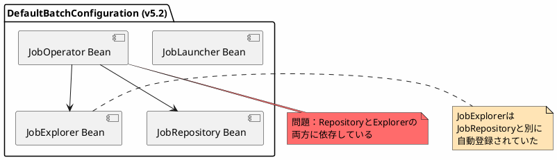
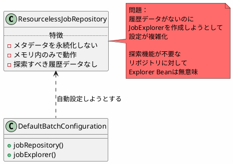
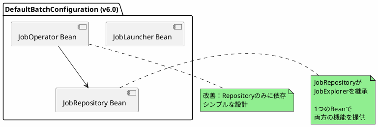
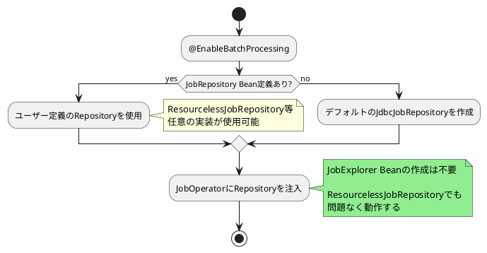
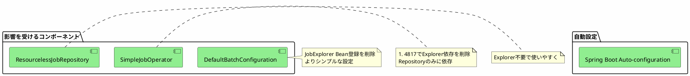

*(このドキュメントは生成AI(Claude Sonnet 4.5)によって2026年1月6日に生成されました)*

## 課題概要

課題 [#4824](https://github.com/spring-projects/spring-batch/issues/4824)（`JobRepository`を`JobExplorer`の拡張とする）と課題 [#4817](https://github.com/spring-projects/spring-batch/issues/4817)（`SimpleJobOperator`の`JobExplorer`依存削除）の実装後、デフォルトのバッチ設定で`JobExplorer` Beanを自動登録する必要がなくなりました。

**デフォルトのバッチ設定とは**: `@EnableBatchProcessing`や`DefaultBatchConfiguration`により、Spring Batchの基本的なインフラストラクチャBean（`JobRepository`、`JobLauncher`、`JobExplorer`等）が自動的に登録される仕組みです。

### v5.2のデフォルト設定



### 特にResourcelessJobRepositoryでの問題

**ResourcelessJobRepositoryとは**: ジョブのメタデータを永続化せず、メモリ内でのみ管理する軽量なJobRepository実装です。テストや一時的なジョブ実行に便利です。



## 原因

v5.2では、`JobRepository`と`JobExplorer`が独立した2つのインターフェースだったため、デフォルト設定で両方のBeanを作成する必要がありました。しかし、課題 [#4824](https://github.com/spring-projects/spring-batch/issues/4824) で`JobRepository`が`JobExplorer`を継承するよう変更されたため、この設計は不要になりました。

### 課題 #4824 の変更内容（再掲）

```java
// v6.0での新しい設計
public interface JobRepository extends JobExplorer {
    // JobExplorerの全メソッドを継承
    // + 追加の書き込みメソッド
    void update(JobExecution jobExecution);
    void add(StepExecution stepExecution);
    // ...
}
```

この変更により、`JobRepository` Beanが`JobExplorer`の機能も提供するようになったため、別途`JobExplorer` Beanを登録する必要がなくなりました。

## 対応方針

**コミット**: [ae2df53](https://github.com/spring-projects/spring-batch/commit/ae2df5396baa25cc5abe68e43508f6d0981dcf68)

`DefaultBatchConfiguration`から`JobExplorer` Beanの自動登録を削除しました。

### v6.0の改善されたデフォルト設定



### ResourcelessJobRepositoryでの改善



### 設定の比較

#### v5.2（変更前）

```java
@Configuration
@EnableBatchProcessing
public class BatchConfig {
    
    @Bean
    public JobRepository jobRepository() {
        return new ResourcelessJobRepositoryFactoryBean()...build();
    }
    
    // 問題：ResourcelessなのにExplorerの設定が必要
    @Bean
    public JobExplorer jobExplorer() {
        // どう実装すればいい？
        // 探索すべきデータがないのに...
        return ???;
    }
}
```

#### v6.0（変更後）

```java
@Configuration
@EnableBatchProcessing
public class BatchConfig {
    
    @Bean
    public JobRepository jobRepository() {
        return new ResourcelessJobRepositoryFactoryBean()...build();
    }
    
    // JobExplorer Beanの定義は不要！
    // JobRepositoryが自動的にExplorerとしても機能
}
```

### メリット

| 項目 | v5.2 | v6.0 |
|------|------|------|
| 自動登録されるBean数 | 2個（Repository + Explorer） | 1個（Repositoryのみ） |
| ResourcelessJobRepository対応 | 困難（Explorerの設定が課題） | 容易（Repository設定のみ） |
| 設定の複雑さ | 高い | 低い |
| 理解しやすさ | 低い（なぜ2つ必要？） | 高い（Repository1つで完結） |

### 影響範囲



### 後方互換性

既存のユーザーが明示的に`JobExplorer` Beanを定義している場合でも、問題なく動作します。`JobRepository`は`JobExplorer`のサブインターフェースなので、既存コードに影響はありません。

```java
// v5.2からの移行コード（そのまま動作）
@Service
public class MyService {
    // JobExplorerを注入していても問題なし
    // JobRepositoryがJobExplorerを実装しているため
    @Autowired
    private JobExplorer jobExplorer;
    
    public void checkJobHistory() {
        Set<String> jobNames = jobExplorer.getJobNames();
        // 正常に動作
    }
}
```

この変更により、Spring Batchの設定がよりシンプルかつ柔軟になり、特に非JDBC実装のJobRepositoryを使用するケースで大幅に改善されました。
