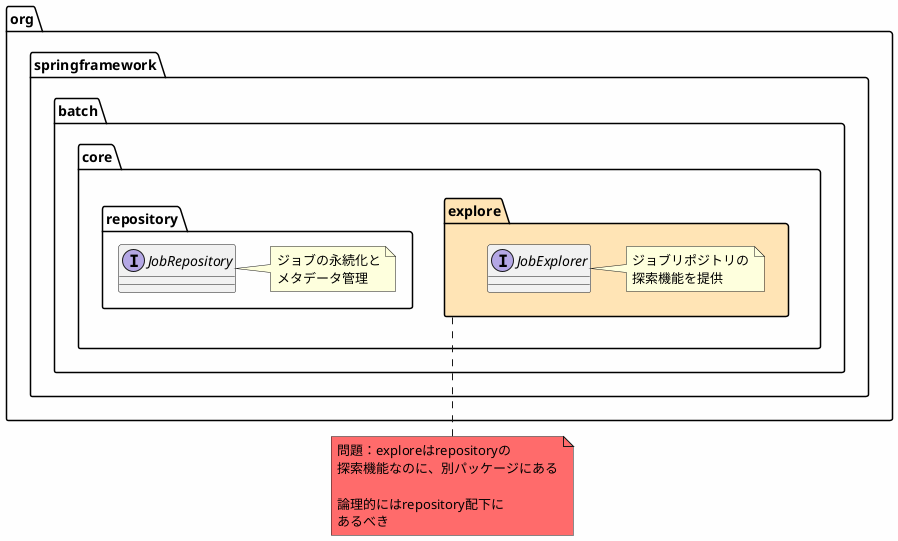
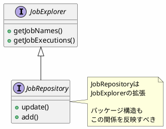
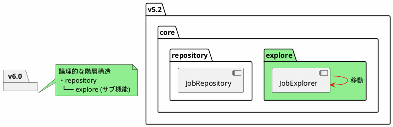
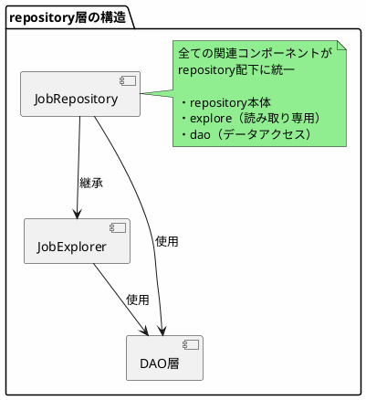

*(このドキュメントは生成AI(Claude Sonnet 4.5)によって2026年1月6日に生成されました)*

## 課題概要

`org.springframework.batch.core.explore`パッケージを`org.springframework.batch.core.repository`配下に移動する、パッケージ構造のリファクタリングです。機能的な変更はありません。

**パッケージ構造の重要性**: Javaのパッケージ構造は、コードの論理的なグループ化と関心事の分離を表現します。適切なパッケージ構造により、コードの可読性と保守性が向上します。

### v5.2のパッケージ構造

```
org.springframework.batch.core
├── Job
├── Step
├── JobExecution
├── StepExecution
├── explore/               ← 現在の位置
│   ├── JobExplorer
│   └── support/
│       ├── JobExplorerFactoryBean
│       └── ...
├── repository/
│   ├── JobRepository
│   └── dao/
│       ├── JdbcJobInstanceDao
│       └── ...
└── ...
```

### 問題点



## 原因

`JobExplorer`は`JobRepository`の読み取り専用サブセットとして設計されましたが、初期のパッケージ設計では別のトップレベルパッケージ（`core.explore`）に配置されていました。しかし、課題 [#4824](https://github.com/spring-projects/spring-batch/issues/4824) で`JobRepository`が`JobExplorer`を継承する設計に変更されたため、パッケージ構造も見直す必要が出てきました。

### 関係性の明確化



## 対応方針

**コミット**: [d7e13fb](https://github.com/spring-projects/spring-batch/commit/d7e13fb7f50dd19a85f8ce76f765b45e39a54846)

`core.explore`パッケージを`core.repository`配下に移動し、論理的な関係を反映したパッケージ構造に変更しました。

### v6.0の改善されたパッケージ構造

```
org.springframework.batch.core
├── Job
├── Step
├── JobExecution
├── StepExecution
├── repository/
│   ├── JobRepository
│   ├── explore/           ← 移動後の位置
│   │   ├── JobExplorer
│   │   └── support/
│   │       ├── JdbcJobExplorerFactoryBean
│   │       └── ...
│   ├── dao/
│   │   ├── JdbcJobInstanceDao
│   │   └── ...
│   └── support/
│       ├── JdbcJobRepositoryFactoryBean
│       └── ...
└── ...
```

### パッケージ移動の視覚化



### メリット

| 項目 | v5.2（移動前） | v6.0（移動後） |
|------|------------|------------|
| パッケージの論理性 | 低い（並列配置） | 高い（階層的） |
| 関係性の明確さ | 不明確 | 明確（親子関係） |
| 新規開発者の理解 | 時間がかかる | 直感的 |
| 保守性 | 低い | 高い |

### インポート文の変更

この移動により、ユーザーコードでのインポート文が変更になります（破壊的変更）：

```java
// v5.2（変更前）
import org.springframework.batch.core.explore.JobExplorer;
import org.springframework.batch.core.explore.support.JobExplorerFactoryBean;

// v6.0（変更後）
import org.springframework.batch.core.repository.explore.JobExplorer;
import org.springframework.batch.core.repository.explore.support.JdbcJobExplorerFactoryBean;
```

### 自動移行の支援

Spring Batchのマイグレーションガイドでは、パッケージ移動を含む変更点が明記され、IDEの自動インポート修正機能で対応できます。また、`@Deprecated`アノテーションによる移行期間は設けられていませんが、v6.0のメジャーバージョンアップのタイミングで実施されるため、ユーザーはアップグレード時に一括対応できます。

### アーキテクチャの改善



この変更により、Spring Batchのコアアーキテクチャがより理解しやすく、保守しやすいものになりました。
