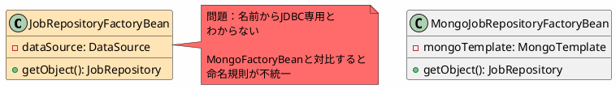
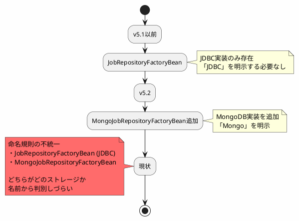
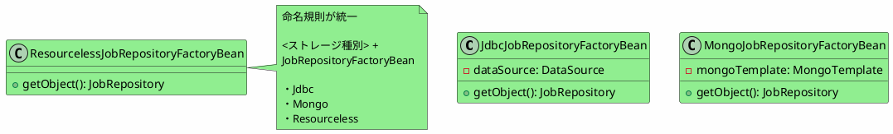
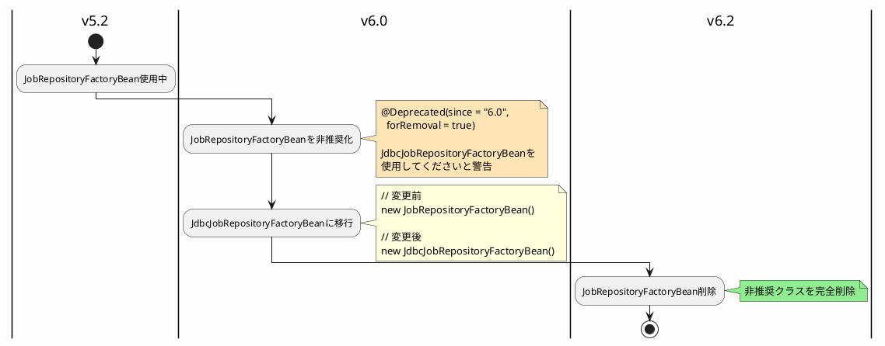

*(このドキュメントは生成AI(Claude Sonnet 4.5)によって2026年1月6日に生成されました)*

## 課題概要

v5.2で`MongoJobRepositoryFactoryBean`が導入されたことに伴い、JDBC専用の`JobRepositoryFactoryBean`を`JdbcJobRepositoryFactoryBean`に名称変更する提案です。

**FactoryBeanとは**: Springフレームワークのデザインパターンの1つで、複雑なBeanの生成ロジックをカプセル化するクラスです。`getObject()`メソッドでBeanインスタンスを生成します。

### v5.2でのJobRepositoryファクトリークラス

| クラス名 | 対象ストレージ | 問題点 |
|---------|------------|--------|
| `JobRepositoryFactoryBean` | JDBC（暗黙的） | 名前からストレージが判別できない ❌ |
| `MongoJobRepositoryFactoryBean` | MongoDB | 名前から明確 ✅ |



## 原因

`JobRepositoryFactoryBean`は、MongoDBサポートが追加される前（v5.1以前）に作成されたクラスで、当時はJDBCが唯一のストレージオプションでした。そのため、「JDBC」を明示する必要がなく、単に`JobRepositoryFactoryBean`と命名されました。

しかし、v5.2で代替実装（`MongoJobRepositoryFactoryBean`）が追加されたことで、命名規則の不統一が発生しました。

### 歴史的な経緯



## 対応方針

**コミット**: [46d42ab](https://github.com/spring-projects/spring-batch/commit/46d42ab757941d6dd56dc32fd6e468b6eb347642)

`JobRepositoryFactoryBean`を`JdbcJobRepositoryFactoryBean`に名称変更し、命名規則を統一しました。

### v6.0の統一された命名規則



### 命名パターンの一貫性

| ストレージ | v5.2（変更前） | v6.0（変更後） | 命名の明確さ |
|---------|------------|------------|-----------|
| JDBC | `JobRepositoryFactoryBean` | `JdbcJobRepositoryFactoryBean` | 明確 ✅ |
| MongoDB | `MongoJobRepositoryFactoryBean` | `MongoJobRepositoryFactoryBean` | 明確 ✅ |
| リソースレス | `ResourcelessJobRepositoryFactoryBean` | `ResourcelessJobRepositoryFactoryBean` | 明確 ✅ |

### 移行パス



### コード移行例

```java
// v5.2（変更前）
@Configuration
public class BatchConfig {
    
    @Bean
    public JobRepository jobRepository(DataSource dataSource,
                                       PlatformTransactionManager transactionManager) 
                                       throws Exception {
        JobRepositoryFactoryBean factory = new JobRepositoryFactoryBean();
        factory.setDataSource(dataSource);
        factory.setTransactionManager(transactionManager);
        factory.afterPropertiesSet();
        return factory.getObject();
    }
}

// v6.0（変更後）
@Configuration
public class BatchConfig {
    
    @Bean
    public JobRepository jobRepository(DataSource dataSource,
                                       PlatformTransactionManager transactionManager) 
                                       throws Exception {
        JdbcJobRepositoryFactoryBean factory = new JdbcJobRepositoryFactoryBean();
        factory.setDataSource(dataSource);
        factory.setTransactionManager(transactionManager);
        factory.afterPropertiesSet();
        return factory.getObject();
    }
}
```

### メリット

1. **命名の一貫性**: すべてのファクトリーBeanが`<ストレージ>JobRepositoryFactoryBean`パターンに従う
2. **コードの可読性**: どのストレージを使用しているか一目瞭然
3. **学習容易性**: 新規開発者が各クラスの役割を直感的に理解できる
4. **拡張性**: 将来的に新しいストレージ実装（例：`CassandraJobRepositoryFactoryBean`）を追加しやすい

### 関連する名称変更

同様の理由で、以下のクラスも名称変更されました：
- 課題 [#4846](https://github.com/spring-projects/spring-batch/issues/4846): `JobExplorerFactoryBean` → `JdbcJobExplorerFactoryBean`

この一連の変更により、Spring BatchのAPIがより一貫性があり、理解しやすいものになりました。
