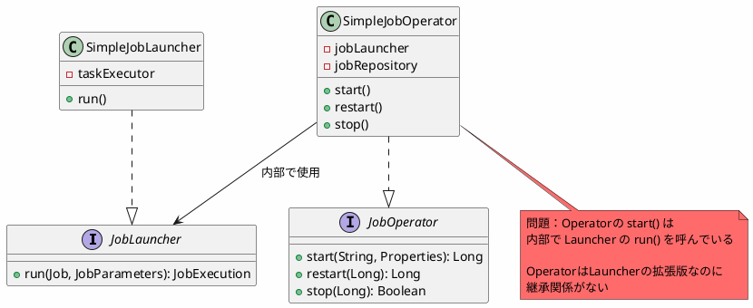
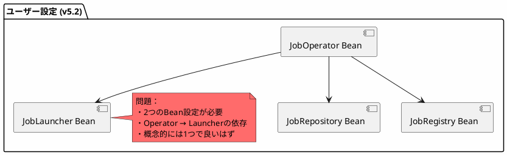
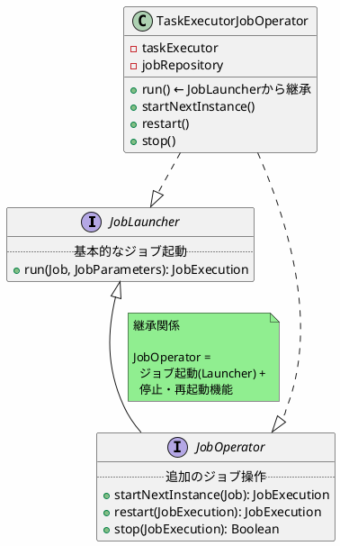
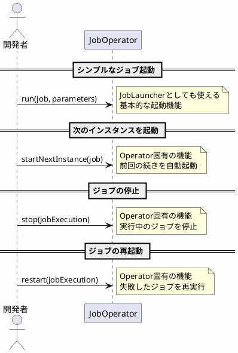
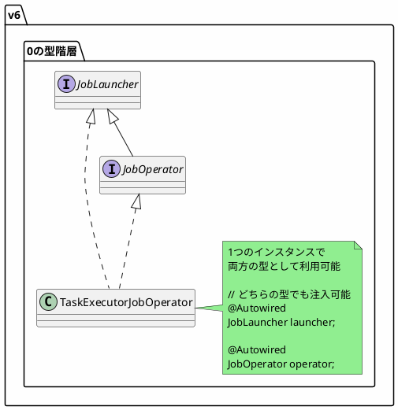

*(このドキュメントは生成AI(Claude Sonnet 4.5)によって2026年1月6日に生成されました)*

## 課題概要

`JobOperator`を`JobLauncher`の拡張（サブインターフェース）として再設計し、2つのBeanを1つに統合してバッチ設定を簡素化する提案です。

**JobLauncherとは**: ジョブを起動するための基本的なAPIです。`run(Job, JobParameters)`メソッドでジョブを実行します。

**JobOperatorとは**: ジョブの起動に加えて、停止・再起動などの操作機能を提供する高レベルAPIです。

### v5.2の構造



### 実装の重複

```java
// SimpleJobOperator.start() の内部実装
public Long start(String jobName, Properties parameters) {
    // 1. ジョブを取得
    Job job = jobRegistry.getJob(jobName);
    // 2. パラメータを変換
    JobParameters jobParameters = converter.getJobParameters(properties);
    // 3. JobLauncherを呼び出し ← ここで依存
    JobExecution execution = jobLauncher.run(job, jobParameters);
    return execution.getId();
}
```

## 原因

v5.2では、`JobLauncher`と`JobOperator`が独立したインターフェースとして設計されていました。しかし、実際には：

1. **機能的な重複**: `JobOperator`の`start()`メソッドは、内部で`JobLauncher.run()`を呼び出している
2. **拡張の関係**: `JobOperator`は`JobLauncher`に停止/再起動機能を追加したもの
3. **設定の複雑化**: ユーザーは両方のBeanを設定する必要がある



## 対応方針

**コミット**: [fc4a665](https://github.com/spring-projects/spring-batch/commit/fc4a66516ac7048e610065628793c62dcc646db5)

`JobOperator`を`JobLauncher`の拡張として設計し直し、継承関係を明確化しました。

### v6.0の改善された構造



### 設定の簡素化

#### v5.2（変更前）

```java
@Configuration
@EnableBatchProcessing
public class BatchConfig {
    
    @Bean
    public JobLauncher jobLauncher(JobRepository jobRepository) {
        SimpleJobLauncher launcher = new SimpleJobLauncher();
        launcher.setJobRepository(jobRepository);
        launcher.setTaskExecutor(new SyncTaskExecutor());
        return launcher;
    }
    
    @Bean
    public JobOperator jobOperator(JobRepository jobRepository,
                                   JobRegistry jobRegistry,
                                   JobLauncher jobLauncher) {
        SimpleJobOperator operator = new SimpleJobOperator();
        operator.setJobRepository(jobRepository);
        operator.setJobRegistry(jobRegistry);
        operator.setJobLauncher(jobLauncher); // Launcherへの依存
        return operator;
    }
}
```

#### v6.0（変更後）

```java
@Configuration
@EnableBatchProcessing
public class BatchConfig {
    
    @Bean
    public JobOperator jobOperator(JobRepository jobRepository) {
        TaskExecutorJobOperator operator = new TaskExecutorJobOperator();
        operator.setJobRepository(jobRepository);
        operator.setTaskExecutor(new SyncTaskExecutor());
        return operator;
        // JobOperatorはJobLauncherを継承しているので、
        // これ1つでジョブ起動も操作も可能
    }
    
    // JobLauncher Beanの定義は不要！
}
```

### 使用シーンの整理



### APIの比較

| 機能 | v5.2 | v6.0 |
|------|------|------|
| 必要なBean数 | 2個（Launcher + Operator） | 1個（Operatorのみ） |
| ジョブ起動 | `JobLauncher.run()` | `JobOperator.run()` ← 継承 |
| ジョブ停止 | `JobOperator.stop()` | `JobOperator.stop()` |
| ジョブ再起動 | `JobOperator.restart()` | `JobOperator.restart()` |
| 設定の複雑さ | 高い | 低い |

### 型の互換性



### メリット

1. **設定の簡素化**: Bean定義が1つで済む
2. **概念の明確化**: OperatorがLauncherの拡張であることが明示的
3. **依存関係の削減**: Operator内でLauncherへの依存が不要
4. **一貫性の向上**: `JobRepository` extends `JobExplorer`と同じパターン（課題 [#4824](https://github.com/spring-projects/spring-batch/issues/4824)）

### 関連する変更

- 課題 [#4834](https://github.com/spring-projects/spring-batch/issues/4834): `SimpleJobOperator` → `TaskExecutorJobOperator`への名称変更
- 課題 [#4833](https://github.com/spring-projects/spring-batch/issues/4833): `JobOperator`の範囲をジョブ操作のみに限定

この再設計により、Spring Batchのコアアーキテクチャがよりシンプルかつ直感的になりました。
