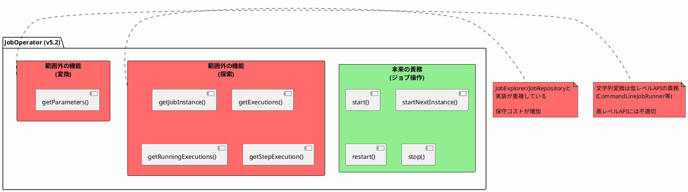
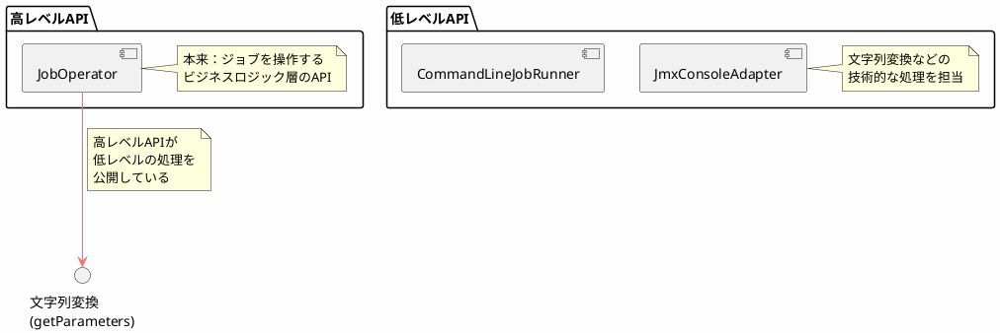
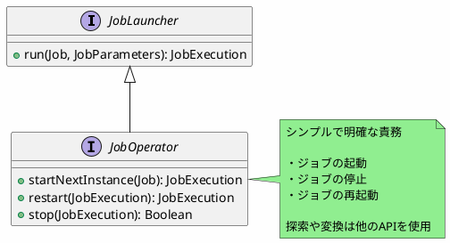
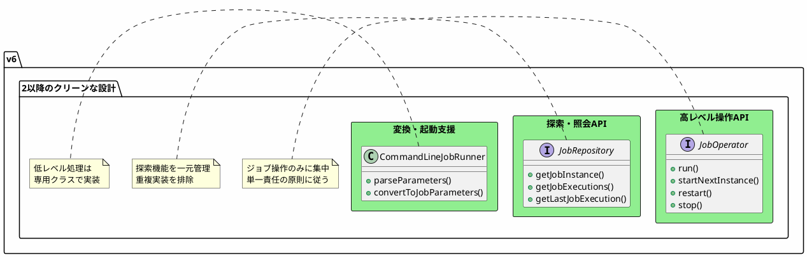
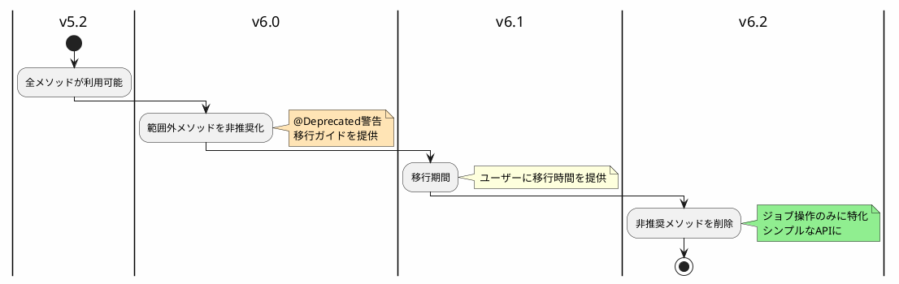

*(このドキュメントは生成AI(Claude Sonnet 4.5)によって2026年1月6日に生成されました)*

## 課題概要

`JobOperator`インターフェースが本来の責務（ジョブの開始・停止・再起動）を超えた機能を公開しているため、範囲をジョブ操作のみに限定する改善提案です。

**単一責任の原則（Single Responsibility Principle）**: オブジェクト指向設計の基本原則の1つで、1つのクラスは1つの責務のみを持つべきという原則です。

### v5.2のJobOperatorインターフェース

```java
public interface JobOperator {
    // ✅ 本来の責務：ジョブ操作
    Long start(String jobName, String parameters);
    Long startNextInstance(String jobName);
    Long restart(Long executionId);
    boolean stop(Long executionId);
    
    // ❌ 範囲外：探索機能（JobExplorerと重複）
    JobInstance getJobInstance(Long executionId);
    List<JobExecution> getExecutions(Long instanceId);
    List<Long> getRunningExecutions(String jobName);
    StepExecution getStepExecution(Long jobExecutionId, Long stepExecutionId);
    
    // ❌ 範囲外：低レベルのパラメータ変換
    String getParameters(Long executionId);  // JobParameters → String変換
}
```

### 問題点の分類



## 原因

v5.2の`JobOperator`は、JSR-352（Java Batch Specification）の影響を受けた設計で、多くの便利メソッドが追加されていました。しかし、これにより以下の問題が発生：

### 1. JobExplorer/JobRepositoryとの実装重複

```plantuml
@startuml
skinparam backgroundColor #FEFEFE

interface "JobExplorer" {
  + getJobInstance(Long)
  + getJobExecutions(JobInstance)
}

interface "JobRepository" {
  + getJobInstance(Long)
  + findJobExecutions(JobInstance)
}

interface "JobOperator" {
  + getJobInstance(Long)
  + getExecutions(Long)
}

database "メタデータDB" as DB

JobExplorer -down-> DB: 読み取り
JobRepository -down-> DB: 読み書き
JobOperator -down-> DB: 読み取り（重複）

note bottom #FF6B6B
  同じ機能を3つのインターフェースで
  実装・保守する必要がある
end note

@enduml
```

### 2. 抽象化レベルの混在



## 対応方針

**コミット**: [afdd842](https://github.com/spring-projects/spring-batch/commit/afdd842bc3e6d599e475f597f8becc12cc685fbd)

JobOperatorと重複している探索メソッドおよび変換メソッドを非推奨化し、v6.2で削除予定としました。

### 非推奨化されたメソッド

```java
public interface JobOperator extends JobLauncher {
    // ✅ 保持：ジョブ操作機能
    JobExecution run(Job job, JobParameters jobParameters);
    JobExecution startNextInstance(Job job);
    JobExecution restart(JobExecution jobExecution);
    boolean stop(JobExecution jobExecution);
    
    // ❌ 非推奨：探索機能
    @Deprecated(since = "6.0", forRemoval = true)
    JobInstance getJobInstance(long executionId);
    
    @Deprecated(since = "6.0", forRemoval = true)
    List<JobExecution> getExecutions(long instanceId);
    
    @Deprecated(since = "6.0", forRemoval = true)
    List<Long> getRunningExecutions(String jobName);
    
    @Deprecated(since = "6.0", forRemoval = true)
    StepExecution getStepExecution(Long jobExecutionId, Long stepExecutionId);
    
    // ❌ 非推奨：パラメータ変換
    @Deprecated(since = "6.0", forRemoval = true)
    String getParameters(long executionId);
}
```

### v6.2での最終的なインターフェース（予定）



### 移行ガイド

#### 探索機能の移行

```java
// v5.2（変更前）
JobOperator jobOperator = ...;
JobInstance instance = jobOperator.getJobInstance(executionId);
List<JobExecution> executions = jobOperator.getExecutions(instanceId);

// v6.0以降（変更後）
JobRepository jobRepository = ...;  // JobExplorerの機能も含む
JobInstance instance = jobRepository.getJobInstance(executionId);
List<JobExecution> executions = jobRepository.getJobExecutions(instance);
```

#### パラメータ変換の移行

```java
// v5.2（変更前）
JobOperator jobOperator = ...;
String params = jobOperator.getParameters(executionId);

// v6.0以降（変更後）
// 低レベルAPIまたはカスタム実装で対応
JobRepository jobRepository = ...;
JobExecution execution = jobRepository.getJobExecution(executionId);
JobParameters parameters = execution.getJobParameters();
// 必要に応じて文字列に変換
String params = parameters.toString();
```

### アーキテクチャの改善



### メリット

| 項目 | v5.2 | v6.2以降 |
|------|------|---------|
| インターフェースの責務 | 曖昧（操作+探索+変換） | 明確（操作のみ） |
| 実装の重複 | あり（3箇所で同じ機能） | なし（1箇所） |
| 保守性 | 低い | 高い |
| テストの容易性 | 低い（多機能） | 高い（単機能） |
| 理解しやすさ | 低い | 高い |

### 段階的な削除計画



### 関連する変更

- 課題 [#4832](https://github.com/spring-projects/spring-batch/issues/4832): `JobOperator`を`JobLauncher`の拡張に
- 課題 [#4845](https://github.com/spring-projects/spring-batch/issues/4845): プリミティブ型の代わりにドメイン型を使用

この変更により、`JobOperator`がより明確な責務を持ち、保守しやすいAPIになります。
