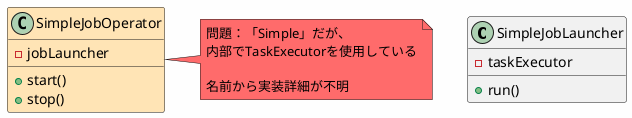

*(このドキュメントは生成AI(Claude Sonnet 4.5)によって2026年1月6日に生成されました)*

## 課題概要

課題 [#4832](https://github.com/spring-projects/spring-batch/issues/4832) で`JobOperator`が`JobLauncher`の拡張となったことに伴い、実装クラス`SimpleJobOperator`を`TaskExecutorJobOperator`に名称変更する提案です。

### v5.2の問題



## 原因

`SimpleJobOperator`という名前は、実装詳細（タスクエグゼキュータの使用）を反映していませんでした。また、`SimpleJobLauncher`が`TaskExecutorJobLauncher`に改名されたこととの整合性も欠けていました。

## 対応方針

**コミット**: [e5bda0d](https://github.com/spring-projects/spring-batch/commit/e5bda0d40ae4ae1dedaca4d9339b29488225db83)

`SimpleJobOperator`を`TaskExecutorJobOperator`に名称変更し、タスクエグゼキュータを使用してジョブを起動することを明示しました。

### v6.0の改善

```java
// v5.2（変更前）
SimpleJobOperator operator = new SimpleJobOperator();
operator.setJobLauncher(jobLauncher);
operator.setJobRepository(jobRepository);

// v6.0（変更後）
TaskExecutorJobOperator operator = new TaskExecutorJobOperator();
operator.setTaskExecutor(new SyncTaskExecutor());  // 明示的
operator.setJobRepository(jobRepository);
```

### メリット

| 項目 | v5.2 | v6.0 |
|------|------|------|
| 実装詳細の明確さ | 低い（Simpleは曖昧） | 高い（TaskExecutorを明示） |
| 命名の一貫性 | 低い | 高い（Launcher/Operatorで統一） |
| 理解しやすさ | 低い | 高い |
