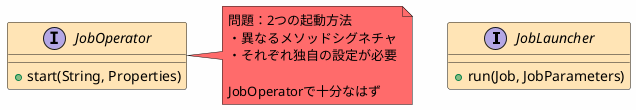

*(このドキュメントは生成AI(Claude Sonnet 4.5)によって2026年1月6日に生成されました)*

## 課題概要

Spring Batch v6.0で、一般的なアプリケーションのためにコアAPIを簡素化・縮小する大規模なリファクタリングです。長年蓄積されてきた不必要な複雑性を削減します。

### 主な問題点

1. **APIが大きすぎる**: 付加価値のない偶発的な複雑性が多数存在（課題 [#3242](https://github.com/spring-projects/spring-batch/issues/3242), [#2901](https://github.com/spring-projects/spring-batch/issues/2901)）
2. **多すぎるBean定義**: シンプルなジョブ実行に必要なBeanが圧倒的に多い
3. **重複した実装**: 同じことを行う複数の方法が存在し混乱を招く

## 原因

### 1. モジュラー設定の過剰な複雑性

`@EnableBatchProcessing(modular = true)`による`JobRegistry`のジョブ名衝突回避機能には、以下の大量のクラスが必要でした：

- `JobFactory`
- `ApplicationContextFactory`
- `ApplicationContextJobFactory`
- `ReferenceJobFactory`
- `AbstractApplicationContextFactory`（2つの拡張含む）
- `JobLoader`
- `JobFactoryRegistrationListener`

この複雑性は、`GroupAwareJob`や`namespace.jobName`のような単純な命名規則で代替可能でした。

### 2. 重複したエントリーポイント



### 3. 重複したリポジトリAPI

課題 [#4824](https://github.com/spring-projects/spring-batch/issues/4824) で詳述されているように、`JobRepository`と`JobExplorer`の2つのBeanが必要でしたが、ほぼすべてのアプリで`JobRepository`は必須であり、追加で`JobExplorer`を定義する必要があることは直感に反します。

## 対応方針

**コミット**: [c872a12](https://github.com/spring-projects/spring-batch/commit/c872a12ad5fdc191a2637ed04775160f8fe7632e), [bfe487c](https://github.com/spring-projects/spring-batch/commit/bfe487ccccfd2b5d7f82b07386094fdaaddd06c1), [bcf4f72](https://github.com/spring-projects/spring-batch/commit/bcf4f724addc96c5beed2447ad9423008a3d6da8)

以下の主要な簡素化を実施：

### 1. モジュラー設定の非推奨化

`@EnableBatchProcessing(modular = true)`とそれに関連する全クラスを非推奨化（課題 [#4866](https://github.com/spring-projects/spring-batch/issues/4866)）

### 2. JobOperatorとJobLauncherの統合

`JobOperator`を`JobLauncher`の拡張とし、1つのエントリーポイントに統合（課題 [#4832](https://github.com/spring-projects/spring-batch/issues/4832)）

### 3. JobRepositoryとJobExplorerの統合

`JobRepository`を`JobExplorer`の拡張とし、1つのBeanで両方の機能を提供（課題 [#4824](https://github.com/spring-projects/spring-batch/issues/4824)）

### 4. JobRegistryの自動設定

`MapJobRegistry`でアプリケーションコンテキストのジョブを自動登録（課題 [#4855](https://github.com/spring-projects/spring-batch/issues/4855)）

### 設定の比較

#### v5.2（変更前）

```java
@Configuration
@EnableBatchProcessing(modular = true)
public class BatchConfig {
    @Bean JobRepository jobRepository() { ... }
    @Bean JobExplorer jobExplorer() { ... }
    @Bean JobLauncher jobLauncher() { ... }
    @Bean JobOperator jobOperator() { ... }
    @Bean JobRegistry jobRegistry() { ... }
    @Bean JobRegistrySmartInitializingSingleton registrar() { ... }
    // 6つのBean + モジュラー設定の複雑性
}
```

#### v6.0（変更後）

```java
@Configuration
@EnableBatchProcessing
public class BatchConfig {
    @Bean JobRepository jobRepository() { ... }
    @Bean JobOperator jobOperator() { ... }
    // 2つのBeanで完結！
}
```

### メリット

| 項目 | v5.2 | v6.0 |
|------|------|------|
| 必要なBean数 | 6+個 | 2個 |
| ジョブ起動方法 | 2つ（Launcher, Operator） | 1つ（Operator） |
| 設定の複雑さ | 高い | 低い |
| 学習曲線 | 急 | 緩やか |
| コードの保守性 | 低い | 高い |

この大規模なリファクタリングにより、Spring Batchがより直感的で使いやすいフレームワークになりました。
