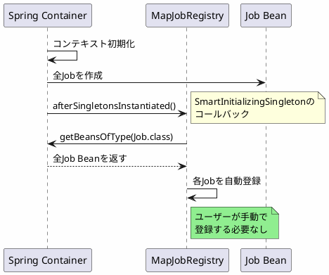

*(このドキュメントは生成AI(Claude Sonnet 4.5)によって2026年1月6日に生成されました)*

## 課題概要

`MapJobRegistry`を`SmartInitializingSingleton`として実装し、アプリケーションコンテキストで定義されたジョブを自動登録できるように改善しました。

### v5.2の問題

```java
@Configuration
public class BatchConfig {
    @Bean JobRegistry jobRegistry() { ... }
    
    @Bean JobRegistrySmartInitializingSingleton registrar(JobRegistry registry) {
        // 別途登録コンポーネントが必要
        return new JobRegistrySmartInitializingSingleton(registry);
    }
}
```

## 原因

v5.2では、`JobRegistry`を使用するために別個の登録コンポーネント（Beanポストプロセッサ、スマート初期化Bean等）を設定する必要があり、設定が複雑化していました。

## 対応方針

**コミット**: [a7f090a](https://github.com/spring-projects/spring-batch/commit/a7f090a45d1aa055e3bdfbc4fdrd06d02ed6d0ac)

`MapJobRegistry`自体を`SmartInitializingSingleton`にし、アプリケーションコンテキストのジョブを自動的に検出・登録するようにしました。

### v6.0の改善

```java
@Configuration
public class BatchConfig {
    @Bean
    public JobRegistry jobRegistry() {
        return new MapJobRegistry();  // これだけでOK！
        // アプリケーションコンテキストのJobが自動登録される
    }
}
```

### 動作の流れ



### メリット

| 項目 | v5.2 | v6.0 |
|------|------|------|
| 必要な設定 | Registry + 登録Bean | Registryのみ |
| コード量 | 多い | 少ない |
| 設定の理解しやすさ | 低い | 高い |

アプリケーションコンテキスト外のジョブは、従来通り手動で登録可能です。
