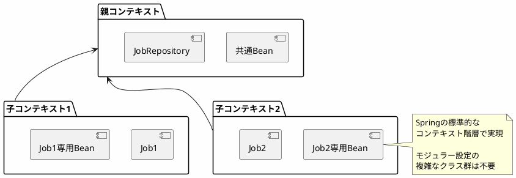

*(このドキュメントは生成AI(Claude Sonnet 4.5)によって2026年1月6日に生成されました)*

## 課題概要

`@EnableBatchProcessing(modular = true)`によるモジュラージョブ設定を非推奨化し、v6.2で削除予定とする提案です。課題 [#4847](https://github.com/spring-projects/spring-batch/issues/4847) のAPI簡素化の主要な一部です。

**モジュラー設定とは**: 各ジョブを独立したアプリケーションコンテキストで実行し、`JobRegistry`でのジョブ名衝突を避ける機能です。

### 必要とされた大量のクラス

この機能のために以下のクラスが必要でした：
- `JobFactory`
- `ApplicationContextFactory`
- `ApplicationContextJobFactory`
- `ReferenceJobFactory`
- `AbstractApplicationContextFactory`（+2つの拡張）
- `JobLoader`
- `JobFactoryRegistrationListener`

## 原因

この機能は実際の利益に対して、APIと実装の複雑性が過剰でした。JSR-352（Java Batch標準）でもこの機能は採用されませんでした。

### 代替手段

ジョブ名の衝突は、より単純な方法で回避できます：
1. `GroupAwareJob`の活用
2. `namespace.jobName`のような命名規則

## 対応方針

**コミット**: [bcf4f72](https://github.com/spring-projects/spring-batch/commit/bcf4f724addc96c5beed2447ad9423008a3d6da8)

`@EnableBatchProcessing(modular = true)`とそれに関連するすべてのクラスを非推奨化し、v6.2での削除を予定しました。

### 移行方法

マイグレーションガイドでは、Springのコンテキスト階層を使用する方法が推奨されています：
https://github.com/spring-projects/spring-batch/wiki/Spring-Batch-6.0-Migration-Guide#changes-related-to-the-modular-batch-configurations-through-enablebatchprocessingmodular--true

### コミュニティからのフィードバック

コメント欄では、実際にこの機能を使用していたユーザーから移行方法についての質問があり、具体的な移行例が提供されました。約100のバッチアプリでこの機能を使用している企業もありましたが、Springのコンテキスト階層を使用する方が、v6以前の実装よりもシンプルで理解しやすいことが示されました。

### メリット

- API全体の大幅な簡素化
- 保守すべきコードの削減
- 標準的なSpring機能の活用
- JSR-352との整合性

この変更は、Spring Batch v6.0の中で最も大きなAPI簡素化の1つです。
