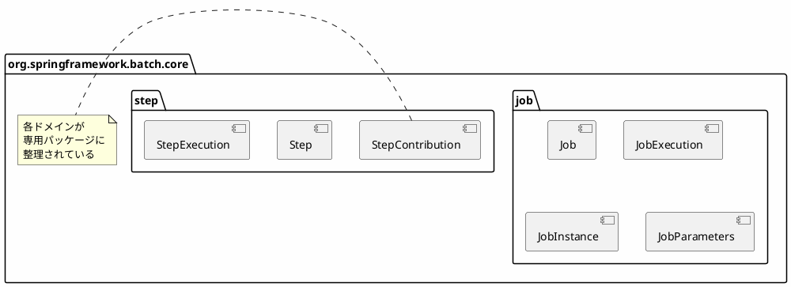

*(このドキュメントは生成AI(Claude Sonnet 4.5)によって2026年1月6日に生成されました)*

## 課題概要

ジョブとステップに関連するすべてのAPIを専用のサブパッケージ（`core.job`と`core.step`）に移動し、パッケージ構造の一貫性と凝集性を向上させました。

### v5.2の問題

```
org.springframework.batch.core
├── Job                        ← 混在
├── Step                       ← 混在
├── JobExecution              ← 混在
├── StepExecution             ← 混在
├── job/                      ← サブパッケージは存在
│   └── (一部のみ)
└── step/                     ← サブパッケージは存在
    └── (一部のみ)
```

## 原因

`core.job`と`core.step`のサブパッケージは既に存在していましたが、ジョブとステップの主要なAPIがコアパッケージ直下に散在しており、構造の一貫性が欠けていました。

## 対応方針

**コミット**: [d95397f](https://github.com/spring-projects/spring-batch/commit/d95397faf023ee3293ee10b41977231734a0f5d1)

すべてのジョブ関連APIを`core.job`に、ステップ関連APIを`core.step`に移動しました。

### v6.0の改善されたパッケージ構造



### メリット

- ドメイン別にAPIが整理
- パッケージの責任が明確
- 関連クラスのグルーピング
- コードナビゲーションの改善
