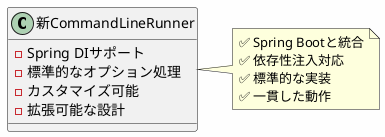

*(このドキュメントは生成AI(Claude Sonnet 4.5)によって2026年1月6日に生成されました)*

## 課題概要

`CommandLineJobRunner`に代わる、カスタマイズ可能で拡張可能な現代的なコマンドラインバッチオペレーターを導入しました。

**CommandLineJobRunnerとは**: コマンドラインからSpring Batchジョブを実行するためのツールです。

### `CommandLineJobRunner`の問題点

1. **拡張性の欠如**: 静的初期化により、カスタマイズが困難
2. **非標準の実装**: オプションとパラメータの処理が独自仕様
3. **Spring Bootとの不整合**: 再利用不可能でコードが重複（課題 [#1309](https://github.com/spring-projects/spring-batch/issues/1309), [#1666](https://github.com/spring-projects/spring-batch/issues/1666)）
4. **動作の乖離**: Spring Batch版とSpring Boot版でジョブパラメータインクリメンタの動作が異なる

## 原因

`CommandLineJobRunner`はSpring Batch v1からの古い設計で、現代的なSpring機能（依存性注入、Spring Bootとの統合等）に対応していませんでした。

## 対応方針

**コミット**: [e6a8088](https://github.com/spring-projects/spring-batch/commit/e6a80889cb74409105e5df4fd092ff52f994b527)

Spring Batch v6の新機能に対応した現代版コマンドラインオペレーターを作成しました。

### 新しいオペレーターの特徴

### メリット

| 項目 | 旧Runner | 新Operator |
|------|----------|------------|
| 拡張性 | 低い（静的） | 高い（DI） |
| カスタマイズ | 困難 | 容易 |
| Spring Boot統合 | 不可能 | 可能 |
| 動作の一貫性 | 低い | 高い |

この新しいオペレーターにより、コマンドラインからのジョブ実行がより柔軟で一貫性のあるものになりました。
