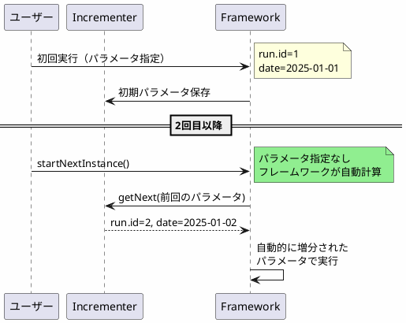

*(このドキュメントは生成AI(Claude Sonnet 4.5)によって2026年1月6日に生成されました)*

## 課題概要

`JobParametersIncrementer`の正しい使用方法を徹底し、インクリメンタ使用時に追加パラメータを指定した場合は警告とともに無視するように動作を修正しました。

**JobParametersIncrementerとは**: 定期実行されるジョブ（毎時、毎日など）のパラメータを自動的に増分させる機能です。データベースのシーケンス（自動採番）に似た概念です。

### 本来の設計意図



### v5.2の誤った使用パターン

```java
// ❌ 誤り：インクリメンタがあるのに毎回パラメータを指定
JobOperator operator = ...;
Properties params = new Properties();
params.setProperty("date", "2025-01-15");  // 手動で変更
operator.start("myJob", params);  // 矛盾！
```

この誤用が以下の問題を引き起こしていました：
- 課題 [#882](https://github.com/spring-projects/spring-batch/issues/882)
- Spring Bootの課題: https://github.com/spring-projects/spring-boot/issues/22602, https://github.com/spring-projects/spring-boot/issues/14484

## 原因

Spring BatchとSpring Bootのコマンドラインランナーが、`JobParametersIncrementer`の概念を誤って実装していました。本来、インクリメンタは「一度設定したら自動増分」であるべきですが、実装では「ユーザーがパラメータを変更しつつ増分」できてしまっていました。

## 対応方針

**コミット**: [72cd7bc](https://github.com/spring-projects/spring-batch/commit/72cd7bcbeec3097d2e5828dda6c2daf0b8b41d85), [eb42128](https://github.com/spring-projects/spring-batch/commit/eb42128f448a4417600a96141b4299cbefe95eb5)

インクリメンタ使用時は、追加パラメータを警告とともに無視するように変更しました。

### v6.0の正しい動作

```java
// ✅ 正しい使用方法
JobOperator operator = ...;

// 初回のみパラメータ指定
Properties params = new Properties();
params.setProperty("date", "2025-01-01");
operator.start("myJob", params);

// 2回目以降はパラメータなし
operator.startNextInstance("myJob");  // フレームワークが自動計算

// もし指定しても...
Properties extraParams = new Properties();
extraParams.setProperty("date", "2025-01-15");
operator.start("myJob", extraParams);
// 警告が出力され、extraParamsは無視される
```

### メリット

- `JobParametersIncrementer`の本来の設計意図を保証
- データベースシーケンスと同様のシンプルな概念
- 混乱を招く誤用の防止
- より予測可能な動作
