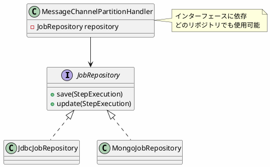

*(このドキュメントは生成AI(Claude Sonnet 4.5)によって2026年1月6日に生成されました)*

## 課題概要

リモートパーティショニング機能の`MessageChannelPartitionHandler`を、JDBC以外のジョブリポジトリ実装（MongoDB等）でも使用できるように改善しました。

**リモートパーティショニングとは**: 大量データを複数のワーカーノードに分散して並列処理する機能です。マネージャーノードがタスクを分割し、リモートのワーカーノードで処理を実行します。

### v5.2の問題

```java
public class MessageChannelPartitionHandler {
    private DataSource dataSource;  // JDBC専用
    
    // MongoDBリポジトリでは使用不可
}
```

## 原因

`MessageChannelPartitionHandler`はリポジトリポーリングを使用する際に、`DataSource`を直接必要としていました。これにより、MongoDBジョブリポジトリ（v5.2で導入）では使用できませんでした。

## 対応方針

**コミット**: [61fc226](https://github.com/spring-projects/spring-batch/commit/61fc22652c9c1f3da38aea9b22cf80da4c5c7ea2)

`MessageChannelPartitionHandler`を`JobRepository`インターフェースに対して動作するように修正しました。

### v6.0の改善



### 使用例

```java
// JDBC
@Bean
public PartitionHandler partitionHandler(JobRepository jdbcRepository) {
    MessageChannelPartitionHandler handler = new MessageChannelPartitionHandler();
    handler.setJobRepository(jdbcRepository);  // ✅ OK
    return handler;
}

// MongoDB
@Bean
public PartitionHandler partitionHandler(JobRepository mongoRepository) {
    MessageChannelPartitionHandler handler = new MessageChannelPartitionHandler();
    handler.setJobRepository(mongoRepository);  // ✅ OK（v6.0で可能に）
    return handler;
}
```

### メリット

- MongoDBリポジトリでのリモートパーティショニング対応
- 将来的な他のリポジトリ実装にも対応
- より柔軟な設計
