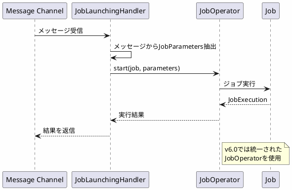

*(このドキュメントは生成AI(Claude Sonnet 4.5)によって2026年1月6日に生成されました)*

## 課題概要

Spring Integration統合における`JobLaunchingGateway`と`JobLaunchingMessageHandler`で、非推奨となった`JobLauncher`の使用を`JobOperator`に置き換えました。

**これらのクラスとは**: Spring Integrationのメッセージング機能を使用してSpring Batchジョブを起動するためのコンポーネントです。

### v5.2の実装

```java
public class JobLaunchingGateway {
    private JobLauncher jobLauncher;  // 非推奨API
}

public class JobLaunchingMessageHandler {
    private JobLauncher jobLauncher;  // 非推奨API
}
```

## 原因

課題 [#4832](https://github.com/spring-projects/spring-batch/issues/4832) で`JobLauncher`が非推奨化されたため、Spring Integration統合コンポーネントも`JobOperator`に移行する必要がありました。

## 対応方針

**コミット**: [c34a1fc](https://github.com/spring-projects/spring-batch/commit/c34a1fc73d632bc9990169333c8ca47355c8b077)

両クラスの内部実装を`JobOperator`を使用するように変更しました。

### v6.0の改善

```java
public class JobLaunchingGateway {
    private JobOperator jobOperator;  // 統一API
}

public class JobLaunchingMessageHandler {
    private JobOperator jobOperator;  // 統一API
}
```

### 使用例



### メリット

- Spring Integration統合でも統一されたAPI
- 一貫性のあるジョブ起動メカニズム
- より保守しやすいコード
