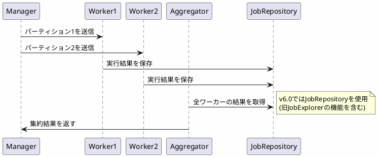

*(このドキュメントは生成AI(Claude Sonnet 4.5)によって2026年1月6日に生成されました)*

## 課題概要

リモートパーティショニング機能の`RemoteStepExecutionAggregator`で、非推奨となった`JobExplorer`の使用を`JobRepository`に置き換えました。

**RemoteStepExecutionAggregatorとは**: リモートパーティショニングにおいて、複数のワーカーからの実行結果を集約するコンポーネントです。

### v5.2の実装

```java
public class RemoteStepExecutionAggregator {
    private JobExplorer jobExplorer;  // 非推奨API
    
    // ワーカーの実行結果を取得
}
```

## 原因

課題 [#4824](https://github.com/spring-projects/spring-batch/issues/4824) で`JobExplorer`が非推奨化されたため、リモートパーティショニング関連コンポーネントも`JobRepository`に移行する必要がありました。

## 対応方針

**コミット**: [4b2586d](https://github.com/spring-projects/spring-batch/commit/4b2586d90c3059045ebb7e2383f50f70cff1b23e)

`RemoteStepExecutionAggregator`の内部実装を`JobRepository`を使用するように変更しました。

### v6.0の改善

```java
public class RemoteStepExecutionAggregator {
    private JobRepository jobRepository;  // 統一API
}
```

### リモートパーティショニングの動作



### メリット

- 統合されたリポジトリAPI
- リモートパーティショニング設定の簡素化
- APIの一貫性向上
