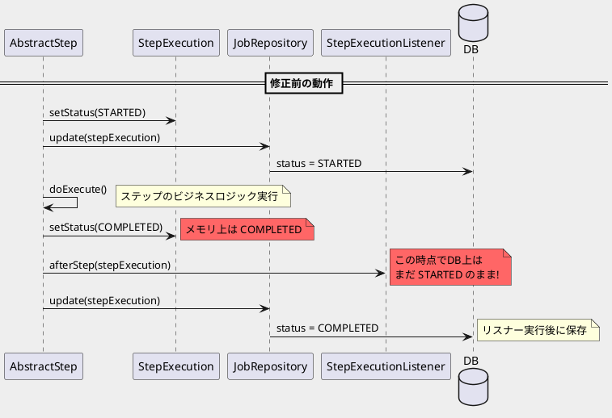
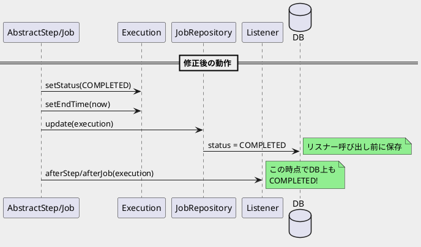

*（このドキュメントは生成AI(Claude Opus 4.5)によって2026年1月27日に生成されました）*

## 課題概要

`StepExecutionListener#afterStep`メソッドが呼び出された時点で、ステップのステータスがデータベース上でまだ`STARTED`のままになっているというバグです。

### 背景知識

| 用語 | 説明 |
|------|------|
| `StepExecutionListener` | ステップの実行前後に処理を挟み込むためのリスナーインターフェース |
| `afterStep` | ステップの処理ロジック実行後に呼び出されるコールバックメソッド |
| `JobRepository` | ジョブやステップの実行状態をデータベースに永続化するコンポーネント |
| `ExitStatus` | ステップやジョブの終了ステータス（COMPLETED、FAILEDなど） |

### ステップ実行とリスナーの関係



### 問題のシナリオ

報告者はステップ完了時に自動バックアップを実行したいと考えていましたが、以下の問題がありました：

1. `afterStep`でデータベースのステータスを確認すると`STARTED`のまま
2. バックアップからリストアした場合、Spring Batchは処理済みステップを再実行してしまう
3. ステップ間のタイミング（前のステップ完了後、次のステップ開始前）で実行されるリスナーが存在しない

## 原因

`afterStep`リスナーを呼び出す**前**に、ステップの実行ステータスがジョブリポジトリに保存されていなかったことが原因です。

メソッドの契約では「ステップの処理ロジックの実行後（成功・失敗を問わず）に呼び出される」と規定されているにもかかわらず、実際にはDB上のステータス更新前にリスナーが実行されていました。

## 対応方針

### diffファイル分析結果

コミット [36068b5](https://github.com/spring-projects/spring-batch/commit/36068b5db84ff242032e9b00515454a84e0745d2) で、ジョブレベルのリスナー呼び出し前にジョブリポジトリへの保存が追加されました。

**変更内容 (`AbstractJob.java`)**

```java
jobExecutionEvent.commit();
execution.setEndTime(LocalDateTime.now());

// save status in job repository before calling listeners  ← 追加
jobRepository.update(execution);                           ← 追加

try {
    listener.afterJob(execution);
}
```

この変更により：
- `afterJob`リスナー呼び出し前に`jobRepository.update(execution)`が実行される
- リスナー内からデータベースを参照した場合、正しいステータス（非実行中）が取得できる

### 修正後の動作



### 追加の議論

コメント4で、メンテナーは`afterStep`が`ExitStatus`を返す設計について疑問を呈しています：

| 比較項目 | `StepExecutionListener#afterStep` | `JobExecutionListener#afterJob` |
|----------|-----------------------------------|----------------------------------|
| 戻り値 | `ExitStatus` | `void` |
| 終了ステータス変更 | 可能 | 不可能 |

この一貫性のなさについて、課題 [#5074](https://github.com/spring-projects/spring-batch/issues/5074) で議論が行われています。

## バグの発生タイミング

- **発生バージョン**: Spring Batch 5.x以前から存在
- **修正コミット**: 
  - [36068b5](https://github.com/spring-projects/spring-batch/commit/36068b5db84ff242032e9b00515454a84e0745d2)（ジョブリスナー対応）
  - [db6ef7b](https://github.com/spring-projects/spring-batch/commit/db6ef7b067e0daeee59c1baea03a0acfed4f5cfc)（ステップリスナー対応）
- **関連Issue**: [#3846](https://github.com/spring-projects/spring-batch/issues/3846)（終了時刻の設定タイミング問題）
