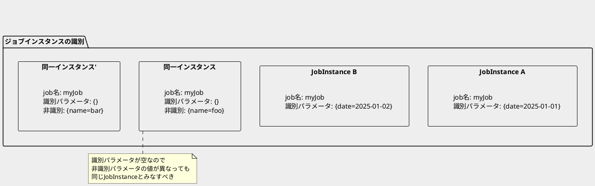
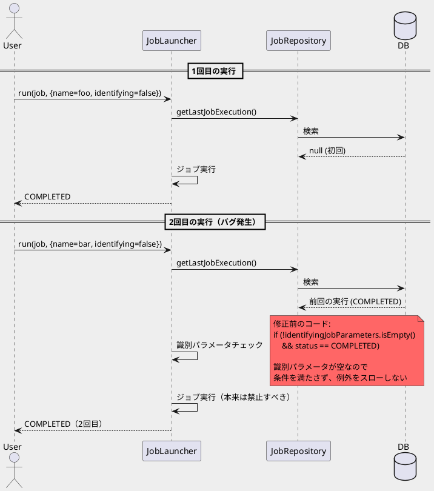
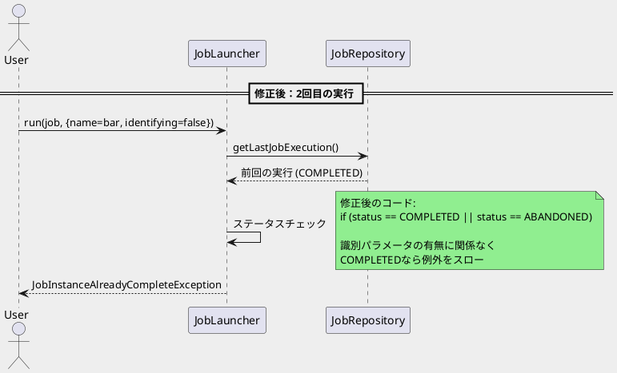

*（このドキュメントは生成AI(Claude Opus 4.5)によって2026年1月27日に生成されました）*

## 課題概要

識別用ジョブパラメータ（identifying parameters）を持たないジョブが、既に正常完了しているにもかかわらず再実行できてしまうというバグです。

### 背景知識

| 用語 | 説明 |
|------|------|
| `JobParameters` | ジョブ実行時に渡すパラメータ。識別用（identifying）と非識別用（non-identifying）がある |
| 識別用パラメータ | ジョブインスタンスを一意に識別するためのパラメータ。同じ識別用パラメータのジョブは「同一インスタンス」とみなされる |
| 非識別用パラメータ | ジョブインスタンスの識別には使用されないパラメータ（`addString("name", "foo", false)`の第3引数が`false`） |
| `JobInstance` | ジョブ名と識別用パラメータの組み合わせで一意に識別されるジョブの論理的な実行単位 |
| `JobInstanceAlreadyCompleteException` | 既に完了済みのジョブインスタンスを再実行しようとした際にスローされる例外 |

### Spring Batchのジョブインスタンス識別の仕組み



### 問題のシナリオ



## 原因

`TaskExecutorJobLauncher`のジョブ再実行チェックロジックに問題がありました。

**問題のコード：**
```java
if (!identifyingJobParameters.isEmpty()
        && (status == BatchStatus.COMPLETED || status == BatchStatus.ABANDONED)) {
    throw new JobInstanceAlreadyCompleteException(...);
}
```

このコードでは、`!identifyingJobParameters.isEmpty()`という条件があるため、識別用パラメータが空の場合は`JobInstanceAlreadyCompleteException`がスローされませんでした。

しかし、識別用パラメータが空の場合でも、同じジョブ名であれば同一のジョブインスタンスとみなされるべきです。そのため、完了済みジョブの再実行は禁止されるべきでした。

## 対応方針

### diffファイル分析結果

PR [#4946](https://github.com/spring-projects/spring-batch/pull/4946) で、`TaskExecutorJobLauncher.java`のチェック条件が修正されました。

**変更内容：**

| 変更前 | 変更後 |
|--------|--------|
| `!identifyingJobParameters.isEmpty() && (status == COMPLETED \|\| status == ABANDONED)` | `status == COMPLETED \|\| status == ABANDONED` |

```java
// 修正前
if (!identifyingJobParameters.isEmpty()
        && (status == BatchStatus.COMPLETED || status == BatchStatus.ABANDONED)) {
    throw new JobInstanceAlreadyCompleteException(...);
}

// 修正後
if (status == BatchStatus.COMPLETED || status == BatchStatus.ABANDONED) {
    throw new JobInstanceAlreadyCompleteException(...);
}
```

**変更のポイント：**
- `!identifyingJobParameters.isEmpty()`条件を削除
- ステータスがCOMPLETEDまたはABANDONEDであれば、識別用パラメータの有無に関わらず例外をスロー
- これにより、識別用パラメータが空でも完了済みジョブの再実行が正しく禁止される

### 修正後の動作



## バグの発生タイミング

- **発生バージョン**: Spring Batch 5.2.x以前（5.2.1で確認）
- **修正PR**: [#4946](https://github.com/spring-projects/spring-batch/pull/4946)
- **修正コミット**: 
  - [1c28dac](https://github.com/spring-projects/spring-batch/commit/1c28daccf0958e2cdcfd1a784e3f7110e73881e4)
  - [250bfff](https://github.com/spring-projects/spring-batch/commit/250bfff1b6e8f2cf4e9219564c3f1d2719f0d17d)
  - [5225249](https://github.com/spring-projects/spring-batch/commit/5225249585fec7e479bf4b3194974d96a848c3c0)
  - [0564ce6](https://github.com/spring-projects/spring-batch/commit/0564ce6293e5178b12aa95b7bce5a461a38e4eb0)
  - [f888ebb](https://github.com/spring-projects/spring-batch/commit/f888ebb43f70d925c028721db0b3d71306089038)
