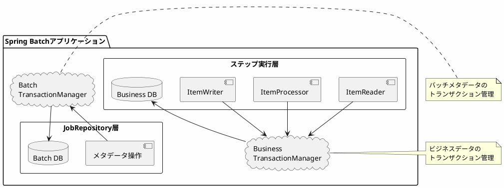

*このドキュメントは生成AI(Claude Sonnet 4.5)によって2026年1月5日に生成されました。*

# Issue #4787: PlatformTransactionManagerの使用方法に関するドキュメント改善

## 課題概要

### 問題の発見
Spring Batchを使用する際、`transactionManager`(トランザクションマネージャー)の設定箇所が多数あり、以下の点が不明確でした:

1. **必須かオプションか**: `transactionManager`の設定が必須なのかオプショナルなのかが分からない
2. **使用範囲の不明確さ**: バッチメタデータ用なのか、ビジネスデータ用なのかが分からない
3. **Spring Bootとの関係**: `@BatchDataSource`と`@BatchTransactionManager`との関係が不明確

**PlatformTransactionManagerとは**: Springフレームワークが提供するトランザクション管理の抽象化インターフェースです。データベース操作を安全に行うため、複数の処理を一つのまとまり(トランザクション)として扱い、全て成功するか、全て失敗するかを保証します。

**トランザクションとは**: データベース操作の一連の処理をひとまとまりとして扱う仕組みです。例えば、銀行の送金処理では「口座Aから引き落とし」と「口座Bへ入金」の2つの操作が両方成功するか、両方失敗するかのどちらかでなければなりません。

### 影響範囲
- Spring Batchを初めて使用する開発者
- 複数のデータソースを使用するプロジェクト
- Spring Bootとの統合を行うプロジェクト

## 原因

### 技術的な背景

#### 1. 過去の仕様変更
Spring Batchは以前、`DataSourceTransactionManager`を自動的に作成していましたが、issue #816で問題が発生し、この自動生成を廃止しました。

```java
// 以前の動作(問題あり)
if (transactionManager == null && dataSource != null) {
    transactionManager = new DataSourceTransactionManager(dataSource);
    // 他のトランザクションマネージャーと競合する可能性
}
```

#### 2. 複数のトランザクションマネージャーの存在
Spring Batchでは、用途に応じて異なるトランザクションマネージャーを使用できます:

| 用途 | トランザクションマネージャー |
|-----|---------------------------|
| バッチメタデータ操作 | ResourcelessTransactionManager |
| ビジネスデータ(JDBC) | DataSourceTransactionManager |
| ビジネスデータ(JPA) | JpaTransactionManager |
| 分散トランザクション | JtaTransactionManager |

#### 3. ドキュメントの不足
これらの使い分けや設定方法が、ドキュメントで十分に説明されていませんでした。

## 対応方針

### 解決アプローチ
コミット`4e5b7d2`で、リファレンスドキュメントに詳細な説明を追加し、以下の点を明確化しました:

1. トランザクションマネージャーがオプションであること
2. ステップとジョブリポジトリで異なるマネージャーを使用できること
3. Spring Bootの自動設定との関係

### 実装内容

#### 1. 基本的な設定パターン

##### パターンA: 単一データソース(最もシンプル)
```java
@Configuration
public class SimpleBatchConfig {
    
    @Bean
    public DataSource dataSource() {
        // データソースの設定
        return new HikariDataSource(...);
    }
    
    @Bean
    public PlatformTransactionManager transactionManager(DataSource dataSource) {
        // バッチメタデータとビジネスデータの両方で同じものを使用
        return new DataSourceTransactionManager(dataSource);
    }
    
    @Bean
    public Step myStep(JobRepository jobRepository,
                       PlatformTransactionManager transactionManager) {
        return new StepBuilder("myStep", jobRepository)
            .<String, String>chunk(10, transactionManager)  // ここで使用
            .reader(reader())
            .processor(processor())
            .writer(writer())
            .build();
    }
}
```

##### パターンB: 分離されたデータソース(推奨)
```java
@Configuration
public class SeparatedDataSourceConfig {
    
    // バッチメタデータ用のデータソース
    @Bean
    @BatchDataSource
    public DataSource batchDataSource() {
        HikariDataSource dataSource = new HikariDataSource();
        dataSource.setJdbcUrl("jdbc:h2:mem:batch");
        return dataSource;
    }
    
    // ビジネスデータ用のデータソース
    @Bean
    @Primary
    public DataSource businessDataSource() {
        HikariDataSource dataSource = new HikariDataSource();
        dataSource.setJdbcUrl("jdbc:postgresql://localhost/business");
        return dataSource;
    }
    
    // バッチメタデータ用のトランザクションマネージャー
    @Bean
    @BatchTransactionManager
    public PlatformTransactionManager batchTransactionManager(
            @BatchDataSource DataSource batchDataSource) {
        return new DataSourceTransactionManager(batchDataSource);
    }
    
    // ビジネスデータ用のトランザクションマネージャー
    @Bean
    @Primary
    public PlatformTransactionManager businessTransactionManager(
            DataSource businessDataSource) {
        return new DataSourceTransactionManager(businessDataSource);
    }
    
    @Bean
    public Step myStep(JobRepository jobRepository) {
        return new StepBuilder("myStep", jobRepository)
            .<String, String>chunk(10, businessTransactionManager)
            // ビジネスデータ用のマネージャーを使用
            .reader(businessDataReader())
            .writer(businessDataWriter())
            .build();
    }
}
```

##### パターンC: リソースレスモード(軽量)
```java
@Configuration
public class ResourcelessConfig {
    
    @Bean
    public JobRepository jobRepository() {
        // メモリ上で動作するリポジトリ
        return new ResourcelessJobRepository();
    }
    
    @Bean
    public PlatformTransactionManager batchTransactionManager() {
        // 実際のトランザクション管理を行わない
        return new ResourcelessTransactionManager();
    }
    
    @Bean
    public Step myStep(JobRepository jobRepository,
                       DataSource businessDataSource) {
        // ステップではビジネスデータ用のマネージャーを使用
        PlatformTransactionManager businessTxManager = 
            new DataSourceTransactionManager(businessDataSource);
            
        return new StepBuilder("myStep", jobRepository)
            .<String, String>chunk(10, businessTxManager)
            .reader(reader())
            .writer(writer())
            .build();
    }
}
```

### トランザクション境界の図解



### Spring Bootの自動設定との統合

Spring Bootを使用している場合、`@EnableBatchProcessing`を使用しなければ、自動設定が働きます:

```java
@SpringBootApplication
// @EnableBatchProcessing は使用しない
public class MyBatchApplication {
    
    public static void main(String[] args) {
        SpringApplication.run(MyBatchApplication.class, args);
    }
    
    @Bean
    public Job myJob(JobRepository jobRepository, Step myStep) {
        return new JobBuilder("myJob", jobRepository)
            .start(myStep)
            .build();
    }
    
    // TransactionManagerは自動設定される
    // 手動で定義する必要なし
}
```

## メリット

### 開発者への利点
1. **設定の明確化**: 何が必須で何がオプショナルかが分かる
2. **柔軟な構成**: 用途に応じてトランザクションマネージャーを使い分けられる
3. **エラー削減**: 適切な設定方法が分かることで、設定ミスを防げる

### プロジェクトへの利点
1. **パフォーマンス最適化**: 軽量なResourcelessTransactionManagerを適切に使用できる
2. **データ分離**: バッチメタデータとビジネスデータを分離できる
3. **保守性向上**: 設定の意図が明確になり、保守が容易になる

## 学習ポイント(入門者向け)

### トランザクションマネージャーの選択ガイド

| シナリオ | 推奨マネージャー | 理由 |
|---------|----------------|------|
| JDBC直接操作 | DataSourceTransactionManager | シンプルで効率的 |
| JPAエンティティ操作 | JpaTransactionManager | エンティティマネージャーとの統合 |
| 複数DB間の分散トランザクション | JtaTransactionManager | 2フェーズコミット対応 |
| テスト環境/軽量実行 | ResourcelessTransactionManager | オーバーヘッドなし |

### チャンク処理でのトランザクション境界

```java
// チャンクサイズ=10の場合
Step step = new StepBuilder("myStep", jobRepository)
    .<String, String>chunk(10, transactionManager)
    .reader(reader())
    .writer(writer())
    .build();
```

実行時の動作:
```
[トランザクション開始]
  - Item 1を読み込み
  - Item 2を読み込み
  ...
  - Item 10を読み込み
  - 10件をまとめて書き込み
[トランザクションコミット]

[トランザクション開始]
  - Item 11を読み込み
  ...
```

このように、チャンクごとにトランザクションが区切られます。エラーが発生した場合、そのチャンクのみがロールバックされ、既にコミットされたチャンクは影響を受けません。

### よくある質問

**Q: transactionManagerを指定しないとどうなる?**
A: Spring Bootの自動設定が有効な場合、適切なトランザクションマネージャーが自動的に注入されます。自動設定を使用しない場合は、明示的に指定する必要があります。

**Q: バッチメタデータとビジネスデータで同じマネージャーを使っても良い?**
A: 問題ありません。多くの場合、これで十分です。分離が必要になるのは、以下のような場合です:
- ビジネスデータベースとは別のデータベースにメタデータを保存したい
- バッチメタデータには軽量なResourcelessTransactionManagerを使いたい
