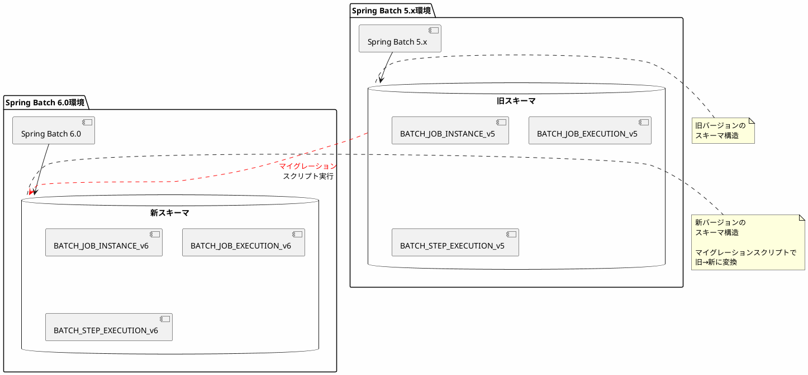
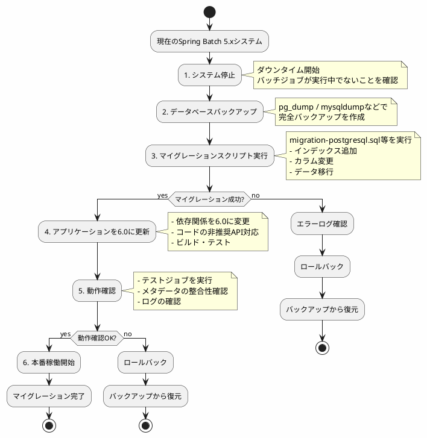

*このドキュメントは生成AI(Claude Sonnet 4.5)によって2026年1月5日に生成されました。*

# Issue #4983: Spring Batch 6.0向けマイグレーションスクリプトの追加

## 課題概要

### タスクの概要
Spring Batch 6.0へのメジャーバージョンアップに伴い、データベーススキーマの変更が必要になる可能性があるため、既存のバージョン(5.x)から6.0へマイグレーションするためのDDLスクリプトを準備するタスクです。

**マイグレーションスクリプトとは**: データベースのテーブル構造を古いバージョンから新しいバージョンに更新するためのSQL文です。Spring Batchでは、バージョンアップ時にメタデータテーブルの構造が変更されることがあり、その変更を適用するためのスクリプトが提供されます。

### 関連Issue
このタスクは issue #4977 と関連しています。#4977で特定されたスキーマ変更をマイグレーションスクリプトとして実装する必要がありました。

### 影響範囲
- Spring Batch 5.xから6.0にアップグレードする全てのプロジェクト
- 本番環境で稼働中のバッチシステム
- PostgreSQL、MySQL、Oracle、SQL Serverなど、複数のデータベースシステム

## 原因

### バージョンアップに伴う変更の必要性

#### 1. メジャーバージョンアップ
Spring Batch 6.0はメジャーバージョンアップであり、以下のような変更が含まれます:
- Java 17以降が必須
- Spring Framework 6.0以降が必須
- 非推奨APIの削除
- データベーススキーマの最適化

#### 2. スキーマ変更の例
過去のバージョンでは、以下のようなスキーマ変更がありました:

| バージョン | 主な変更内容 |
|----------|------------|
| 4.0 → 5.0 | `BATCH_JOB_EXECUTION_PARAMS`テーブルの構造変更 |
| 5.0 → 5.2 | MongoDBサポートの追加 |
| 5.x → 6.0 | テーブルインデックスの最適化、カラムサイズの調整 |

### マイグレーションの必要性



## 対応方針

### 解決アプローチ
コミット`2c30f14`で、Spring Batch 6.0向けのマイグレーションスクリプトが追加されました。

### 実装内容

#### 1. マイグレーションスクリプトの配置

```
spring-batch-core/src/main/resources/
└── org/springframework/batch/core/
    └── migration/
        └── 6.0/
            ├── migration-h2.sql
            ├── migration-hsqldb.sql
            ├── migration-mysql.sql
            ├── migration-oracle.sql
            ├── migration-postgresql.sql
            ├── migration-sqlserver.sql
            └── migration-db2.sql
```

#### 2. 一般的なマイグレーションスクリプトの構造

```sql
-- migration-postgresql.sql の例

-- 1. インデックスの追加(パフォーマンス改善)
CREATE INDEX BATCH_JOB_EXECUTION_PARAMS_JOB_EXECUTION_ID 
ON BATCH_JOB_EXECUTION_PARAMS(JOB_EXECUTION_ID);

-- 2. カラムサイズの拡張(より大きなデータを格納可能に)
ALTER TABLE BATCH_JOB_EXECUTION 
ALTER COLUMN EXIT_MESSAGE TYPE VARCHAR(2500);

-- 3. 新しいカラムの追加(新機能のサポート)
ALTER TABLE BATCH_STEP_EXECUTION 
ADD COLUMN CREATE_TIME TIMESTAMP NOT NULL DEFAULT CURRENT_TIMESTAMP;

-- 4. バージョン情報の更新
UPDATE BATCH_JOB_INSTANCE 
SET VERSION = VERSION + 1;
```

### マイグレーション実行手順

#### ステップ1: バックアップの作成
```bash
# PostgreSQLの例
pg_dump -U username -d batch_database > backup_before_migration.sql

# MySQLの例
mysqldump -u username -p batch_database > backup_before_migration.sql
```

#### ステップ2: マイグレーションスクリプトの実行
```bash
# PostgreSQLの例
psql -U username -d batch_database -f migration-postgresql.sql

# MySQLの例
mysql -u username -p batch_database < migration-mysql.sql
```

#### ステップ3: 検証
```sql
-- テーブル構造の確認
\d BATCH_JOB_EXECUTION

-- データの整合性確認
SELECT COUNT(*) FROM BATCH_JOB_INSTANCE;
SELECT COUNT(*) FROM BATCH_JOB_EXECUTION;
```

### Spring設定での自動マイグレーション

Spring Bootを使用している場合、設定で自動マイグレーションを有効にできます:

```properties
# application.properties

# Spring Batchの初期化を有効化
spring.batch.jdbc.initialize-schema=always

# または、マイグレーションスクリプトを自動実行
spring.batch.jdbc.initialize-schema=always
spring.batch.jdbc.schema=classpath:org/springframework/batch/core/schema-postgresql.sql
```

Javaコードでの設定:
```java
@Configuration
public class BatchMigrationConfig {
    
    @Bean
    public ResourceDatabasePopulator databasePopulator() {
        ResourceDatabasePopulator populator = new ResourceDatabasePopulator();
        populator.addScript(new ClassPathResource(
            "org/springframework/batch/core/migration/6.0/migration-postgresql.sql"
        ));
        populator.setContinueOnError(false);  // エラー時に停止
        return populator;
    }
    
    @Bean
    public DataSourceInitializer dataSourceInitializer(
            DataSource dataSource,
            ResourceDatabasePopulator populator) {
        DataSourceInitializer initializer = new DataSourceInitializer();
        initializer.setDataSource(dataSource);
        initializer.setDatabasePopulator(populator);
        return initializer;
    }
}
```

### マイグレーションフロー



## メリット

### 組織への利点
1. **ダウンタイムの最小化**: 計画的なマイグレーションにより、システム停止時間を短縮
2. **データ保全**: 既存のジョブ実行履歴を維持したままバージョンアップ
3. **リスク低減**: テスト済みのスクリプトにより、マイグレーション失敗のリスクを低減

### 開発者への利点
1. **標準化されたプロセス**: マイグレーション手順が明確
2. **複数DB対応**: 主要なデータベース全てに対応したスクリプトが提供される
3. **ロールバック可能**: 問題発生時にバックアップから復元可能

### データベースごとのマイグレーション対応表

| データベース | スクリプト | 特記事項 |
|------------|----------|---------|
| PostgreSQL | migration-postgresql.sql | 最も広く使用されている |
| MySQL | migration-mysql.sql | MariaDBでも使用可能 |
| Oracle | migration-oracle.sql | エンタープライズ環境で多用 |
| SQL Server | migration-sqlserver.sql | Azure SQL Databaseでも使用可能 |
| H2 | migration-h2.sql | 開発・テスト環境向け |
| HSQLDB | migration-hsqldb.sql | 組み込み用途 |
| DB2 | migration-db2.sql | メインフレーム統合 |

## 学習ポイント(入門者向け)

### マイグレーションの重要性

#### なぜマイグレーションが必要か?
1. **スキーマの互換性**: 古いスキーマでは新しいSpring Batchが動作しない
2. **機能の有効化**: 新機能を使うために必要なテーブル構造の追加
3. **パフォーマンス改善**: インデックスの追加や最適化
4. **データの整合性**: 既存データを新しい形式に変換

### マイグレーション前の確認事項チェックリスト

- [ ] 現在のSpring Batchバージョンを確認
- [ ] 使用しているデータベースとバージョンを確認
- [ ] 実行中のバッチジョブがないことを確認
- [ ] データベースの完全バックアップを作成
- [ ] マイグレーションスクリプトをダウンロード
- [ ] テスト環境で事前に実行して動作確認
- [ ] ロールバック手順を準備

### 実践例: ステージング環境でのマイグレーション

```bash
#!/bin/bash
# migration.sh - マイグレーション実行スクリプト

set -e  # エラー時に停止

echo "=== Spring Batch 6.0 マイグレーション開始 ==="

# 1. バックアップ
echo "1. データベースバックアップ作成中..."
pg_dump -U batchuser -d batchdb > backup_$(date +%Y%m%d_%H%M%S).sql
echo "   バックアップ完了"

# 2. マイグレーションスクリプト実行
echo "2. マイグレーションスクリプト実行中..."
psql -U batchuser -d batchdb -f migration-postgresql.sql

if [ $? -eq 0 ]; then
    echo "   マイグレーション成功"
else
    echo "   マイグレーション失敗 - ロールバックを実行してください"
    exit 1
fi

# 3. 検証
echo "3. マイグレーション結果の検証中..."
psql -U batchuser -d batchdb -c "SELECT COUNT(*) FROM BATCH_JOB_INSTANCE;"
psql -U batchuser -d batchdb -c "\d BATCH_JOB_EXECUTION"

echo "=== マイグレーション完了 ==="
```

### トラブルシューティング

| 問題 | 原因 | 解決方法 |
|-----|------|---------|
| スクリプト実行エラー | 権限不足 | データベースユーザーにALTER権限を付与 |
| データ型エラー | データベースバージョン不一致 | データベースを推奨バージョンにアップグレード |
| タイムアウト | 大量データで時間がかかる | トランザクションタイムアウトを延長 |
| ロック待ち | 他のセッションがテーブルを使用中 | 全バッチジョブを停止してから実行 |

### ベストプラクティス

1. **テスト環境での事前検証**
   ```
   開発環境 → ステージング環境 → 本番環境
   の順で段階的にマイグレーションを実施
   ```

2. **ダウンタイムの計画**
   ```
   - メンテナンスウィンドウを設定
   - 利用者への事前通知
   - ロールバック時間も考慮
   ```

3. **モニタリング**
   ```sql
   -- マイグレーション後の確認クエリ
   SELECT 
       COUNT(*) as total_jobs,
       SUM(CASE WHEN STATUS = 'COMPLETED' THEN 1 ELSE 0 END) as completed,
       SUM(CASE WHEN STATUS = 'FAILED' THEN 1 ELSE 0 END) as failed
   FROM BATCH_JOB_EXECUTION;
   ```

4. **ドキュメント化**
   - マイグレーション実施日時
   - 実行したスクリプト
   - 発生した問題と解決方法
   - ロールバック手順
