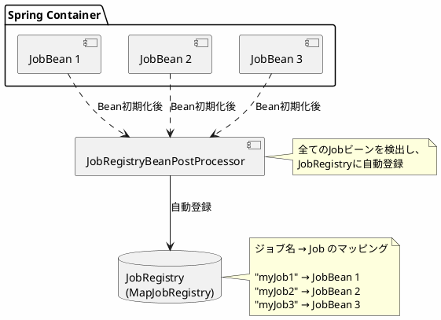

*このドキュメントは生成AI(Claude Sonnet 4.5)によって2026年1月5日に生成されました。*

# Issue #5026: CommandLineJobOperatorの要件に関するドキュメント改善

## 課題概要

### 問題の発見
Spring Batch 6.0で導入された`CommandLineJobOperator`を使用する際、`JobRegistry`が必須であることがドキュメントで十分に明確にされておらず、実行時エラーが発生する問題が報告されました。

**CommandLineJobOperatorとは**: コマンドラインからSpring Batchジョブを起動、停止、再起動できるユーティリティクラスです。`java CommandLineJobOperator MyConfig start myJob`のように、シェルスクリプトからバッチジョブを操作できます。

**JobRegistryとは**: アプリケーション内のジョブを登録・管理するレジストリです。ジョブ名からJobインスタンスを取得する機能を提供します。

### 具体的な問題

#### エラーの発生
```bash
java CommandLineJobOperator my.package.BatchConfig start myJob

# エラー
A required bean was not found in the application context: 
No qualifying bean of type 'org.springframework.batch.core.configuration.JobRegistry' available
```

#### 原因
Spring Batch 6.0では issue #4971 により`JobRegistry`がオプションになり、デフォルトでBeanとして登録されなくなりました。しかし、`CommandLineJobOperator`は内部で`JobRegistry`を必須としているため、手動での登録が必要になりました。

### 影響範囲
- `CommandLineJobOperator`を使用するプロジェクト
- シェルスクリプトやCron等からバッチジョブを起動する環境
- `@EnableBatchProcessing`または`DefaultBatchConfiguration`を使用するプロジェクト

## 原因

### Spring Batch 6.0での変更

#### 1. JobRegistryのオプション化(#4971)
以前のバージョンでは、`JobRegistry`は自動的にBeanとして登録されていましたが、必ずしも必要でないケースも多いため、オプションに変更されました。

#### 2. CommandLineJobOperatorの要件
`CommandLineJobOperator`の`main`メソッドは、以下のように`JobRegistry`を明示的に取得します:

```java
public static void main(String[] args) {
    // ...
    
    ApplicationContext context = new AnnotationConfigApplicationContext(configClass);
    
    // 314行目: ここでJobRegistryを取得しようとする
    jobRegistry = context.getBean(JobRegistry.class);  // ← NoSuchBeanDefinitionException!
    
    // ...
}
```

`JobRegistry`が存在しない場合、このコードは失敗します。

### CommandLineJobOperatorの動作フロー

```plantuml
@startuml
skinparam backgroundColor #FEFEFE

actor User as user
participant "CommandLineJobOperator\n(main)" as cli
participant "ApplicationContext" as ctx
participant "JobRegistry" as registry
participant "JobOperator" as operator
participant "Job" as job

user -> cli: java CommandLineJobOperator\nMyConfig start myJob

activate cli

cli -> ctx: 設定クラスからコンテキスト作成
activate ctx
ctx --> cli: コンテキスト

cli -> ctx: JobRegistryを取得\ncontext.getBean(JobRegistry.class)
activate registry

alt JobRegistryが存在する
  ctx --> cli: JobRegistry
  
  cli -> registry: getJob("myJob")
  registry --> cli: Job
  
  cli -> operator: start(jobName)
  activate operator
  operator -> job: 実行
  operator --> cli: 成功
  deactivate operator
  
  cli --> user: 終了コード 0
else JobRegistryが存在しない
  ctx --> cli: NoSuchBeanDefinitionException
  
  cli --> user: エラー:\nJobRegistryが見つかりません
  
  note right
    必要なBeanがアプリケーション
    コンテキストに見つかりませんでした:
    JobRegistryが必要です
  end note
endif

deactivate cli
deactivate ctx
deactivate registry

@enduml
```

## 対応方針

### 解決アプローチ
コミット`acc48a3`で、リファレンスドキュメントに`CommandLineJobOperator`の要件と設定例を追加しました。

### 実装内容

#### 1. DefaultBatchConfigurationを使用する場合

```java
@Configuration
public class BatchConfig extends DefaultBatchConfiguration {
    
    @Autowired
    private ApplicationContext applicationContext;
    
    // JobRegistryをBeanとして登録
    @Bean
    public JobRegistry jobRegistry() {
        return new MapJobRegistry();
    }
    
    // DefaultBatchConfigurationをオーバーライド
    @Override
    protected JobRegistry getJobRegistry() {
        return applicationContext.getBean(JobRegistry.class);
    }
    
    // ジョブ定義
    @Bean
    public Job myJob(JobRepository jobRepository, Step myStep) {
        return new JobBuilder("myJob", jobRepository)
            .start(myStep)
            .build();
    }
    
    @Bean
    public Step myStep(JobRepository jobRepository,
                       PlatformTransactionManager transactionManager) {
        return new StepBuilder("myStep", jobRepository)
            .<String, String>chunk(10, transactionManager)
            .reader(reader())
            .processor(processor())
            .writer(writer())
            .build();
    }
}
```

#### 2. @EnableBatchProcessingを使用する場合

```java
@Configuration
@EnableBatchProcessing
public class BatchConfig {
    
    // JobRegistryをBeanとして登録
    @Bean
    public JobRegistry jobRegistry() {
        return new MapJobRegistry();
    }
    
    // ジョブ定義
    @Bean
    public Job myJob(JobRepository jobRepository, Step myStep) {
        return new JobBuilder("myJob", jobRepository)
            .start(myStep)
            .build();
    }
    
    @Bean
    public Step myStep(JobRepository jobRepository,
                       PlatformTransactionManager transactionManager) {
        return new StepBuilder("myStep", jobRepository)
            .<String, String>chunk(10, transactionManager)
            .reader(reader())
            .processor(processor())
            .writer(writer())
            .build();
    }
}
```

#### 3. JobRegistryへのジョブ自動登録

ジョブを`JobRegistry`に自動登録するための設定:

```java
@Configuration
public class BatchConfig extends DefaultBatchConfiguration {
    
    @Bean
    public JobRegistry jobRegistry() {
        return new MapJobRegistry();
    }
    
    @Override
    protected JobRegistry getJobRegistry() {
        return applicationContext.getBean(JobRegistry.class);
    }
    
    // JobRegistryBeanPostProcessorで自動登録
    @Bean
    public JobRegistryBeanPostProcessor jobRegistryBeanPostProcessor(
            JobRegistry jobRegistry) {
        JobRegistryBeanPostProcessor postProcessor = 
            new JobRegistryBeanPostProcessor();
        postProcessor.setJobRegistry(jobRegistry);
        return postProcessor;
    }
}
```

`JobRegistryBeanPostProcessor`を使用すると、Spring管理下の全てのJobが自動的に`JobRegistry`に登録されます。

### CommandLineJobOperatorの使用方法

#### 基本的なコマンド

```bash
# ジョブを起動
java CommandLineJobOperator my.package.BatchConfig start myJob param1=value1

# ジョブを停止
java CommandLineJobOperator my.package.BatchConfig stop myJob executionId=123

# ジョブを再起動
java CommandLineJobOperator my.package.BatchConfig restart myJob executionId=123

# ジョブを放棄(abandon)
java CommandLineJobOperator my.package.BatchConfig abandon myJob executionId=123
```

#### シェルスクリプトでの使用例

```bash
#!/bin/bash
# run-batch.sh - バッチジョブ実行スクリプト

CLASSPATH="target/classes:target/lib/*"
CONFIG_CLASS="com.example.batch.BatchConfig"
JOB_NAME="dailyProcessingJob"

# 現在日付をパラメータとして渡す
DATE=$(date +%Y-%m-%d)

java -cp $CLASSPATH \
    org.springframework.batch.core.launch.support.CommandLineJobOperator \
    $CONFIG_CLASS \
    start \
    $JOB_NAME \
    date=$DATE

if [ $? -eq 0 ]; then
    echo "ジョブが正常に完了しました"
else
    echo "ジョブが失敗しました"
    exit 1
fi
```

### Cron登録例

```cron
# 毎日午前2時にバッチジョブを実行
0 2 * * * /opt/batch/run-batch.sh >> /var/log/batch/daily-job.log 2>&1
```

### 設定パターンの比較表

| 設定方法 | JobRegistry登録 | getJobRegistry()オーバーライド | JobRegistryBeanPostProcessor |
|---------|---------------|------------------------------|----------------------------|
| DefaultBatchConfiguration | ✅ 必須 | ✅ 必須 | 推奨 |
| @EnableBatchProcessing | ✅ 必須 | ❌ 不要 | 推奨 |
| 手動設定 | ✅ 必須 | 状況による | 推奨 |

## メリット

### 開発者への利点
1. **明確な要件**: 必要な設定が明確になり、トラブルシューティングが容易
2. **複数の設定例**: 異なる設定スタイルに対応した例を提供
3. **迅速な問題解決**: エラーの原因と解決方法が分かりやすい

### 運用への利点
1. **スクリプト化**: シェルスクリプトやCronからバッチジョブを簡単に起動
2. **自動化**: CI/CDパイプラインやスケジューラーとの統合が容易
3. **監視**: 終了コードで成功/失敗を判定可能

## 学習ポイント(入門者向け)

### JobRegistryの役割

#### ジョブの登録と検索
```java
// JobRegistryへの手動登録
JobRegistry registry = new MapJobRegistry();
Job myJob = createMyJob();
registry.register(new ReferenceJobFactory(myJob));

// ジョブ名での検索
Job retrievedJob = registry.getJob("myJob");
```

#### 自動登録の仕組み


### CommandLineJobOperatorとJobLauncherの違い

| 特徴 | CommandLineJobOperator | JobLauncher |
|-----|----------------------|-------------|
| 使用場所 | コマンドライン | プログラム内 |
| 設定方法 | 設定クラス指定 | Spring DI |
| ジョブ取得 | JobRegistry経由 | 直接参照 |
| 用途 | スクリプト、Cron | Webアプリ、API |
| パラメータ | コマンドライン引数 | JobParametersオブジェクト |

### 実践例: 完全な設定

```java
@Configuration
public class ProductionBatchConfig extends DefaultBatchConfiguration {
    
    @Autowired
    private ApplicationContext applicationContext;
    
    @Bean
    public JobRegistry jobRegistry() {
        return new MapJobRegistry();
    }
    
    @Override
    protected JobRegistry getJobRegistry() {
        return applicationContext.getBean(JobRegistry.class);
    }
    
    @Bean
    public JobRegistryBeanPostProcessor jobRegistryBeanPostProcessor(
            JobRegistry jobRegistry) {
        JobRegistryBeanPostProcessor postProcessor = 
            new JobRegistryBeanPostProcessor();
        postProcessor.setJobRegistry(jobRegistry);
        return postProcessor;
    }
    
    // ジョブ1: 日次処理
    @Bean
    public Job dailyProcessingJob(JobRepository jobRepository,
                                   Step extractStep,
                                   Step transformStep,
                                   Step loadStep) {
        return new JobBuilder("dailyProcessingJob", jobRepository)
            .start(extractStep)
            .next(transformStep)
            .next(loadStep)
            .build();
    }
    
    // ジョブ2: 月次集計
    @Bean
    public Job monthlyReportJob(JobRepository jobRepository,
                                 Step aggregateStep,
                                 Step reportStep) {
        return new JobBuilder("monthlyReportJob", jobRepository)
            .start(aggregateStep)
            .next(reportStep)
            .build();
    }
    
    // ステップ定義...
}
```

実行:
```bash
# 日次処理を実行
java CommandLineJobOperator \
    com.example.ProductionBatchConfig \
    start \
    dailyProcessingJob \
    date=2024-01-15

# 月次集計を実行
java CommandLineJobOperator \
    com.example.ProductionBatchConfig \
    start \
    monthlyReportJob \
    month=2024-01
```

### トラブルシューティング

| エラーメッセージ | 原因 | 解決方法 |
|---------------|------|---------|
| No qualifying bean of type 'JobRegistry' | JobRegistry未登録 | `@Bean`でMapJobRegistryを登録 |
| Job not found in registry | ジョブ未登録 | JobRegistryBeanPostProcessorを追加 |
| Configuration class not found | クラスパス問題 | CLASSPATHを確認 |
| No such job | ジョブ名の誤り | JobRegistry.getJobNames()で確認 |
