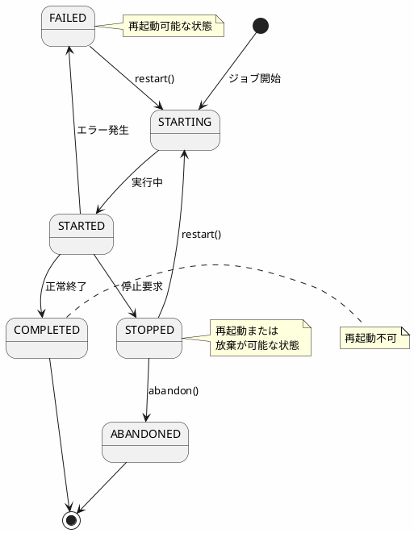
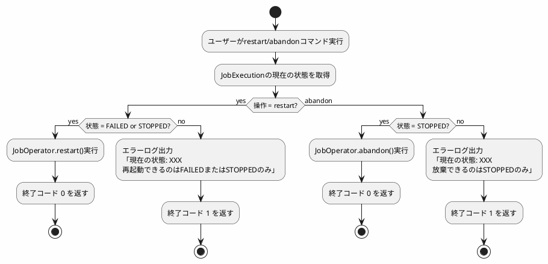

*このドキュメントは生成AI(Claude Sonnet 4.5)によって2026年1月5日に生成されました。*

# Issue #5057: CommandLineJobOperatorの再起動/放棄の状態検証改善

## 課題概要

### 改善提案
`CommandLineJobOperator`の`restart()`および`abandon()`メソッドにおいて、ジョブ実行の現在の状態を事前にチェックし、無効な操作を早期に防ぐとともに、明確なエラーログを出力する改善が提案されました。

**CommandLineJobOperatorとは**: コマンドラインからSpring Batchジョブを起動、停止、再起動、放棄できるユーティリティクラスです。

### 現在の問題点

#### 1. Abandon(放棄)操作
- `STOPPED`状態のジョブのみ放棄できるべきだが、状態チェックがない
- 無効な状態でも`JobOperator#abandon`に委譲され、下流で失敗する
- TODO コメントで廃止された`JobExecutionNotStoppedException`に言及

#### 2. Restart(再起動)操作  
- `FAILED`または`STOPPED`状態のジョブのみ再起動できるべきだが、状態チェックがない
- TODO コメントで状態チェックの必要性を言及しているが実装されていない

### 影響範囲
- `CommandLineJobOperator`を使用してジョブを管理する全てのプロジェクト
- 特に本番環境での運用で、無効な操作によるエラーハンドリング

## 原因

### 技術的な背景

#### 修正前のコード

##### Restart メソッド
```java
private int restart(long jobExecutionId) throws JobExecutionException {
    // TODO ジョブ実行が失敗しなかった場合、チェックしてエラーをログに記録すべき
    JobExecution restartedExecution = this.jobOperator.restart(jobExecution);
    return this.exitCodeMapper.intValue(restartedExecution.getExitStatus().getExitCode());
}
```

##### Abandon メソッド
```java
private int abandon(long jobExecutionId) throws JobExecutionAlreadyRunningException {
    // TODO ジョブ実行が停止していない場合、JobExecutionNotStoppedExceptionをスローすべき
    // 注: JobExecutionNotStoppedExceptionは廃止済み
    JobExecution abandonedExecution = this.jobOperator.abandon(jobExecution);
    return this.exitCodeMapper.intValue(abandonedExecution.getExitStatus().getExitCode());
}
```

### ジョブ実行の状態遷移



## 対応方針

### 解決アプローチ
コミット`cb55ccc`で、CLIレベルでの明示的な状態チェックとロギングを実装しました。

### 実装内容

#### 修正後: Restart メソッド

```java
private int restart(long jobExecutionId) throws JobExecutionException {
    JobExecution jobExecution = this.jobOperator.getJobExecution(jobExecutionId);
    BatchStatus status = jobExecution.getStatus();
    
    // 再起動可能な状態をチェック
    if (status != BatchStatus.FAILED && status != BatchStatus.STOPPED) {
        logger.error("Cannot restart job execution with id " + jobExecutionId + 
                     ". Current status is " + status + 
                     ", but only FAILED or STOPPED executions can be restarted.");
        return ExitCodeMapper.JVM_EXITCODE_GENERIC_ERROR;
    }
    
    // 再起動実行
    JobExecution restartedExecution = this.jobOperator.restart(jobExecutionId);
    return this.exitCodeMapper.intValue(restartedExecution.getExitStatus().getExitCode());
}
```

#### 修正後: Abandon メソッド

```java
private int abandon(long jobExecutionId) throws JobExecutionAlreadyRunningException {
    JobExecution jobExecution = this.jobOperator.getJobExecution(jobExecutionId);
    BatchStatus status = jobExecution.getStatus();
    
    // 放棄可能な状態をチェック
    if (status != BatchStatus.STOPPED) {
        logger.error("Cannot abandon job execution with id " + jobExecutionId + 
                     ". Current status is " + status + 
                     ", but only STOPPED executions can be abandoned.");
        return ExitCodeMapper.JVM_EXITCODE_GENERIC_ERROR;
    }
    
    // 放棄実行
    JobExecution abandonedExecution = this.jobOperator.abandon(jobExecutionId);
    return this.exitCodeMapper.intValue(abandonedExecution.getExitStatus().getExitCode());
}
```

### 使用例

#### Restart コマンド

```bash
# ケース1: FAILED状態のジョブを再起動(成功)
$ java CommandLineJobOperator MyConfig restart myJob executionId=123

# ログ出力
INFO: Restarting job execution with id 123
INFO: Job execution restarted successfully

# 終了コード: 0


# ケース2: COMPLETED状態のジョブを再起動しようとする(失敗)
$ java CommandLineJobOperator MyConfig restart myJob executionId=124

# ログ出力
ERROR: Cannot restart job execution with id 124. 
       Current status is COMPLETED, but only FAILED or STOPPED executions can be restarted.

# 終了コード: 1
```

#### Abandon コマンド

```bash
# ケース1: STOPPED状態のジョブを放棄(成功)
$ java CommandLineJobOperator MyConfig abandon myJob executionId=125

# ログ出力
INFO: Abandoning job execution with id 125
INFO: Job execution abandoned successfully

# 終了コード: 0


# ケース2: FAILED状態のジョブを放棄しようとする(失敗)
$ java CommandLineJobOperator MyConfig abandon myJob executionId=126

# ログ出力
ERROR: Cannot abandon job execution with id 126. 
       Current status is FAILED, but only STOPPED executions can be abandoned.

# 終了コード: 1
```

### 状態遷移と操作の対応表

| 現在の状態 | restart() | abandon() | start() | stop() |
|----------|-----------|-----------|---------|--------|
| STARTING | ❌ | ❌ | ❌ | ✅ |
| STARTED | ❌ | ❌ | ❌ | ✅ |
| COMPLETED | ❌ | ❌ | ✅ (新規) | ❌ |
| FAILED | ✅ | ❌ | ❌ | ❌ |
| STOPPED | ✅ | ✅ | ❌ | ❌ |
| ABANDONED | ❌ | ❌ | ✅ (新規) | ❌ |

### エラーハンドリングフロー



## メリット

### 開発者への利点
1. **早期エラー検出**: 無効な操作を実行前に検出
2. **明確なエラーメッセージ**: 現在の状態と期待される状態が明示される
3. **デバッグの効率化**: ログから問題の原因が即座に分かる

### 運用への利点
1. **安全性向上**: 無効な操作による予期しない動作を防止
2. **スクリプトでの利用**: 終了コードで処理の成否を判定可能
3. **監視の容易性**: 明確なログで監視システムと連携しやすい

## 学習ポイント(入門者向け)

### ジョブ実行の状態管理

#### BatchStatusの種類

```java
public enum BatchStatus {
    STARTING,   // 開始処理中
    STARTED,    // 実行中
    STOPPING,   // 停止処理中
    STOPPED,    // 停止済み
    FAILED,     // 失敗
    COMPLETED,  // 正常完了
    ABANDONED   // 放棄済み
}
```

#### 各状態の意味と遷移条件

| 状態 | 説明 | 次の遷移先 |
|-----|------|-----------|
| STARTING | ジョブが開始処理中 | STARTED, FAILED |
| STARTED | ジョブが実行中 | COMPLETED, FAILED, STOPPING |
| STOPPING | 停止要求を受けて停止処理中 | STOPPED |
| STOPPED | ユーザーによって停止された | STARTING(restart), ABANDONED(abandon) |
| FAILED | エラーにより失敗 | STARTING(restart) |
| COMPLETED | 正常に完了 | 終了 |
| ABANDONED | 放棄された(再起動不可) | 終了 |

### 実践例: 運用スクリプト

#### ジョブ監視・自動再起動スクリプト

```bash
#!/bin/bash
# job-monitor.sh - ジョブの監視と自動再起動

CONFIG_CLASS="com.example.batch.BatchConfig"
JOB_NAME="criticalJob"
EXECUTION_ID=$1

# ジョブの状態を確認
check_status() {
    # JobOperatorを使って状態を取得(簡略化)
    STATUS=$(java CommandLineJobOperator $CONFIG_CLASS status $JOB_NAME executionId=$EXECUTION_ID)
    echo $STATUS
}

# 現在の状態を取得
CURRENT_STATUS=$(check_status)

echo "ジョブ実行ID $EXECUTION_ID の現在の状態: $CURRENT_STATUS"

case $CURRENT_STATUS in
    "FAILED")
        echo "失敗を検出しました。再起動を試みます..."
        java CommandLineJobOperator $CONFIG_CLASS restart $JOB_NAME executionId=$EXECUTION_ID
        
        if [ $? -eq 0 ]; then
            echo "再起動に成功しました"
        else
            echo "再起動に失敗しました"
            # アラート通知
            send_alert "ジョブ $JOB_NAME の再起動に失敗"
            exit 1
        fi
        ;;
        
    "STOPPED")
        echo "停止状態を検出しました。"
        read -p "再起動しますか? (y/n): " answer
        
        if [ "$answer" = "y" ]; then
            java CommandLineJobOperator $CONFIG_CLASS restart $JOB_NAME executionId=$EXECUTION_ID
        else
            echo "放棄しますか? (y/n): "
            read answer
            if [ "$answer" = "y" ]; then
                java CommandLineJobOperator $CONFIG_CLASS abandon $JOB_NAME executionId=$EXECUTION_ID
            fi
        fi
        ;;
        
    "COMPLETED")
        echo "ジョブは正常に完了しています"
        ;;
        
    *)
        echo "現在の状態: $CURRENT_STATUS"
        ;;
esac
```

#### Cron連携例

```bash
#!/bin/bash
# daily-job-runner.sh - 日次ジョブ実行スクリプト

CONFIG_CLASS="com.example.batch.BatchConfig"
JOB_NAME="dailyProcessingJob"
LOG_DIR="/var/log/batch"
DATE=$(date +%Y%m%d)

LOG_FILE="$LOG_DIR/$JOB_NAME-$DATE.log"

echo "[$DATE] ジョブ開始: $JOB_NAME" >> $LOG_FILE

# ジョブ実行
java CommandLineJobOperator $CONFIG_CLASS start $JOB_NAME date=$DATE >> $LOG_FILE 2>&1

EXIT_CODE=$?

if [ $EXIT_CODE -eq 0 ]; then
    echo "[$DATE] ジョブ正常終了" >> $LOG_FILE
else
    echo "[$DATE] ジョブ失敗 (終了コード: $EXIT_CODE)" >> $LOG_FILE
    
    # 失敗時はメール通知
    mail -s "バッチジョブ失敗: $JOB_NAME" admin@example.com < $LOG_FILE
fi

exit $EXIT_CODE
```

Cron設定:
```cron
# 毎日午前3時に実行
0 3 * * * /opt/batch/daily-job-runner.sh
```

### トラブルシューティング

| 問題 | 原因 | 解決方法 |
|-----|------|---------|
| restart時に「COMPLETED状態は再起動できない」 | 正常終了したジョブを再起動しようとした | 新しいパラメータでstart |
| abandon時に「FAILED状態は放棄できない」 | 失敗したジョブを直接放棄しようとした | まずrestartで再起動を試みる |
| 「ジョブが実行中」エラー | 同じジョブが既に実行中 | 完了を待つか、stopで停止 |
| 終了コード1で失敗 | 無効な操作や状態 | ログを確認して適切な操作を実行 |

### 終了コードの活用

```bash
#!/bin/bash
# 終了コードに基づいた処理分岐

java CommandLineJobOperator MyConfig restart myJob executionId=123

case $? in
    0)
        echo "成功"
        ;;
    1)
        echo "汎用エラー(無効な状態など)"
        ;;
    2)
        echo "ジョブが見つからない"
        ;;
    *)
        echo "その他のエラー"
        ;;
esac
```
