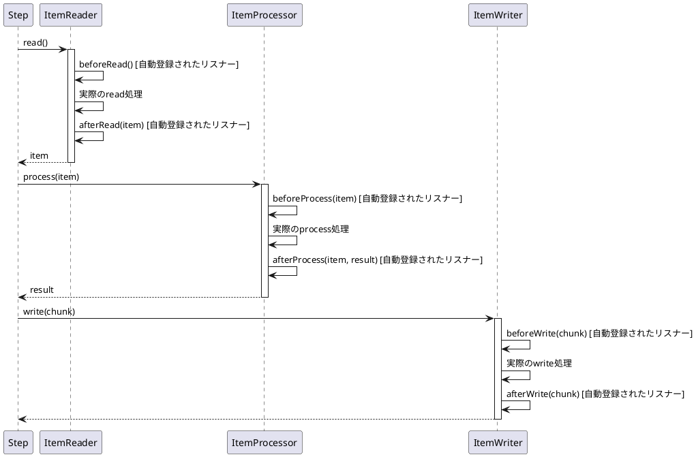

*このドキュメントは生成AI(Claude Sonnet 4.5)によって2026年1月5日に生成されました。*

# Issue #5087: ItemHandler実装を自動的にStepListenerとして登録

## 課題概要

`ItemProcessor`, `ItemReader`, `ItemWriter`を実装するBeanが、対応する`StepListener`インターフェース(`ItemProcessListener`, `ItemReadListener`, `ItemWriteListener`)も実装している場合、それらを自動的にStepListenerとして登録する機能が追加されました。

**StepListenerとは**: Step実行のライフサイクルイベント(読み込み前後、処理前後、書き込み前後、エラー発生時など)をフックして、カスタム処理を追加できる仕組みです。

## 背景

従来、ItemHandlerとStepListenerの両方を実装したBeanは、明示的に`.listener()`メソッドで登録する必要がありました:

```java
@Bean
public Step myStep(JobRepository jobRepository,
                   PlatformTransactionManager transactionManager,
                   MyProcessor processor) {
    return new StepBuilder("myStep", jobRepository)
        .<String, String>chunk(10, transactionManager)
        .reader(reader())
        .processor(processor)
        .writer(writer())
        .listener(processor)  // ← 明示的登録が必要
        .build();
}
```

## 対応方針

Spring Batch 6.0では、ItemHandlerがStepListenerも実装している場合、自動的にリスナーとして登録されます。

### 自動登録の仕組み

```java
// AbstractTaskletStepBuilderクラス内の改善
private void registerStepListenerAsItemListenerIfPossible(Object itemHandler) {
    if (itemHandler instanceof ItemReadListener<?> readListener) {
        listener(readListener);
    }
    if (itemHandler instanceof ItemProcessListener<?, ?> processListener) {
        listener(processListener);
    }
    if (itemHandler instanceof ItemWriteListener<?> writeListener) {
        listener(writeListener);
    }
}
```

この自動登録は、以下のメソッドで`ItemHandler`が設定される際に実行されます:
- `reader(ItemReader)` 
- `processor(ItemProcessor)`
- `writer(ItemWriter)`

## 使用例

### 自動登録の例

```java
@Component
public class LoggingProcessor implements 
        ItemProcessor<String, String>,
        ItemProcessListener<String, String> {
    
    @Override
    public String process(String item) throws Exception {
        return item.toUpperCase();
    }
    
    @Override
    public void beforeProcess(String item) {
        System.out.println("処理開始: " + item);
    }
    
    @Override
    public void afterProcess(String item, String result) {
        System.out.println("処理完了: " + item + " -> " + result);
    }
    
    @Override
    public void onProcessError(String item, Exception e) {
        System.err.println("処理エラー: " + item + ", " + e.getMessage());
    }
}

@Bean
public Step myStep(JobRepository jobRepository,
                   PlatformTransactionManager transactionManager,
                   LoggingProcessor processor) {
    return new StepBuilder("myStep", jobRepository)
        .<String, String>chunk(10, transactionManager)
        .reader(reader())
        .processor(processor)  // ← 自動的にリスナーとしても登録される
        .writer(writer())
        .build();
}
```

### 複数のリスナーインターフェースを実装

```java
@Component
public class AuditItemWriter implements 
        ItemWriter<Transaction>,
        ItemWriteListener<Transaction>,
        ItemReadListener<Transaction> {
    
    @Override
    public void write(Chunk<? extends Transaction> items) throws Exception {
        // 書き込み処理
    }
    
    @Override
    public void beforeWrite(Chunk<? extends Transaction> items) {
        System.out.println("書き込み開始: " + items.size() + "件");
    }
    
    @Override
    public void afterWrite(Chunk<? extends Transaction> items) {
        System.out.println("書き込み完了: " + items.size() + "件");
    }
    
    @Override
    public void onWriteError(Exception exception, Chunk<? extends Transaction> items) {
        System.err.println("書き込みエラー: " + exception.getMessage());
    }
    
    // ItemReadListenerメソッドも実装可能
}
```

## 学習ポイント

### StepListenerの種類

| リスナー | タイミング | 用途 |
|---------|----------|------|
| StepExecutionListener | Step開始・終了 | ログ記録、リソース初期化/解放 |
| ItemReadListener | アイテム読み込み前後 | 入力データの検証・ログ |
| ItemProcessListener | アイテム処理前後 | 処理時間計測・監査 |
| ItemWriteListener | アイテム書き込み前後 | 出力データの検証・ログ |
| SkipListener | スキップ発生時 | エラー追跡・通知 |
| RetryListener | リトライ発生時 | リトライ回数監視 |

### 自動登録の利点

```
従来:
├── ItemProcessor実装
├── ItemProcessListener実装  
└── .listener()で明示的登録  ← 忘れやすい!

6.0以降:
├── ItemProcessor実装
└── ItemProcessListener実装  ← 自動登録!
```

### 実行フロー



## 注意点

- 同じBeanを`.processor()`と`.listener()`で重複登録すると、リスナーメソッドが2回呼ばれます
- 自動登録を避けたい場合は、ItemHandlerとStepListenerを別々のBeanに分けてください
