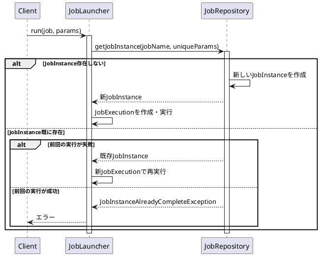

*このドキュメントは生成AI(Claude Sonnet 4.5)によって2026年1月5日に生成されました。*

# Issue #5088: JobParametersのキー衝突問題の修正

## 課題概要

`JobParameters.getUniqueJobParameters()`メソッドが、内部的に`TreeMap`を使用しているため、キーの順序がソートされ、元の挿入順序が失われる問題が報告されました。

**JobParametersとは**: バッチジョブを一意に識別し、ジョブに渡すパラメータを保持するオブジェクトです。同じパラメータで実行されたジョブは同一のJobInstanceと見なされます。

## 問題の詳細

### 問題のあるコード

```java
public Map<String, JobParameter<?>> getUniqueJobParameters() {
    Map<String, JobParameter<?>> result = new TreeMap<>();  // ← キーがソートされる!
    for (Entry<String, JobParameter<?>> entry : this.parameters.entrySet()) {
        if (entry.getValue().isIdentifying()) {
            result.put(entry.getKey(), entry.getValue());
        }
    }
    return Collections.unmodifiableMap(result);
}
```

### 影響

1. **予測不可能な順序**: パラメータの順序が挿入順ではなく、キー名のアルファベット順になる
2. **デバッグ困難**: ログやテストで期待する順序と異なる
3. **一貫性の欠如**: `parameters`フィールドは`LinkedHashMap`(挿入順を保持)なのに、返される`Map`は`TreeMap`(ソート順)

## 対応方針

```java
// 修正後のコード
public Map<String, JobParameter<?>> getUniqueJobParameters() {
    Map<String, JobParameter<?>> result = new LinkedHashMap<>();  // ✅ 挿入順を保持
    for (Entry<String, JobParameter<?>> entry : this.parameters.entrySet()) {
        if (entry.getValue().isIdentifying()) {
            result.put(entry.getKey(), entry.getValue());
        }
    }
    return Collections.unmodifiableMap(result);
}
```

## 使用例

### 修正前の動作

```java
JobParameters params = new JobParametersBuilder()
    .addString("z-param", "value1", true)
    .addString("a-param", "value2", true)
    .addString("m-param", "value3", true)
    .toJobParameters();

Map<String, JobParameter<?>> unique = params.getUniqueJobParameters();
System.out.println(unique.keySet());
// 出力(修正前): [a-param, m-param, z-param]  ← ソートされている!
```

### 修正後の動作

```java
JobParameters params = new JobParametersBuilder()
    .addString("z-param", "value1", true)
    .addString("a-param", "value2", true)
    .addString("m-param", "value3", true)
    .toJobParameters();

Map<String, JobParameter<?>> unique = params.getUniqueJobParameters();
System.out.println(unique.keySet());
// 出力(修正後): [z-param, a-param, m-param]  ← 挿入順を保持!
```

## 学習ポイント

### Javaの主なMap実装

| Map実装 | 順序 | 用途 |
|---------|------|------|
| HashMap | 順序なし(ランダム) | 一般的な用途 |
| LinkedHashMap | 挿入順を保持 | 順序が重要な場合 |
| TreeMap | キーの自然順序(ソート) | ソートが必要な場合 |
| ConcurrentHashMap | 順序なし | 並行処理 |

### identifyingパラメータとは

```java
JobParameters params = new JobParametersBuilder()
    // identifyingパラメータ(true) → JobInstanceの識別に使用
    .addString("date", "2024-01-01", true)
    .addLong("id", 123L, true)
    
    // non-identifyingパラメータ(false) → 識別に使用しない
    .addString("logLevel", "DEBUG", false)
    .addLong("timeout", 30L, false)
    .toJobParameters();

// getUniqueJobParameters()はidentifyingパラメータのみ返す
Map<String, JobParameter<?>> unique = params.getUniqueJobParameters();
// => {date=2024-01-01, id=123}  (logLevel, timeoutは含まれない)
```

### JobInstanceの一意性



### JobParametersの比較

```java
// 同じidentifyingパラメータ → 同じJobInstance
JobParameters params1 = new JobParametersBuilder()
    .addString("date", "2024-01-01", true)
    .addLong("id", 123L, true)
    .toJobParameters();

JobParameters params2 = new JobParametersBuilder()
    .addString("date", "2024-01-01", true)
    .addLong("id", 123L, true)
    .addString("logLevel", "DEBUG", false)  // ← non-identifying
    .toJobParameters();

// params1とparams2は同じJobInstanceを生成する
// (non-identifyingパラメータは識別に影響しない)
```

## 実用例

### タイムスタンプを使った再実行

```java
@Bean
public JobLauncher jobLauncher(JobRepository jobRepository) {
    return new TaskExecutorJobLauncher(jobRepository, taskExecutor());
}

public void runJobAgain(Job job) throws Exception {
    JobParameters params = new JobParametersBuilder()
        .addString("businessDate", "2024-01-01", true)
        .addLong("timestamp", System.currentTimeMillis(), true)  // ← 毎回異なる
        .toJobParameters();
    
    jobLauncher.run(job, params);  // 常に新しいJobInstanceが作成される
}
```
