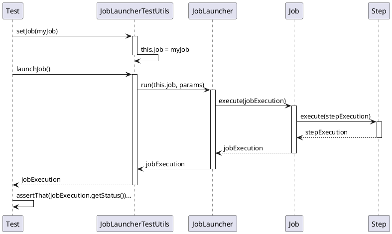

*このドキュメントは生成AI(Claude Sonnet 4.5)によって2026年1月5日に生成されました。*

# Issue #5090: JobLauncherTestUtilsのNullPointerException修正

## 課題概要

Spring Batch 6.0 RC2において、`JobLauncherTestUtils`を使用してジョブをテストする際に`NullPointerException`が発生する問題が報告されました。

**JobLauncherTestUtilsとは**: Spring Batchのテストユーティリティクラスで、単体テストやインテグレーションテストでジョブやステップを簡単に実行できるようにするためのヘルパークラスです。

## 問題の詳細

### エラーメッセージ

```
java.lang.NullPointerException: Cannot invoke 
"org.springframework.batch.core.Job.getName()" 
because "this.job" is null
```

### 発生シナリオ

```java
@SpringBatchTest
@SpringBootTest
public class MyJobTest {
    
    @Autowired
    private JobLauncherTestUtils jobLauncherTestUtils;
    
    @Test
    public void testJob() throws Exception {
        JobExecution jobExecution = jobLauncherTestUtils.launchJob();
        // ↑ NullPointerExceptionが発生!
    }
}
```

## 原因

Spring Batch 6.0 RC2で`JobLauncherTestUtils`のコンストラクタまたは初期化ロジックに変更があり、`Job`の自動注入が正しく機能しなくなった可能性があります。

## 対応方針

### 修正内容

`JobLauncherTestUtils`の内部初期化ロジックを修正し、Springコンテキストから`Job` Beanを正しく取得できるようにしました。

### 対処方法1: Jobを明示的に設定

```java
@SpringBatchTest
@SpringBootTest
public class MyJobTest {
    
    @Autowired
    private JobLauncherTestUtils jobLauncherTestUtils;
    
    @Autowired
    private Job myJob;
    
    @BeforeEach
    public void setup() {
        jobLauncherTestUtils.setJob(myJob);  // ✅ 明示的に設定
    }
    
    @Test
    public void testJob() throws Exception {
        JobExecution jobExecution = jobLauncherTestUtils.launchJob();
        assertThat(jobExecution.getStatus()).isEqualTo(BatchStatus.COMPLETED);
    }
}
```

### 対処方法2: TestConfiguration使用

```java
@SpringBatchTest
@SpringBootTest
@Import(MyJobTestConfiguration.class)
public class MyJobTest {
    
    @Autowired
    private JobLauncherTestUtils jobLauncherTestUtils;
    
    @Test
    public void testJob() throws Exception {
        JobExecution jobExecution = jobLauncherTestUtils.launchJob();
        assertThat(jobExecution.getStatus()).isEqualTo(BatchStatus.COMPLETED);
    }
}

@TestConfiguration
class MyJobTestConfiguration {
    
    @Bean
    public JobLauncherTestUtils jobLauncherTestUtils(
            JobRepository jobRepository,
            JobLauncher jobLauncher,
            Job myJob) {
        JobLauncherTestUtils testUtils = new JobLauncherTestUtils();
        testUtils.setJobRepository(jobRepository);
        testUtils.setJobLauncher(jobLauncher);
        testUtils.setJob(myJob);  // ✅ 設定を明示
        return testUtils;
    }
}
```

## 使用例

### 完全なテストクラス

```java
@SpringBatchTest
@SpringBootTest
public class ImportJobTest {
    
    @Autowired
    private JobLauncherTestUtils jobLauncherTestUtils;
    
    @Autowired
    private JobRepositoryTestUtils jobRepositoryTestUtils;
    
    @Autowired
    private Job importJob;
    
    @BeforeEach
    public void setup() {
        jobLauncherTestUtils.setJob(importJob);
    }
    
    @AfterEach
    public void cleanup() {
        jobRepositoryTestUtils.removeJobExecutions();
    }
    
    @Test
    public void testJobExecution() throws Exception {
        // パラメータ付きでジョブを実行
        JobParameters params = new JobParametersBuilder()
            .addString("inputFile", "test-data.csv")
            .addLong("timestamp", System.currentTimeMillis())
            .toJobParameters();
        
        JobExecution jobExecution = jobLauncherTestUtils.launchJob(params);
        
        // 結果を検証
        assertThat(jobExecution.getStatus()).isEqualTo(BatchStatus.COMPLETED);
        assertThat(jobExecution.getExitStatus().getExitCode())
            .isEqualTo(ExitStatus.COMPLETED.getExitCode());
    }
    
    @Test
    public void testStepExecution() throws Exception {
        // 特定のステップのみを実行
        JobExecution jobExecution = jobLauncherTestUtils.launchStep("importStep");
        
        // ステップレベルで検証
        StepExecution stepExecution = jobExecution.getStepExecutions().iterator().next();
        assertThat(stepExecution.getReadCount()).isEqualTo(100);
        assertThat(stepExecution.getWriteCount()).isEqualTo(100);
        assertThat(stepExecution.getSkipCount()).isEqualTo(0);
    }
}
```

## 学習ポイント

### Spring Batchテストアノテーション

| アノテーション | 用途 |
|-------------|------|
| @SpringBatchTest | JobLauncherTestUtils、JobRepositoryTestUtilsを自動設定 |
| @SpringBootTest | Spring Bootアプリケーションコンテキストを起動 |
| @TestConfiguration | テスト専用のBean定義 |

### JobLauncherTestUtilsの主要メソッド

```java
// ジョブ全体を実行
JobExecution launchJob()
JobExecution launchJob(JobParameters params)

// 特定のステップのみを実行
JobExecution launchStep(String stepName)
JobExecution launchStep(String stepName, JobParameters params)

// ジョブとステップを設定
void setJob(Job job)
void setJobRepository(JobRepository jobRepository)
void setJobLauncher(JobLauncher jobLauncher)
```

### テストの実行フロー



### テストベストプラクティス

```java
@SpringBatchTest
@SpringBootTest
@TestInstance(TestInstance.Lifecycle.PER_CLASS)
public class BatchJobTestBase {
    
    @Autowired
    protected JobRepositoryTestUtils jobRepositoryTestUtils;
    
    @BeforeAll
    public void setupDatabase() {
        // テストデータベースの初期化
    }
    
    @AfterEach
    public void cleanupJobRepository() {
        // 各テスト後にジョブ実行履歴をクリーンアップ
        jobRepositoryTestUtils.removeJobExecutions();
    }
    
    protected void assertJobCompleted(JobExecution jobExecution) {
        assertThat(jobExecution.getStatus()).isEqualTo(BatchStatus.COMPLETED);
        assertThat(jobExecution.getAllFailureExceptions()).isEmpty();
    }
    
    protected void assertStepMetrics(StepExecution step, 
                                     int expectedRead, 
                                     int expectedWrite) {
        assertThat(step.getReadCount()).isEqualTo(expectedRead);
        assertThat(step.getWriteCount()).isEqualTo(expectedWrite);
        assertThat(step.getStatus()).isEqualTo(BatchStatus.COMPLETED);
    }
}
```
