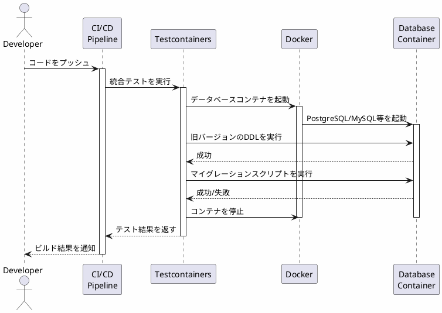

*このドキュメントは生成AI(Claude Sonnet 4.5)によって2026年1月5日に生成されました。*

# Issue #4289: DDLマイグレーションスクリプトの統合テスト追加

## 課題概要

### 背景
Spring Batchでは、データベースにジョブの実行履歴やステップの状態を保存するために、専用のテーブル構造(メタデータテーブル)が必要です。これらのテーブルを作成するためのDDLスクリプト(データベース定義言語スクリプト)が各データベース用に用意されています。

**Spring Batchとは**: Spring Batchは、大量のデータを効率的に処理するためのJavaフレームワークです。例えば、数百万件のデータをファイルから読み込んで加工し、データベースに保存するような「バッチ処理」を簡単に実装できます。

**DDLスクリプトとは**: データベースにテーブルを作成したり、カラムを追加したりするためのSQL文です。Spring Batchでは、バージョンアップ時にテーブル構造を変更する「マイグレーションスクリプト」も提供されています。

### 問題点
過去に#4260や#4271のような問題が発生しました。これらは、マイグレーションスクリプトに構文エラーや実行エラーが含まれていた事例です。スクリプトが実際のデータベースで正しく動作するかを検証する自動テストがなかったため、リリース後にユーザーが問題に遭遇していました。

### 影響範囲
- Spring Batchを使用する全てのプロジェクト
- 特にバージョンアップ時のマイグレーション作業を行う開発者
- PostgreSQL、MySQL、Oracle、SQL Serverなど、複数のデータベースを使用する環境

## 原因

### 技術的な原因
1. **検証プロセスの欠如**: DDLスクリプトやマイグレーションスクリプトを実際のデータベースに対して実行する自動テストが存在しなかった
2. **手動検証の限界**: 複数のデータベース(PostgreSQL、MySQL、Oracleなど)に対して毎回手動でスクリプトを検証するのは非現実的
3. **リグレッションリスク**: スクリプトの修正時に、他のバージョンやデータベースでの動作を壊してしまう可能性

## 対応方針

### 解決アプローチ
統合テストを作成し、各データベースに対してDDLスクリプトとマイグレーションスクリプトが正しく実行できることを自動検証する仕組みを導入しました。

### 実装内容

#### 1. Testcontainersを使用した統合テスト
**Testcontainersとは**: テスト実行時に、Dockerコンテナとして実際のデータベースを自動起動・停止できるJavaライブラリです。これにより、ローカル環境に依存せず、常に同じ環境でテストできます。

```java
@Testcontainers
class PostgreSQLMigrationScriptIntegrationTests {
    
    // PostgreSQLコンテナを自動起動
    @Container
    public static PostgreSQLContainer<?> postgres = 
        new PostgreSQLContainer<>(DockerImageName.parse("postgres:13.3"));
    
    @Test
    void migrationScriptShouldBeValid() {
        // データソース(データベース接続)を設定
        PGSimpleDataSource datasource = new PGSimpleDataSource();
        datasource.setURL(postgres.getJdbcUrl());
        
        // スクリプトを実行
        ResourceDatabasePopulator databasePopulator = new ResourceDatabasePopulator();
        // 古いバージョンのスキーマを作成
        databasePopulator.addScript(new ClassPathResource(
            "/org/springframework/batch/core/schema-postgresql-4.sql"));
        // マイグレーションスクリプトを実行
        databasePopulator.addScript(new ClassPathResource(
            "/org/springframework/batch/core/migration/5.0/migration-postgresql.sql"));
        
        // エラーが発生しないことを確認
        Assertions.assertDoesNotThrow(() -> databasePopulator.execute(datasource));
    }
}
```

#### 2. 組み込みデータベース用のテスト
H2やHSQLDBなどの組み込みデータベース用にも同様のテストを作成しました。

```java
@Test
void testMigrationScript() {
    // H2データベースを組み込みで起動
    EmbeddedDatabase database = new EmbeddedDatabaseBuilder()
        .setType(EmbeddedDatabaseType.H2)
        .addScript("/org/springframework/batch/core/schema-h2.sql")
        .addScript("/org/springframework/batch/core/migration/5.0/migration-h2.sql")
        .build();
    
    // テスト後はクリーンアップ
    database.shutdown();
}
```

### テスト対象
以下のデータベースに対して統合テストを追加:
- PostgreSQL
- MySQL
- Oracle
- SQL Server
- DB2
- H2 (組み込み)
- HSQLDB (組み込み)

### 実装されたコミット

| コミット | 内容 |
|---------|------|
| d79971b | PostgreSQL用統合テスト追加 |
| b095f10 | MySQL用統合テスト追加 |
| 45c175b | Oracle用統合テスト追加 |
| 1f11625 | SQL Server用統合テスト追加 |
| 8608e18 | DB2用統合テスト追加 |
| ced1cbf | H2用統合テスト追加 |
| 01619c6 | HSQLDB用統合テスト追加 |
| b2c63d3 | テストインフラの改善 |
| 9a422fa | 最終調整とドキュメント更新 |

### テスト実行フロー



## メリット

### 開発者への利点
1. **自動検証**: スクリプトの変更時に自動的にテストが実行され、問題を早期発見
2. **信頼性向上**: リリース前に複数のデータベースでの動作を保証
3. **リグレッション防止**: 既存のスクリプトへの影響を即座に検出

### ユーザーへの利点
1. **スムーズなマイグレーション**: バージョンアップ時のデータベーススキーマ更新が確実に成功
2. **ダウンタイムの削減**: スクリプトエラーによる運用停止のリスク低減
3. **安心して利用できる**: 品質保証されたマイグレーションスクリプト

### テスト対象の比較表

| データベース | テスト方法 | 実行環境 | 検証内容 |
|-------------|-----------|---------|---------|
| PostgreSQL | Testcontainers | Docker | スキーマ作成＋マイグレーション |
| MySQL | Testcontainers | Docker | スキーマ作成＋マイグレーション |
| Oracle | Testcontainers | Docker | スキーマ作成＋マイグレーション |
| SQL Server | Testcontainers | Docker | スキーマ作成＋マイグレーション |
| H2 | EmbeddedDatabase | JVM内 | スキーマ作成＋マイグレーション |
| HSQLDB | EmbeddedDatabase | JVM内 | スキーマ作成＋マイグレーション |

## 学習ポイント(入門者向け)

### Testcontainersの利点
- **環境の一貫性**: 開発者のローカル環境、CI/CD環境で同じデータベースバージョンを使用
- **クリーンな状態**: テストごとに新しいコンテナを起動するため、データが残らない
- **並列実行可能**: 複数のテストを同時実行してもコンテナが独立しているため干渉しない

### Spring Batchのメタデータテーブル
Spring Batchが使用する主なテーブル:
- `BATCH_JOB_INSTANCE`: ジョブの実行インスタンス
- `BATCH_JOB_EXECUTION`: ジョブの実行履歴
- `BATCH_STEP_EXECUTION`: ステップの実行履歴
- `BATCH_JOB_EXECUTION_PARAMS`: ジョブパラメータ

これらのテーブルがないと、Spring Batchは動作しません。
