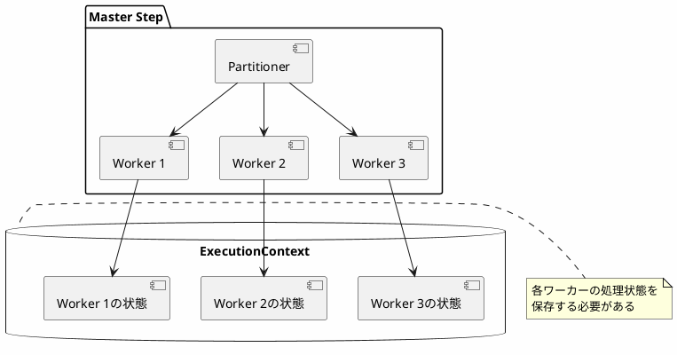
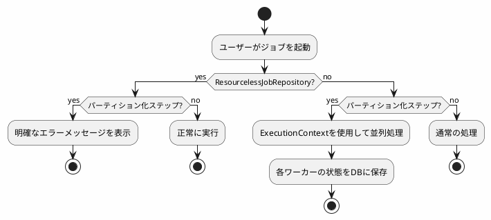

*このドキュメントは生成AI(Claude Sonnet 4.5)によって2026年1月5日に生成されました。*

# Issue #4732: ResourcelessJobRepositoryとPartitionerの互換性問題

## 課題概要

### 問題の発見
ユーザーが`ResourcelessJobRepository`をパーティション化されたステップ(Partitioned Step)と組み合わせて使用した際に、不正確で誤解を招くエラーメッセージが表示される問題が報告されました。

**ResourcelessJobRepositoryとは**: Spring Batch 5.0で導入された、データベースを必要としない軽量なジョブリポジトリです。通常、Spring Batchはジョブの実行履歴をデータベースに保存しますが、このリポジトリはメモリ上でのみ動作し、永続化を行いません。開発環境やテスト環境で便利です。

**Partitionerとは**: 大量のデータを複数の部分(パーティション)に分割して、並列処理を行う仕組みです。例えば、100万件のデータを10個のパーティションに分けて、それぞれを別スレッドで処理することで、処理時間を大幅に短縮できます。

### エラーメッセージの問題点
```
Cannot restart step from STARTING status. The old execution may still be executing, 
so you may need to verify manually that this is the case.
```

このメッセージは「再起動(restart)」について言及していますが、実際にはジョブの再起動を試みていないため、ユーザーを混乱させていました。

### 影響範囲
- `ResourcelessJobRepository`を使用するプロジェクト
- パーティション化されたステップを含むバッチジョブ
- 特に開発・テスト環境でのデバッグ作業

## 原因

### 技術的な背景

#### 1. ResourcelessJobRepositoryの制約
`ResourcelessJobRepository`は以下の機能をサポートしていません:
- 実行コンテキスト(ExecutionContext)の永続化
- ジョブの再起動機能
- ステップの状態管理

#### 2. Partitionerの要件
パーティション化されたステップは、以下の理由で実行コンテキストが必須です:



#### 3. エラーメッセージの不正確さ
内部的には「実行コンテキストがサポートされていない」ことが原因ですが、エラーメッセージは「再起動の問題」として報告されていました。これは、以下のコード部分で発生していました:

```java
// 実際のエラー発生箇所
if (executionContext == null) {
    throw new JobExecutionException(
        "Cannot restart step from STARTING status..."
    );
}
```

## 対応方針

### 解決アプローチ
コミット`69331c5`で、より明確で正確なエラーメッセージを提供するように改善されました。

### 実装内容

#### 1. エラーメッセージの改善
新しいエラーメッセージは、以下の情報を明確に伝えます:
- `ResourcelessJobRepository`が原因であること
- パーティション化されたステップと互換性がないこと
- 実行コンテキストのサポートが必要であること

改善後のメッセージ例:
```
ResourcelessJobRepository cannot be used with partitioned steps 
as it does not support execution context.
```

#### 2. ドキュメントの更新
以下のドキュメントが更新されました:
- [Javadoc](https://docs.spring.io/spring-batch/docs/current/api/org/springframework/batch/core/repository/support/ResourcelessJobRepository.html)
- [リファレンスドキュメント](https://docs.spring.io/spring-batch/reference/whatsnew.html#new-resourceless-job-repository)

### 互換性マトリックス

| 機能 | ResourcelessJobRepository | 通常のJobRepository |
|-----|--------------------------|-------------------|
| シンプルなステップ | ✅ サポート | ✅ サポート |
| パーティション化ステップ | ❌ 非サポート | ✅ サポート |
| ジョブの再起動 | ❌ 非サポート | ✅ サポート |
| 実行コンテキストの永続化 | ❌ 非サポート | ✅ サポート |
| データベース不要 | ✅ 利点 | ❌ 必要 |

### 推奨される使用方法

#### ResourcelessJobRepositoryが適している場合
```java
@Configuration
public class SimpleJobConfig {
    
    @Bean
    public Job simpleJob(JobRepository jobRepository) {
        return new JobBuilder("simpleJob", jobRepository)
            .start(simpleStep())
            .build();
    }
    
    @Bean
    public Step simpleStep() {
        return new StepBuilder("simpleStep", jobRepository)
            .tasklet((contribution, chunkContext) -> {
                // シンプルな処理
                System.out.println("Processing...");
                return RepeatStatus.FINISHED;
            })
            .build();
    }
}
```

#### 通常のJobRepositoryが必要な場合
```java
@Configuration
public class PartitionedJobConfig {
    
    @Bean
    public Job partitionedJob(JobRepository jobRepository) {
        return new JobBuilder("partitionedJob", jobRepository)
            .start(masterStep())
            .build();
    }
    
    @Bean
    public Step masterStep() {
        return new StepBuilder("masterStep", jobRepository)
            .partitioner("workerStep", partitioner())
            .step(workerStep())
            .gridSize(10)  // 10個のパーティションに分割
            .taskExecutor(taskExecutor())
            .build();
    }
    
    @Bean
    public Partitioner partitioner() {
        // パーティション分割ロジック
        return gridSize -> {
            Map<String, ExecutionContext> partitions = new HashMap<>();
            for (int i = 0; i < gridSize; i++) {
                ExecutionContext context = new ExecutionContext();
                context.putInt("partitionNumber", i);
                partitions.put("partition" + i, context);
            }
            return partitions;
        };
    }
}
```

### 処理フロー図



## メリット

### 開発者への利点
1. **問題の早期発見**: 設定ミスをすぐに特定できる
2. **明確な解決策**: エラーメッセージから対処方法が分かる
3. **デバッグ時間の削減**: 無駄な調査時間を削減

### ユーザーへの利点
1. **適切なリポジトリ選択**: 要件に応じた正しいJobRepositoryを選択できる
2. **予期しないエラー回避**: 実行時の問題を未然に防げる

## 学習ポイント(入門者向け)

### JobRepositoryの役割
Spring BatchのJobRepositoryは、以下の情報を管理します:
1. **JobInstance**: ジョブの論理的な実行単位
2. **JobExecution**: ジョブの物理的な実行履歴
3. **StepExecution**: ステップの実行履歴
4. **ExecutionContext**: 実行中の状態データ

### Partitionerの仕組み
```
大きなデータセット (100万件)
    ↓ 分割
パーティション1 (0-10万件)   ──→ ワーカー1
パーティション2 (10-20万件)  ──→ ワーカー2
パーティション3 (20-30万件)  ──→ ワーカー3
    ...
パーティション10 (90-100万件) ──→ ワーカー10
    ↓ 並列処理
全ワーカー完了 → ステップ完了
```

各ワーカーの処理状態を追跡するため、ExecutionContextの永続化が必要です。

### 選択ガイド

| 要件 | 推奨リポジトリ |
|-----|--------------|
| 開発環境でのクイックテスト | ResourcelessJobRepository |
| 本番環境での実行 | JdbcJobRepository |
| パーティション化が必要 | JdbcJobRepository |
| ジョブの再起動が必要 | JdbcJobRepository |
| データベース不要 | ResourcelessJobRepository |
