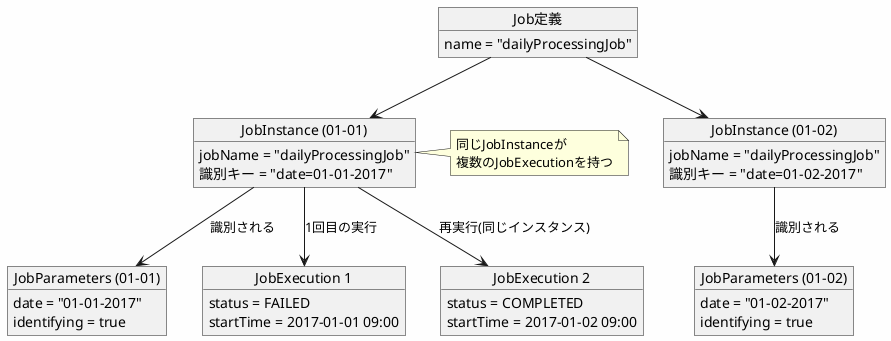
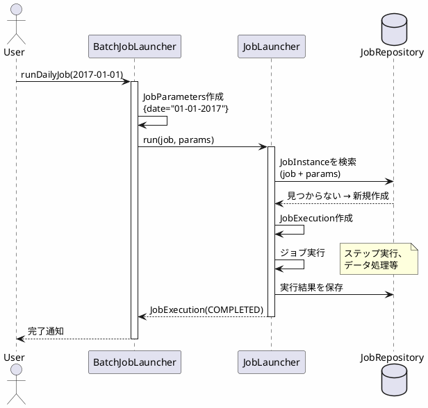

*このドキュメントは生成AI(Claude Sonnet 4.5)によって2026年1月5日に生成されました。*

# Issue #4791: ジョブパラメータの例への不明確な参照の修正

## 課題概要

### 問題の発見
Spring Batchのリファレンスドキュメントにおいて、ジョブパラメータ(`JobParameters`)に関する説明で、前のセクションの例を参照しているにもかかわらず、そのことが明確に示されていませんでした。

**JobParametersとは**: Spring Batchでジョブを実行する際に渡すパラメータです。例えば、「2017年1月1日のデータを処理する」ジョブと「2017年1月2日のデータを処理する」ジョブは、同じジョブ定義ですが、異なるパラメータで実行されます。

### 具体的な問題
ドキュメントの「JobParameters」セクションに以下の記述がありました:

> 前述の例では、1月1日の1つのインスタンスと1月2日の別のインスタンスがありますが、実際にはJobは1つしかなく、2つのJobParameterオブジェクトを持っています。

しかし、この文章が参照している「例」がどこにあるのかが明示されておらず、読者が混乱する可能性がありました。

### 影響範囲
- Spring Batchのドキュメントを読む全ての開発者
- 特に初めてSpring Batchを学習する入門者

## 原因

### ドキュメント構造の問題
実際には、この説明は前のセクション「JobInstance」で説明された例を引き継いでいました:

**JobInstanceセクションの内容**:
```
たとえば、1月1日の実行、1月2日の実行などがあります。
1月1日の実行が最初に失敗し、翌日に再実行された場合、
それは依然として1月1日の実行です。
```

しかし、JobParametersセクションでは、この例への明示的なリンクや参照がありませんでした。

### JobInstanceとJobParametersの関係



## 対応方針

### 解決アプローチ
コミット`8020331`で、ドキュメントにJobInstanceセクションへの明示的なリンクを追加しました。

### 実装内容

#### 修正前のテキスト
```
前述の例では、1月1日の1つのインスタンスと1月2日の別のインスタンスがありますが、
実際にはJobは1つしかなく、2つのJobParameterオブジェクトを持っています。
```

#### 修正後のテキスト
```
[JobInstanceセクション](https://docs.spring.io/spring-batch/reference/domain.html#jobinstance)
で述べた例では、1月1日の1つのインスタンスと1月2日の別のインスタンスがありますが、
実際にはJobは1つしかなく、2つのJobParameterオブジェクトを持っています。
```

### ドキュメント構造の改善

| セクション | 内容 | 参照関係 |
|----------|------|---------|
| JobInstance | ジョブの論理的な実行単位の説明 | 基本概念 |
| JobParameters | ジョブに渡すパラメータの説明 | JobInstanceを参照 |
| JobExecution | ジョブの物理的な実行履歴の説明 | JobInstanceを参照 |

## メリット

### ドキュメント利用者への利点
1. **理解の容易さ**: 参照関係が明確になり、概念を理解しやすくなる
2. **学習効率の向上**: 関連するセクションをすぐに確認できる
3. **混乱の回避**: 「どの例?」という疑問が発生しない

### ドキュメント保守者への利点
1. **一貫性の向上**: ドキュメント全体で参照方法が統一される
2. **フィードバック削減**: 同様の質問や指摘が減る

## 学習ポイント(入門者向け)

### Spring Batchの基本概念の関係

#### 1. Job(ジョブ定義)
```java
@Bean
public Job dailyProcessingJob(JobRepository jobRepository, Step step1) {
    return new JobBuilder("dailyProcessingJob", jobRepository)
        .start(step1)
        .build();
}
```
これは「設計図」のようなものです。1つのアプリケーションに1つだけ存在します。

#### 2. JobParameters(ジョブパラメータ)
```java
JobParameters params1 = new JobParametersBuilder()
    .addString("date", "01-01-2017")
    .toJobParameters();

JobParameters params2 = new JobParametersBuilder()
    .addString("date", "01-02-2017")
    .toJobParameters();
```
ジョブに渡す「引数」のようなものです。実行ごとに異なる値を渡せます。

#### 3. JobInstance(ジョブインスタンス)
```
JobInstance = Job + 識別可能なJobParameters

例:
- JobInstance 1 = dailyProcessingJob + {date=01-01-2017}
- JobInstance 2 = dailyProcessingJob + {date=01-02-2017}
```
「特定のパラメータでの特定のジョブ」を表します。論理的な実行単位です。

#### 4. JobExecution(ジョブ実行)
```
JobExecution = JobInstanceの物理的な実行記録

例:
- JobExecution 1: 1月1日 09:00 実行 → FAILED
- JobExecution 2: 1月2日 09:00 実行(再実行) → COMPLETED
```
実際にジョブが実行された記録です。同じJobInstanceが複数のJobExecutionを持つことがあります(失敗して再実行した場合など)。

### 実際の使用例

```java
@Service
public class BatchJobLauncher {
    
    @Autowired
    private JobLauncher jobLauncher;
    
    @Autowired
    private Job dailyProcessingJob;
    
    public void runDailyJob(LocalDate date) throws Exception {
        // 1. JobParametersを作成
        JobParameters jobParameters = new JobParametersBuilder()
            .addString("date", date.toString())
            .addLong("timestamp", System.currentTimeMillis())  // 実行時刻
            .toJobParameters();
        
        // 2. ジョブを起動
        JobExecution execution = jobLauncher.run(dailyProcessingJob, jobParameters);
        
        // 3. 結果を確認
        if (execution.getStatus() == BatchStatus.COMPLETED) {
            System.out.println("ジョブが正常に完了しました");
        } else {
            System.out.println("ジョブが失敗しました: " + execution.getExitStatus());
        }
    }
}
```

### 実行例のフロー



### 同じジョブの再実行

```java
// 1回目の実行(失敗)
JobParameters params = new JobParametersBuilder()
    .addString("date", "01-01-2017")
    .toJobParameters();

JobExecution execution1 = jobLauncher.run(job, params);
// 結果: FAILED

// 2回目の実行(再実行)
// 同じパラメータで再実行
JobExecution execution2 = jobLauncher.run(job, params);
// 結果: COMPLETED

// この場合:
// - JobInstanceは1つ(同じパラメータなので)
// - JobExecutionは2つ(物理的な実行が2回)
```

### 重要な注意点

1. **識別パラメータ**: デフォルトでは、全てのパラメータがJobInstanceの識別に使用されます
2. **非識別パラメータ**: 識別に使用したくないパラメータは明示的に設定できます

```java
JobParameters params = new JobParametersBuilder()
    .addString("date", "01-01-2017")  // 識別用
    .addLong("timestamp", System.currentTimeMillis(), false)  // 非識別用
    .toJobParameters();
```

この場合、`timestamp`が異なっていても、`date`が同じであれば同じJobInstanceとみなされます。
