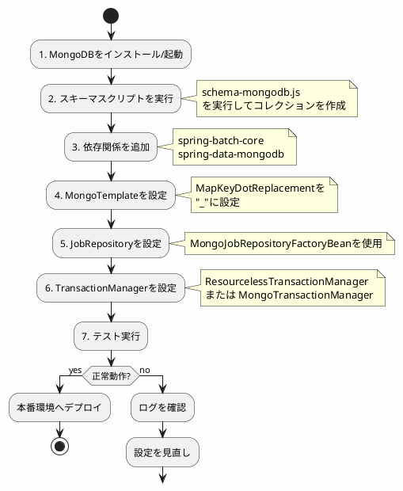

*このドキュメントは生成AI(Claude Sonnet 4.5)によって2026年1月5日に生成されました。*

# Issue #4859: MongoDBジョブリポジトリ設定の明確化

## 課題概要

### 問題の発見
Spring Batch 5.2でMongoDBをジョブリポジトリとして使用できるようになりましたが、その設定方法がリファレンスドキュメントで十分に説明されていませんでした。

**MongoDBジョブリポジトリとは**: Spring Batch 5.2から導入された、MongoDBをバッチジョブのメタデータ保存先として使用できる機能です。従来のRDBMS(PostgreSQL、MySQLなど)の代わりに、NoSQLデータベースであるMongoDBを使用できます。

**NoSQLとRDBMSの違い**:
- **RDBMS**: 行と列の表形式でデータを保存(PostgreSQL、MySQLなど)
- **NoSQL**: JSONのようなドキュメント形式でデータを保存(MongoDBなど)

### 具体的な不足情報
リファレンスドキュメントの「Configuring a JobRepository」セクションでは、MongoDBを使用する際の以下の情報が不足していました:

1. **DDLスクリプトの実行**: ジョブ実行前に必要なコレクション(テーブルに相当)の作成方法
2. **特殊な設定**: `MapKeyDotReplacement`などの必須設定
3. **前提条件**: MongoDB固有の設定要件

### 影響範囲
- MongoDBをジョブリポジトリとして使用したい開発者
- 既存のMongoDBインフラを活用したいプロジェクト
- マイクロサービス環境でSpring Batchを使用するケース

## 原因

### ドキュメント構造の問題
1. **情報の散在**: 「What's new in Spring Batch 5.2」セクションにMongoDBに関する注記があったが、詳細が不足
2. **設定手順の欠如**: 実際の設定手順が体系的に記載されていなかった
3. **トラブルシューティング情報の不足**: よくあるエラーや解決方法が記載されていなかった

### MongoDBジョブリポジトリの技術的要件

#### 1. コレクション構造
MongoDBでは、RDBMSのテーブルに相当する「コレクション」が必要です:

| RDBMSテーブル | MongoDBコレクション | 用途 |
|--------------|-------------------|------|
| BATCH_JOB_INSTANCE | jobInstance | ジョブインスタンスの保存 |
| BATCH_JOB_EXECUTION | jobExecution | ジョブ実行履歴の保存 |
| BATCH_STEP_EXECUTION | stepExecution | ステップ実行履歴の保存 |
| BATCH_JOB_EXECUTION_PARAMS | - | パラメータはjobExecutionに埋め込み |

#### 2. MapKeyDotReplacementの必要性
MongoDBでは、ドキュメントのキーに`.`(ドット)を含めることができません。しかし、Spring BatchのExecutionContextには`.`を含むキーが使用されることがあります。

```java
// 問題となるケース
ExecutionContext context = new ExecutionContext();
context.put("my.property", "value");  // キーに"."が含まれる
```

これを解決するために、`MapKeyDotReplacement`を設定し、`.`を別の文字に置き換える必要があります。

## 対応方針

### 解決アプローチ
コミット`17bc8f7`で、リファレンスドキュメントに詳細な設定手順と前提条件を追加しました。

### 実装内容

#### 1. DDLスクリプトの準備と実行

##### スクリプトの場所
```
spring-batch-core/src/main/resources/org/springframework/batch/core/
├── schema-mongodb.js          # 初期スキーマ作成スクリプト
└── migration/
    └── 5.2/
        └── migration-mongodb.js  # マイグレーションスクリプト
```

##### スクリプトの実行方法
```javascript
// schema-mongodb.js の内容例
db.createCollection("jobInstance");
db.createCollection("jobExecution");
db.createCollection("stepExecution");

// インデックスの作成
db.jobInstance.createIndex(
    { "jobName": 1, "jobKey": 1 },
    { unique: true }
);

db.jobExecution.createIndex({ "jobInstanceId": 1 });
db.stepExecution.createIndex({ "jobExecutionId": 1 });
```

実行コマンド:
```bash
mongosh myBatchDatabase < schema-mongodb.js
```

#### 2. Spring設定の完全な例

```java
@Configuration
public class MongoDBBatchConfig {
    
    @Bean
    public MongoTemplate mongoTemplate(MongoClient mongoClient) {
        // MongoDBへの接続設定
        MongoTemplate template = new MongoTemplate(mongoClient, "myBatchDatabase");
        
        // 重要: MapKeyDotReplacementの設定
        MappingMongoConverter converter = 
            (MappingMongoConverter) template.getConverter();
        converter.setMapKeyDotReplacement("_");  // "."を"_"に置き換え
        
        return template;
    }
    
    @Bean
    public JobRepository jobRepository(MongoTemplate mongoTemplate) 
            throws Exception {
        // MongoDBJobRepositoryの設定
        MongoJobRepositoryFactoryBean factory = 
            new MongoJobRepositoryFactoryBean();
        factory.setMongoOperations(mongoTemplate);
        factory.afterPropertiesSet();
        
        return factory.getObject();
    }
    
    @Bean
    public PlatformTransactionManager transactionManager() {
        // MongoDBはトランザクションをサポートするが、
        // シンプルなケースではResourcelessTransactionManagerで十分
        return new ResourcelessTransactionManager();
    }
}
```

#### 3. application.propertiesでの設定

```properties
# MongoDBの接続設定
spring.data.mongodb.uri=mongodb://localhost:27017/myBatchDatabase
spring.data.mongodb.database=myBatchDatabase

# MongoDBジョブリポジトリの有効化
spring.batch.job.repository.type=mongodb

# MapKeyDotReplacementの設定
spring.data.mongodb.field-naming-strategy=org.springframework.data.mongodb.core.mapping.SnakeCaseFieldNamingStrategy
```

### データフロー図

```plantuml
@startuml
skinparam backgroundColor #FEFEFE

package "Spring Batchアプリケーション" {
  [JobLauncher]
  [Job]
  [Step]
  
  interface "JobRepository" as repo
  class "MongoJobRepository" as mongoRepo
}

database "MongoDB" {
  collections {
    [jobInstance]
    [jobExecution]
    [stepExecution]
  }
}

[JobLauncher] --> repo
repo <|.. mongoRepo
mongoRepo --> [jobInstance]
mongoRepo --> [jobExecution]
mongoRepo --> [stepExecution]

[Job] --> [Step]
[Step] ..> repo : メタデータ保存

note right of mongoRepo
  MapKeyDotReplacementで
  "."を"_"に変換
  
  例:
  "my.property" → "my_property"
end note

@enduml
```

### MongoDB vs RDBMS比較

| 特徴 | RDBMS | MongoDB |
|-----|-------|---------|
| データ形式 | 行と列(テーブル) | JSON形式(ドキュメント) |
| スキーマ | 固定的 | 柔軟 |
| トランザクション | 完全サポート | レプリカセットで可能 |
| インデックス | 標準SQL | MongoDB独自 |
| 設定の複雑さ | シンプル | やや複雑 |
| 水平スケーリング | 困難 | 容易(シャーディング) |

### 設定手順のチェックリスト



## メリット

### MongoDBを使用する利点
1. **スケーラビリティ**: 水平スケーリングが容易
2. **柔軟性**: スキーマ変更が容易
3. **既存インフラの活用**: 既にMongoDBを使用している場合、追加のRDBMSが不要
4. **マイクロサービス親和性**: ドキュメント指向がマイクロサービスアーキテクチャに適している

### ドキュメント改善の利点
1. **セットアップ時間の短縮**: 明確な手順により、迅速な導入が可能
2. **トラブルシューティングの効率化**: よくある問題と解決策が記載されている
3. **学習曲線の緩和**: 初心者でもMongoDBジョブリポジトリを使用できる

## 学習ポイント(入門者向け)

### MongoDBの基本概念

#### 1. コレクション(Collection)
RDBMSのテーブルに相当します。

```javascript
// RDBMSのテーブル作成
CREATE TABLE job_instance (
    job_instance_id BIGINT PRIMARY KEY,
    job_name VARCHAR(100) NOT NULL
);

// MongoDBのコレクション作成
db.createCollection("jobInstance");
```

#### 2. ドキュメント(Document)
RDBMSの行に相当します。JSON形式で保存されます。

```json
// jobInstanceコレクションのドキュメント例
{
  "_id": ObjectId("507f1f77bcf86cd799439011"),
  "jobName": "dailyProcessingJob",
  "jobKey": "date=01-01-2017",
  "version": 0
}
```

#### 3. インデックス
検索を高速化するための仕組みです。

```javascript
// ユニークインデックスの作成
db.jobInstance.createIndex(
    { "jobName": 1, "jobKey": 1 },
    { unique: true }
);
```

### MapKeyDotReplacementの動作

#### 問題のあるケース
```java
// ExecutionContextにドットを含むキーを設定
ExecutionContext context = new ExecutionContext();
context.put("file.path", "/data/input.csv");
context.put("record.count", 1000);
```

MongoDBに保存しようとすると:
```
MongoWriteException: Document failed validation
```

#### 解決後の動作
```java
// MapKeyDotReplacement設定後
converter.setMapKeyDotReplacement("_");
```

MongoDBに保存されるドキュメント:
```json
{
  "executionContext": {
    "file_path": "/data/input.csv",
    "record_count": 1000
  }
}
```

### 実装例: 完全な設定

```java
@Configuration
@EnableBatchProcessing
public class CompleteMongoBatchConfig {
    
    @Value("${spring.data.mongodb.uri}")
    private String mongoUri;
    
    @Bean
    public MongoClient mongoClient() {
        return MongoClients.create(mongoUri);
    }
    
    @Bean
    public MongoTemplate mongoTemplate(MongoClient mongoClient) {
        MongoTemplate template = new MongoTemplate(
            mongoClient, 
            "batchDatabase"
        );
        
        // MapKeyDotReplacementの設定
        MappingMongoConverter converter = 
            (MappingMongoConverter) template.getConverter();
        converter.setMapKeyDotReplacement("_");
        
        return template;
    }
    
    @Bean
    public Job myJob(JobRepository jobRepository, Step myStep) {
        return new JobBuilder("myJob", jobRepository)
            .start(myStep)
            .build();
    }
    
    @Bean
    public Step myStep(JobRepository jobRepository, 
                       PlatformTransactionManager transactionManager) {
        return new StepBuilder("myStep", jobRepository)
            .<String, String>chunk(10, transactionManager)
            .reader(reader())
            .processor(processor())
            .writer(writer())
            .build();
    }
}
```

### トラブルシューティング

| エラー | 原因 | 解決方法 |
|-------|------|---------|
| Document failed validation | キーに`.`が含まれる | MapKeyDotReplacementを設定 |
| Collection not found | スキーマスクリプト未実行 | schema-mongodb.jsを実行 |
| Connection refused | MongoDBが起動していない | MongoDBを起動 |
| Duplicate key error | 同じジョブパラメータで再実行 | パラメータを変更 |
