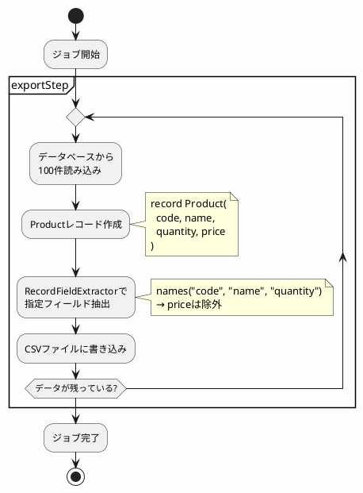

*このドキュメントは生成AI(Claude Sonnet 4.5)によって2026年1月5日に生成されました。*

# Issue #4916: FlatFileItemWriterBuilderのRecordFieldExtractor設定不具合

## 課題概要

### 問題の発見
`FlatFileItemWriterBuilder`を使用してCSVファイルなどのフラットファイルを出力する際、Javaのrecord型を`sourceType()`で指定し、`names()`でフィールド名を指定しても、`names()`の設定が無視される問題が報告されました。

**Recordとは**: Java 14で導入された、イミュータブル(変更不可)なデータクラスを簡潔に定義できる機能です。

```java
// 従来のクラス定義
public class Person {
    private final String name;
    private final int age;
    
    public Person(String name, int age) {
        this.name = name;
        this.age = age;
    }
    
    // getter、equals、hashCodeなどが必要
}

// Record型
public record Person(String name, int age) {}  // これだけ!
```

**FlatFileItemWriterとは**: Spring Batchで、CSVやタブ区切りなどのテキストファイルにデータを書き込むためのクラスです。

### 具体的な問題

```java
public record MyRecord(String name, int age, String address) {}

FlatFileItemWriter<MyRecord> writer = new FlatFileItemWriterBuilder<MyRecord>()
    .name("myRecordWriter")
    .resource(new FileSystemResource("output.csv"))
    .sourceType(MyRecord.class)  // Record型を指定
    .names("name", "age")        // この設定が無視される!
    .delimited()
    .build();

// 期待される出力: name, age のみ
// 実際の出力: name, age, address (全フィールドが出力される)
```

### 影響範囲
- Java Record型を使用してSpring Batchでファイル出力を行うプロジェクト
- 特定のフィールドのみを出力したい場合
- Spring Batch 5.2以降でRecord型のサポートが追加された後のプロジェクト

## 原因

### 技術的な原因

#### 1. RecordFieldExtractorの実装
`FlatFileItemWriterBuilder`は、Record型を検出すると`RecordFieldExtractor`を使用します:

```java
// 問題のあるコード(修正前)
if (this.sourceType != null && this.sourceType.isRecord()) {
    this.fieldExtractor = new RecordFieldExtractor<>(this.sourceType);
    // names()の設定が渡されていない!
}
```

#### 2. BeanWrapperFieldExtractorとの不整合
一方、通常のクラスの場合は`BeanWrapperFieldExtractor`が使用され、こちらは`names()`の設定を正しく反映します:

```java
// 通常のクラスの場合
if (this.sourceType != null && !this.sourceType.isRecord()) {
    BeanWrapperFieldExtractor<T> extractor = new BeanWrapperFieldExtractor<>();
    extractor.setNames(this.names.toArray(new String[0]));  // ✅ 設定される
    this.fieldExtractor = extractor;
}
```

### 動作比較図

```plantuml
@startuml
skinparam backgroundColor #FEFEFE

package "修正前の動作" {
  class "MyRecord" as record1 {
    name: String
    age: int
    address: String
  }
  
  class "RecordFieldExtractor" as extractor1 {
    - names: null
  }
  
  file "output.csv" as csv1 {
    name,age,address
    John,30,Tokyo
  }
  
  record1 --> extractor1 : 全フィールド抽出
  extractor1 --> csv1 : 全て出力
}

package "修正後の動作" {
  class "MyRecord" as record2 {
    name: String
    age: int
    address: String
  }
  
  class "RecordFieldExtractor" as extractor2 {
    - names: ["name", "age"]
  }
  
  file "output.csv" as csv2 {
    name,age
    John,30
  }
  
  record2 --> extractor2 : 指定フィールドのみ抽出
  extractor2 --> csv2 : 指定フィールドのみ出力
}

@enduml
```

## 対応方針

### 解決アプローチ
コミット`8f56f93`および`0eeacd5`で、`names()`の設定を`RecordFieldExtractor`に渡すように修正されました。

### 実装内容

#### 修正内容

```java
// FlatFileItemWriterBuilder.build()内
// 修正前
if (this.sourceType != null && this.sourceType.isRecord()) {
    this.fieldExtractor = new RecordFieldExtractor<>(this.sourceType);
}

// 修正後
if (this.sourceType != null && this.sourceType.isRecord()) {
    RecordFieldExtractor<T> extractor = new RecordFieldExtractor<>(this.sourceType);
    if (this.names != null && !this.names.isEmpty()) {
        extractor.setNames(this.names.toArray(new String[this.names.size()]));
    }
    this.fieldExtractor = extractor;
}
```

### 使用例

#### 基本的な使い方
```java
public record Employee(
    Long id,
    String name, 
    int age, 
    String department,
    Double salary
) {}

@Bean
public FlatFileItemWriter<Employee> employeeWriter() {
    return new FlatFileItemWriterBuilder<Employee>()
        .name("employeeWriter")
        .resource(new FileSystemResource("output/employees.csv"))
        .sourceType(Employee.class)
        .names("name", "age", "department")  // id と salary は出力しない
        .delimited()
        .delimiter(",")
        .build();
}
```

出力結果:
```csv
name,age,department
John Smith,30,Engineering
Jane Doe,25,Marketing
Bob Johnson,35,Sales
```

#### ヘッダー付きCSV
```java
@Bean
public FlatFileItemWriter<Employee> employeeWriterWithHeader() {
    return new FlatFileItemWriterBuilder<Employee>()
        .name("employeeWriter")
        .resource(new FileSystemResource("output/employees.csv"))
        .sourceType(Employee.class)
        .names("name", "age", "department")
        .delimited()
        .delimiter(",")
        .headerCallback(writer -> {
            writer.write("氏名,年齢,部署");  // 日本語ヘッダー
        })
        .build();
}
```

出力結果:
```csv
氏名,年齢,部署
John Smith,30,Engineering
Jane Doe,25,Marketing
```

#### カスタムフォーマット
```java
@Bean
public FlatFileItemWriter<Employee> customFormatWriter() {
    return new FlatFileItemWriterBuilder<Employee>()
        .name("employeeWriter")
        .resource(new FileSystemResource("output/employees.txt"))
        .sourceType(Employee.class)
        .names("name", "age", "department")
        .formatted()  // 固定長フォーマット
        .format("%-20s%3d%-15s")  // 名前20桁、年齢3桁、部署15桁
        .build();
}
```

出力結果:
```
John Smith          30 Engineering     
Jane Doe            25 Marketing       
Bob Johnson         35 Sales           
```

### フィールド選択の戦略

| ユースケース | 設定方法 | 例 |
|------------|---------|-----|
| 全フィールド出力 | `names()`を指定しない | 全てのフィールドが出力される |
| 一部フィールド出力 | `names()`で必要なフィールドのみ指定 | `names("name", "age")` |
| 順序変更 | `names()`で出力順を指定 | `names("age", "name")` |
| 複数回使用 | 同じフィールドを複数回指定可能 | `names("name", "name")` |

## メリット

### 開発者への利点
1. **Record型の完全サポート**: モダンなJavaの機能を制限なく使用できる
2. **一貫性**: 通常のクラスとRecord型で同じ動作になる
3. **柔軟性**: 必要なフィールドのみを選択的に出力できる

### プロジェクトへの利点
1. **コードの簡潔性**: Record型を使用することでボイラープレートコードを削減
2. **保守性向上**: フィールドの追加/削除が容易
3. **型安全性**: コンパイル時に型チェックされる

## 学習ポイント(入門者向け)

### Record型の利点

#### 従来のJavaBean
```java
public class PersonBean {
    private String name;
    private int age;
    
    public PersonBean() {}
    
    public PersonBean(String name, int age) {
        this.name = name;
        this.age = age;
    }
    
    public String getName() { return name; }
    public void setName(String name) { this.name = name; }
    public int getAge() { return age; }
    public void setAge(int age) { this.age = age; }
    
    @Override
    public boolean equals(Object o) {
        if (this == o) return true;
        if (o == null || getClass() != o.getClass()) return false;
        PersonBean that = (PersonBean) o;
        return age == that.age && Objects.equals(name, that.name);
    }
    
    @Override
    public int hashCode() {
        return Objects.hash(name, age);
    }
    
    @Override
    public String toString() {
        return "PersonBean{name='" + name + "', age=" + age + "}";
    }
}
```

#### Record型
```java
public record Person(String name, int age) {}
// これだけで、上記のJavaBeanと同等の機能を持つ!
```

### FlatFileItemWriterの完全な例

```java
@Configuration
public class FileWriterJobConfig {
    
    // データ定義
    public record Product(
        String code,
        String name,
        int quantity,
        double price
    ) {}
    
    @Bean
    public Job exportProductJob(JobRepository jobRepository, 
                                 Step exportStep) {
        return new JobBuilder("exportProductJob", jobRepository)
            .start(exportStep)
            .build();
    }
    
    @Bean
    public Step exportStep(JobRepository jobRepository,
                          PlatformTransactionManager transactionManager) {
        return new StepBuilder("exportStep", jobRepository)
            .<Product, Product>chunk(100, transactionManager)
            .reader(productReader())
            .writer(productWriter())
            .build();
    }
    
    @Bean
    public ItemReader<Product> productReader() {
        // データベースから商品情報を読み込む
        return new JdbcCursorItemReaderBuilder<Product>()
            .name("productReader")
            .dataSource(dataSource())
            .sql("SELECT code, name, quantity, price FROM products")
            .rowMapper((rs, rowNum) -> new Product(
                rs.getString("code"),
                rs.getString("name"),
                rs.getInt("quantity"),
                rs.getDouble("price")
            ))
            .build();
    }
    
    @Bean
    public FlatFileItemWriter<Product> productWriter() {
        return new FlatFileItemWriterBuilder<Product>()
            .name("productWriter")
            .resource(new FileSystemResource("output/products.csv"))
            .sourceType(Product.class)
            .names("code", "name", "quantity")  // priceは出力しない
            .delimited()
            .delimiter(",")
            .headerCallback(writer -> {
                writer.write("商品コード,商品名,在庫数");
            })
            .build();
    }
}
```

### 実行フロー



### トラブルシューティング

| 問題 | 原因 | 解決方法 |
|-----|------|---------|
| 全フィールドが出力される | `names()`が設定されていない | `names()`を明示的に指定 |
| フィールドが出力されない | フィールド名が間違っている | Record定義と一致させる |
| 文字化けが発生 | エンコーディング未設定 | `.encoding("UTF-8")`を追加 |
| ヘッダーが表示されない | headerCallbackが未設定 | `.headerCallback()`を追加 |

### Record型とBeanの選択ガイド

| 要件 | 推奨 | 理由 |
|-----|------|------|
| イミュータブルなデータ | Record | 変更不可で安全 |
| データのカプセル化 | Record | getter/setterが自動生成 |
| 継承が必要 | Bean | Recordは継承不可 |
| ミュータブル(変更可能) | Bean | Recordは変更不可 |
| 簡潔なコード | Record | ボイラープレート不要 |
