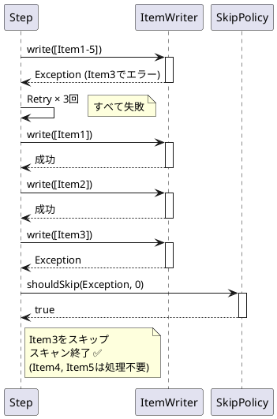

*このドキュメントは生成AI(Claude Sonnet 4.5)によって2026年1月5日に生成されました。*

# Issue #5091: Writerリトライ使い果たし時のChunk全体スキャンの最適化

## 課題概要

Spring Batch 6.0において、`ItemWriter`でリトライが使い果たされた場合、常にChunk全体がスキャンされる動作が最適化されました。実際には**1件のアイテムが問題を引き起こしている場合でも**、Chunk内のすべてのアイテムが再処理されていました。

**Chunkスキャンとは**: Writerで例外が発生した際、どのアイテムが問題を引き起こしたかを特定するため、Chunk内のアイテムを1件ずつ再処理する動作です。

## 問題の詳細

### 非効率な動作(修正前)

```
Chunk: [Item1, Item2, Item3, Item4, Item5]
         ↓
      Writer (Item3でエラー)
         ↓
    Retry × 3回
         ↓
    リトライ使い果たし
         ↓
    Chunk全体をスキャン (5件すべて1件ずつ再処理)
    - Item1 → 書き込み成功
    - Item2 → 書き込み成功
    - Item3 → エラー発生 (問題のアイテム)
    - Item4 → 再処理 (不要!)
    - Item5 → 再処理 (不要!)
```

問題のアイテム(Item3)を特定した後も、Item4とItem5が再処理されます。

### 最適化された動作(修正後)

```
Chunk: [Item1, Item2, Item3, Item4, Item5]
         ↓
      Writer (Item3でエラー)
         ↓
    Retry × 3回
         ↓
    リトライ使い果たし
         ↓
    スキャン開始
    - Item1 → 書き込み成功
    - Item2 → 書き込み成功
    - Item3 → エラー発生 (問題のアイテムを特定!)
    - スキャン終了 ✅ (Item4, Item5はスキップ)
```

問題のアイテムを特定した時点でスキャンを終了します。

## 原因

従来の実装では、Writerでリトライが使い果たされた場合、常に`scan()`メソッドがChunk全体を処理していました:

```java
// 修正前の疑似コード
private void handleWriteError(Chunk chunk, Exception e) {
    if (retryExhausted(e)) {
        // Chunk全体をスキャン
        scan(chunk);  // ← 問題のアイテム発見後も続行
    }
}
```

## 対応方針

修正により、問題のアイテムが特定された時点でスキャンを終了するよう最適化されました:

```java
// 修正後の疑似コード
private void handleWriteError(Chunk chunk, Exception e) {
    if (retryExhausted(e)) {
        // 問題のアイテムが見つかるまでスキャン
        scanUntilProblemItemFound(chunk);  // ✅ 最適化
    }
}

private void scanUntilProblemItemFound(Chunk chunk) {
    for (Item item : chunk) {
        try {
            writer.write(List.of(item));
        } catch (Exception e) {
            // 問題のアイテムを特定
            handleItemError(item, e);
            return;  // ✅ ここで終了
        }
    }
}
```

## 使用例

### パフォーマンス比較

```java
@Bean
public Step importStep(JobRepository jobRepository,
                       PlatformTransactionManager transactionManager) {
    return new StepBuilder("importStep", jobRepository)
        .<Customer, Customer>chunk(100, transactionManager)
        .reader(customerReader())
        .processor(customerProcessor())
        .writer(customerWriter())
        .faultTolerant()
        .retry(DeadlockLoserDataAccessException.class)
        .retryLimit(3)
        .skip(DataIntegrityViolationException.class)
        .skipLimit(10)
        .build();
}
```

### シナリオ: 100件のChunkで90番目のアイテムがエラー

| 版 | 動作 | 再処理件数 |
|---|------|----------|
| 修正前 | 90件目でエラー特定後、91-100件目も再処理 | 100件 |
| 修正後 | 90件目でエラー特定後、スキャン終了 | 90件 |
| **改善** | **10件の不要な再処理を削減** | **-10件** |

大規模バッチ(例: Chunk=1000)では、さらに効果が顕著です。

## 学習ポイント

### Chunkスキャンの仕組み



### フォールトトレラント処理フロー

```
1. Chunk書き込み試行
   ↓ (失敗)
2. Retry設定に従い再試行
   ↓ (リトライ使い果たし)
3. Chunkスキャン開始 (1件ずつ書き込み)
   ↓
4. 問題アイテム特定
   ↓
5. SkipPolicyに照会
   ↓ (shouldSkip = true)
6. スキャン終了 ← ✅ ここで最適化!
   ↓
7. 次のChunk処理へ
```

### 適用シーン

| ケース | 効果 |
|-------|------|
| Chunk=10, エラーが9件目 | 小(1件削減) |
| Chunk=100, エラーが50件目 | 中(50件削減) |
| Chunk=1000, エラーが100件目 | 大(900件削減!) |

特に大きなChunkサイズを使用している場合、パフォーマンス向上が顕著です。

### ベストプラクティス

```java
// Chunkサイズの決定
@Bean
public Step myStep(JobRepository jobRepository,
                   PlatformTransactionManager transactionManager) {
    return new StepBuilder("myStep", jobRepository)
        .<Input, Output>chunk(determineOptimalChunkSize(), transactionManager)
        .reader(reader())
        .writer(writer())
        .faultTolerant()
        .retry(TransientException.class)
        .retryLimit(3)
        .skip(SkippableException.class)
        .skipLimit(10)
        .build();
}

private int determineOptimalChunkSize() {
    // 要素:
    // - トランザクションサイズ(小さいほど安全)
    // - スループット(大きいほど高速)
    // - メモリ使用量(大きいほど多く消費)
    // - エラー時の再処理コスト(大きいほどスキャンが長い)
    
    return 100;  // バランスの取れた値
}
```

## 注意点

- この最適化は、Writerでのリトライ使い果たし時のスキャンにのみ適用されます
- Reader/Processorでの例外処理には影響しません
- SkipPolicyが`shouldSkip = false`を返した場合、ステップは即座に失敗します
