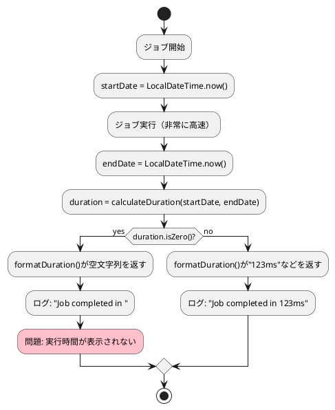

# Issue #5037: ステップやジョブが瞬時に完了した際のログ出力の問題

**Issue URL**: https://github.com/spring-projects/spring-batch/issues/5037

**関連コミット**:
- [249330b](https://github.com/spring-projects/spring-batch/commit/249330b2718492424c2df9b452279c9601c2802e)
- [f3ccc74](https://github.com/spring-projects/spring-batch/commit/f3ccc7405c9d8f1c1f8a33fdfbbcbe143799e8f7)
- [1d50d82](https://github.com/spring-projects/spring-batch/commit/1d50d829907a580fe3aea5b6a17859a418e478b9)

---

## 課題概要

### 問題の説明

Spring Batchでは、ジョブやステップが完了すると、実行時間を含むログが出力されます。しかし、ジョブが非常に高速に完了した場合（開始時刻と終了時刻がミリ秒単位で同じ場合）、ログメッセージの末尾に実行時間が表示されない問題が発生しました。

**期待されるログ**:
```
Job: [FlowJob: [name=...]] completed with the following parameters: [...] 
and the following status: [FAILED] in 0ms
```

**実際のログ**:
```
Job: [FlowJob: [name=...]] completed with the following parameters: [...] 
and the following status: [FAILED] in 
```

### 背景知識の補足

**Spring Batchのログ出力**:
- Spring Batchはジョブやステップの開始・終了時に自動的にログを出力します
- これらのログには実行時間（duration）が含まれ、パフォーマンス監視やトラブルシューティングに役立ちます

**実行時間の計算**:
- 実行時間は開始時刻（startDate）と終了時刻（endDate）から`Duration`オブジェクトとして計算されます
- `Duration.isZero()`が`true`の場合、実行時間がゼロであることを意味します

### 影響範囲

| 項目 | 内容 |
|------|------|
| **影響するバージョン** | Spring Batch 5.2.2以降 |
| **影響する機能** | ログ出力（特に高速実行されるジョブ/ステップ） |
| **重大度** | 低（機能的な問題ではなく表示の問題） |
| **発生条件** | ジョブ/ステップの開始と終了が同一ミリ秒内に発生 |

---

## 原因

### 根本原因

`BatchMetrics.formatDuration()`メソッドに以下のロジックが実装されていました:

```java
public static String formatDuration(Duration duration) {
    if (duration.isZero()) {
        return "";  // 空文字列を返す
    }
    // ... フォーマット処理
}
```

**問題点**:
1. `duration.isZero()`が`true`の場合、空文字列`""`が返される
2. ログメッセージでは `"... in " + formatDuration(duration)` のように結合される
3. 結果として `"... in "` と末尾が不完全な文字列になる

### 処理フロー



---

## 対応方針

### 修正内容

`BatchMetrics.formatDuration()`メソッドを修正し、実行時間がゼロの場合でも`"0ms"`を返すようにしました。

**修正前**:
```java
public static String formatDuration(Duration duration) {
    if (duration.isZero()) {
        return "";
    }
    // ...
}
```

**修正後**:
```java
public static String formatDuration(Duration duration) {
    if (duration.isZero()) {
        return "0ms";  // ゼロの場合も明示的に表示
    }
    // ...
}
```

### テストケースの追加

問題を検証するためのテストケースも追加されました:

```java
@Test
void testFormatDurationWhenCalculationReturnsZeroDuration() {
    var startDate = LocalDateTime.now();
    var endDate = LocalDateTime.parse(startDate.toString());
    var calculateDuration = BatchMetrics.calculateDuration(startDate, endDate);
    
    Assertions.assertNotNull(calculateDuration);
    var formattedDurationString = BatchMetrics.formatDuration(calculateDuration);
    Assertions.assertTrue(StringUtils.hasText(formattedDurationString));
}
```

### 変更の影響

| 項目 | 内容 |
|------|------|
| **互換性** | 後方互換性あり（表示のみの変更） |
| **パフォーマンス** | 影響なし |
| **リリース** | Spring Batch 6.0.1 / 5.2.xバックポート |

### 期待される結果

修正後は、実行時間がゼロの場合でも以下のように表示されます:

```
Job: [FlowJob: [name=...]] completed with the following parameters: [...] 
and the following status: [FAILED] in 0ms
```

これにより、ログの一貫性が保たれ、ジョブが実際に実行されたことが明確になります。
