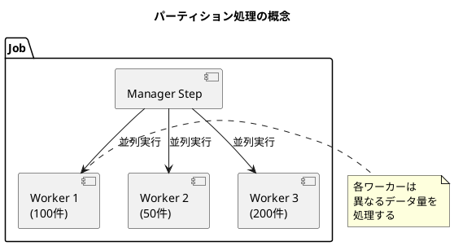
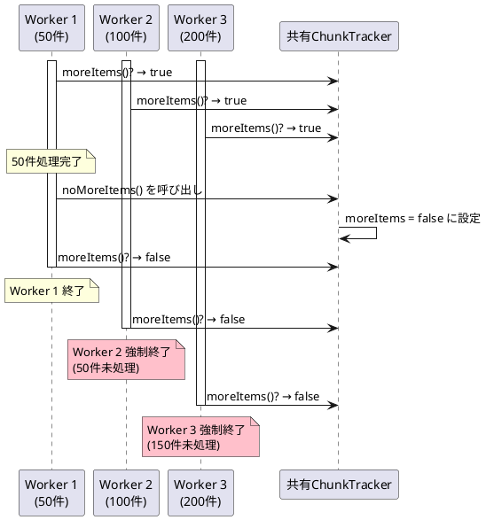
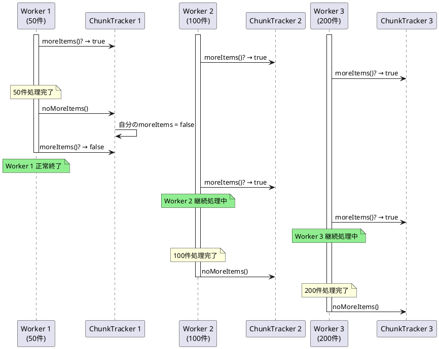

# Issue #5099: パーティション化ステップでのチャンク処理の早期終了問題

**Issue URL**: https://github.com/spring-projects/spring-batch/issues/5099

**関連コミット**:
- [a2d61f8](https://github.com/spring-projects/spring-batch/commit/a2d61f8ffa33da7680b9ca0d3f8b8195d90fab69)

---

## 課題概要

### 問題の説明

Spring Batch 6.0の新しいチャンク処理実装において、ローカルパーティション機能を使用した際に重大なバグが発生しました。複数のパーティション（並列処理単位）でデータ量が異なる場合、**最初のパーティションが完了すると、他のパーティションの処理が中断され、未処理データが残る**という問題です。

### 背景知識の補足

**パーティション処理とは**:
- 大量データを複数の小さな単位（パーティション）に分割して並列処理する機能
- 各パーティションは独立したスレッドで実行され、処理速度を向上させる



**ChunkTrackerとは**:
- チャンク処理の進行状況を追跡する内部オブジェクト
- `noMoreItems()`メソッドで「まだ処理すべきアイテムがあるか」を判定

### 影響範囲

| 項目 | 内容 |
|------|------|
| **影響するバージョン** | Spring Batch 6.0.0 |
| **影響する機能** | ローカルパーティション処理 |
| **重大度** | 高（データ喪失の可能性） |
| **発生条件** | パーティション間でデータ量が異なる場合 |

---

## 原因

### 根本原因の詳細

Spring Batch 6.0で`ChunkTracker`がインスタンス変数からスレッドローカル変数に変更されましたが、そのライフサイクル管理に問題がありました。

**問題のコード構造**:

```java
public class ChunkOrientedStep {
    // 問題: インスタンス単位で1つのChunkTrackerを共有
    private ChunkTracker chunkTracker = new ChunkTracker();
    
    protected void doExecute(StepExecution stepExecution) {
        // 各パーティションがこのメソッドを呼び出す
        while (chunkTracker.moreItems()) {  // ←ここが問題
            // チャンク処理
        }
    }
}
```

**問題の発生シーケンス**:



### 技術的な詳細

1. **ChunkOrientedStep.doExecute()** は各パーティション実行ごとに呼ばれる（3回）
2. しかし **ChunkTracker.noMoreItems()** はすべての実行で共有され、1回しか呼ばれない
3. 最初に完了したパーティションが`noMoreItems()`を呼ぶと、他のパーティションも影響を受ける

---

## 対応方針

### 修正内容

`ChunkTracker`を**ThreadLocal変数**に変更し、各スレッド（パーティション）ごとに独立したインスタンスを持つようにしました。

**修正後のコード構造**:

```java
public class ChunkOrientedStep {
    // 修正: ThreadLocalでスレッドごとに独立したインスタンス
    private ThreadLocal<ChunkTracker> chunkTracker = 
        ThreadLocal.withInitial(ChunkTracker::new);
    
    protected void doExecute(StepExecution stepExecution) {
        // 各パーティションが独自のChunkTrackerを使用
        while (chunkTracker.get().moreItems()) {
            // チャンク処理
        }
    }
    
    @Override
    protected void close(ExecutionContext executionContext) {
        // 重要: メモリリーク防止のためThreadLocalをクリア
        this.chunkTracker.remove();
        this.compositeItemStream.close();
    }
}
```

### 修正後の動作



### 追加の修正ポイント

**課題 #5126** で指摘されたように、ThreadLocalのライフサイクル管理も改善されました:

| 改善点 | 内容 |
|--------|------|
| **初期化** | `open()`メソッドで`moreItems`を`true`に設定 |
| **クリーンアップ** | `close()`メソッドで`ThreadLocal.remove()`を呼び出し |
| **目的** | メモリリークの防止と複数実行時の再利用 |

### 変更の影響

| 項目 | 内容 |
|------|------|
| **互換性** | 後方互換性あり（内部実装の変更のみ） |
| **パフォーマンス** | ThreadLocal使用による若干のオーバーヘッド |
| **リリース** | Spring Batch 6.0.1 |
| **関連修正** | #5114, #5126でさらなる改善 |

### テストの強化

この問題を検出するため、パーティショニングのテストスイートに以下が追加されました:
- チャンク指向タスクレットでのローカルパーティショニングテスト
- 異なるデータ量を持つパーティションのテスト
