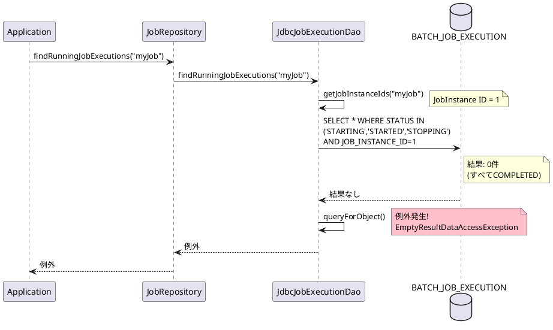
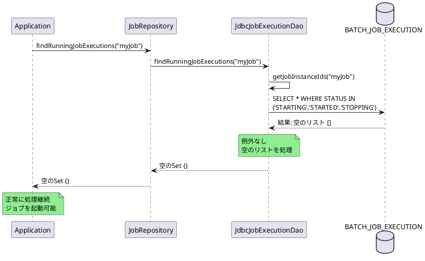

# Issue #5104: 完了済みジョブに対するfindRunningJobExecutionsの例外

**Issue URL**: https://github.com/spring-projects/spring-batch/issues/5104

**関連コミット**:
- [5750492](https://github.com/spring-projects/spring-batch/commit/57504927d912947ad1d15079b00d0969060db664)

---

## 課題概要

### 問題の説明

`JobRepository.findRunningJobExecutions()`メソッドは、指定されたジョブ名で**現在実行中**のジョブ実行を検索するメソッドですが、実行中のジョブが存在しない場合（すべてのジョブがCOMPLETEDまたはFAILED状態）に`EmptyResultDataAccessException`がスローされる問題が発生しました。

### 背景知識の補足

**JobRepositoryとは**:
- Spring Batchのジョブ実行情報を管理するコンポーネント
- データベースのBATCH_JOB_EXECUTIONテーブルにジョブの状態を保存

**ジョブのステータス**:
| ステータス | 説明 |
|-----------|------|
| STARTING | ジョブ起動中 |
| STARTED | ジョブ実行中 |
| STOPPING | ジョブ停止処理中 |
| STOPPED | ジョブが停止された |
| COMPLETED | ジョブが正常完了 |
| FAILED | ジョブが失敗 |

**findRunningJobExecutions()の用途**:
```java
// 二重起動防止のチェック
Set<JobExecution> runningJobs = 
    jobRepository.findRunningJobExecutions("myJob");
if (runningJobs.isEmpty()) {
    // ジョブを起動
} else {
    // 既に実行中なので待機
}
```

### 影響範囲

| 項目 | 内容 |
|------|------|
| **影響するバージョン** | Spring Batch 6.0.0 |
| **影響する機能** | ジョブ実行状態の確認、二重起動防止 |
| **重大度** | 中（予期しない例外発生） |
| **発生条件** | 完了済みジョブのみが存在する状態 |

---

## 原因

### 根本原因の詳細

`JdbcJobExecutionDao.findRunningJobExecutions()`の実装に問題がありました。

**問題のコード**:
```java
public Set<JobExecution> findRunningJobExecutions(String jobName) {
    final Set<JobExecution> result = new HashSet<>();
    List<Long> jobInstanceIds = this.jobInstanceDao.getJobInstanceIds(jobName);
    
    for (long jobInstanceId : jobInstanceIds) {
        // 問題: queryForObject()は結果が0件の場合に例外をスロー
        long runningJobExecutionId = getJdbcTemplate()
            .queryForObject(
                getQuery(GET_RUNNING_EXECUTION_FOR_INSTANCE),
                Long.class, 
                jobInstanceId
            );
        
        JobExecution runningJobExecution = getJobExecution(runningJobExecutionId);
        result.add(runningJobExecution);
    }
    return result;
}
```

**実行されるSQL**:
```sql
SELECT E.JOB_EXECUTION_ID
FROM BATCH_JOB_EXECUTION E, BATCH_JOB_INSTANCE I
WHERE E.JOB_INSTANCE_ID=I.JOB_INSTANCE_ID 
  AND I.JOB_INSTANCE_ID=? 
  AND E.STATUS IN ('STARTING', 'STARTED', 'STOPPING')
```

### 問題のシーケンス



### なぜ問題なのか

- **期待される動作**: 実行中のジョブがない場合は空のSet `{}` を返す
- **実際の動作**: `EmptyResultDataAccessException`がスローされる
- **原因**: Spring JDBCの`queryForObject()`は結果が0件の場合に例外をスローする設計

---

## 対応方針

### 修正内容

`query()`メソッドを使用してリストで結果を取得し、空の場合でも例外をスローしないように修正しました。

**修正後のコード**:
```java
public Set<JobExecution> findRunningJobExecutions(String jobName) {
    final Set<JobExecution> result = new HashSet<>();
    List<Long> jobInstanceIds = this.jobInstanceDao.getJobInstanceIds(jobName);
    
    for (long jobInstanceId : jobInstanceIds) {
        // 修正: query()を使用してListで受け取る
        List<Long> runningJobExecutionIds = getJdbcTemplate()
            .query(
                getQuery(GET_RUNNING_EXECUTION_FOR_INSTANCE),
                (rs, rowNum) -> rs.getLong("JOB_EXECUTION_ID"),
                jobInstanceId
            );
        
        // 結果が0件の場合は何もしない（空のままループ継続）
        for (Long executionId : runningJobExecutionIds) {
            JobExecution runningJobExecution = getJobExecution(executionId);
            result.add(runningJobExecution);
        }
    }
    return result;
}
```

### 修正後の動作



### Spring JDBCメソッドの比較

| メソッド | 戻り値 | 結果が0件の場合 | 結果が複数件の場合 |
|---------|--------|----------------|-------------------|
| `queryForObject()` | 単一オブジェクト | **例外スロー** | 最初の1件を返す |
| `query()` | List | 空リスト`[]`を返す | すべての結果を返す |

### 変更の影響

| 項目 | 内容 |
|------|------|
| **互換性** | 後方互換性あり（例外が発生しなくなる） |
| **パフォーマンス** | わずかに向上（例外処理が不要） |
| **リリース** | Spring Batch 6.0.1 |

### 使用例

修正後は以下のコードが正常に動作します:

```java
@Scheduled(cron = "0 */5 * * * *")  // 5分ごと
public void launchJobIfNotRunning() {
    Set<JobExecution> runningJobs = 
        jobRepository.findRunningJobExecutions("myJob");
    
    if (runningJobs.isEmpty()) {
        // 実行中のジョブがない → 起動OK
        jobLauncher.run(myJob, new JobParameters());
    } else {
        // 実行中のジョブがある → 待機
        logger.info("Job is already running, skipping...");
    }
}
```
