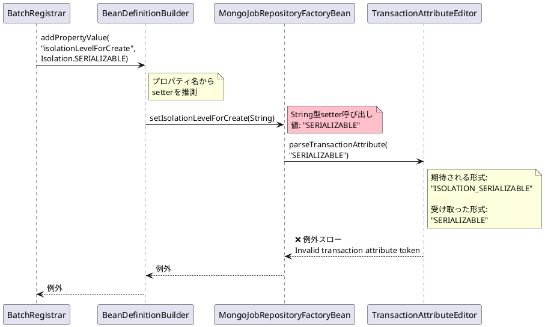
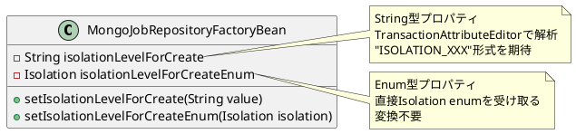
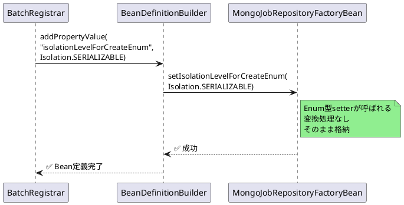

# Issue #5105: @EnableMongoJobRepositoryのトランザクション属性エラー

**Issue URL**: https://github.com/spring-projects/spring-batch/issues/5105

**関連コミット**: (issue内で詳細に議論され、PRで解決)

---

## 課題概要

### 問題の説明

`@EnableBatchProcessing`と`@EnableMongoJobRepository`を組み合わせて使用すると、Spring Batchアプリケーション起動時に以下のエラーが発生します:

```
Invalid transaction attribute token: [SERIALIZABLE]
```

この問題により、MongoDBをジョブリポジトリとして使用するBatchアプリケーションが起動できません。

### 背景知識の補足

**@EnableBatchProcessing**:
- Spring Batchの基本機能を有効化するアノテーション
- JobRepository、JobLauncher、TransactionManagerなどを自動設定

**@EnableMongoJobRepository**:
- MongoDBをジョブリポジトリとして使用するための設定アノテーション
- デフォルトはJDBCリポジトリ、MongoDBを使う場合に追加

**トランザクション分離レベル**:

| 分離レベル | 説明 |
|----------|------|
| READ_UNCOMMITTED | 他のトランザクションの未コミットデータを読める |
| READ_COMMITTED | コミット済みデータのみ読める |
| REPEATABLE_READ | 同じトランザクション内で同じ行を再読み込み時に同じ結果 |
| SERIALIZABLE | 最も厳格、完全に順次実行されるように制御 |

**MongoTransactionManager**:
- MongoDBのトランザクションを管理するクラス
- ACID特性をサポート

### 影響範囲

| 項目 | 内容 |
|------|------|
| **影響するバージョン** | Spring Batch 6.0.0 |
| **影響する技術スタック** | Spring Boot 4.0.0 + MongoDB + Java 25 |
| **影響する機能** | MongoDBベースのJobRepository |
| **重大度** | 高（アプリケーション起動不可） |

---

## 原因

### 根本原因の詳細

`BatchRegistrar`クラスの`registerMongoJobRepository()`メソッドで、トランザクション分離レベルを設定する際に**誤ったプロパティ名**を使用していました。

**問題のコード**:
```java
// BatchRegistrar.registerMongoJobRepository()
Isolation isolationLevelForCreate = 
    mongoJobRepositoryAnnotation.isolationLevelForCreate();

if (isolationLevelForCreate != null) {
    // 問題: "isolationLevelForCreate"プロパティに直接Enumを設定
    beanDefinitionBuilder.addPropertyValue(
        "isolationLevelForCreate",  // ← これはStringプロパティ
        isolationLevelForCreate     // ← これはIsolation enum
    );
}
```

### なぜエラーが発生するのか

**内部処理の流れ**:



### TransactionAttributeEditorの期待形式

| Enum値 | 期待されるString | 実際に渡される値 | 結果 |
|--------|----------------|-----------------|------|
| Isolation.SERIALIZABLE | "ISOLATION_SERIALIZABLE" | "SERIALIZABLE" | ❌ エラー |
| Isolation.READ_COMMITTED | "ISOLATION_READ_COMMITTED" | "READ_COMMITTED" | ❌ エラー |

### JDBC版との比較

**JDBC版（正しい実装）**:
```java
// BatchRegistrar.registerJdbcJobRepository()
Isolation isolationLevelForCreate = 
    jdbcJobRepositoryAnnotation.isolationLevelForCreate();

if (isolationLevelForCreate != null) {
    // 正しい: "isolationLevelForCreateEnum"プロパティにEnumを設定
    beanDefinitionBuilder.addPropertyValue(
        "isolationLevelForCreateEnum",  // ← Enum専用プロパティ
        isolationLevelForCreate
    );
}
```

**MongoDefaultBatchConfiguration（正しい実装）**:
```java
@Bean
public JobRepository jobRepository() {
    MongoJobRepositoryFactoryBean factory = 
        new MongoJobRepositoryFactoryBean();
    
    // 正しい: setIsolationLevelForCreateEnum()を呼び出し
    factory.setIsolationLevelForCreateEnum(
        getIsolationLevelForCreate()
    );
    
    return factory.getObject();
}
```

### プロパティとセッターの対応



---

## 対応方針

### 修正内容

プロパティ名を`"isolationLevelForCreate"`から`"isolationLevelForCreateEnum"`に変更しました。

**修正後のコード**:
```java
// BatchRegistrar.registerMongoJobRepository()
Isolation isolationLevelForCreate = 
    mongoJobRepositoryAnnotation.isolationLevelForCreate();

if (isolationLevelForCreate != null) {
    // 修正: Enum専用プロパティに設定
    beanDefinitionBuilder.addPropertyValue(
        "isolationLevelForCreateEnum",  // ← 正しいプロパティ名
        isolationLevelForCreate
    );
}
```

### 修正後の動作フロー



### テストケースの追加

リグレッション防止のため、`BatchRegistrarTests`にMongoDBリポジトリ設定テストを追加:

```java
@Configuration
@EnableBatchProcessing
@EnableMongoJobRepository
static class MongoJobConfiguration {

    @Bean
    MongoOperations mongoTemplate() {
        return Mockito.mock(MongoOperations.class);
    }

    @Bean
    MongoTransactionManager transactionManager() {
        return Mockito.mock(MongoTransactionManager.class);
    }
}

@Test
@DisplayName("@EnableMongoJobRepositoryでJobRepositoryが正常に構成される")
void testMongoJobRepositoryConfiguredWithEnableMongoJobRepository() {
    AnnotationConfigApplicationContext context =
            new AnnotationConfigApplicationContext(MongoJobConfiguration.class);

    JobRepository jobRepository = context.getBean(JobRepository.class);
    assertThat(jobRepository).isNotNull();
}
```

### 設定方法の統一

修正後、以下3つの設定方法で同じ動作を保証:

| 設定方法 | プロパティ名 | 動作 |
|---------|------------|------|
| **@EnableMongoJobRepository** | `isolationLevelForCreateEnum` | ✅ 正常動作 |
| **MongoDefaultBatchConfiguration** | `isolationLevelForCreateEnum` | ✅ 正常動作 |
| **JDBC版(@EnableJdbcJobRepository)** | `isolationLevelForCreateEnum` | ✅ 正常動作 |

### 変更の影響

| 項目 | 内容 |
|------|------|
| **互換性** | 後方互換性あり（エラーが解消される） |
| **パフォーマンス** | 影響なし |
| **リリース** | Spring Batch 6.0.1 (想定) |

### 使用例

修正後は以下の設定が正常に動作します:

```java
@EnableBatchProcessing
@EnableMongoJobRepository
@Configuration
public class SimpleJobConfig {

    @Bean
    Job simpleJob(Step simpleStep, JobRepository jobRepository) {
        return new JobBuilder("simpleJob", jobRepository)
                .incrementer(new RunIdIncrementer())
                .start(simpleStep)
                .build();
    }

    @Bean
    Step simpleStep(Tasklet simpleTasklet, 
                    PlatformTransactionManager transactionManager, 
                    JobRepository jobRepository) {
        return new StepBuilder("simpleStep", jobRepository)
                .tasklet(simpleTasklet, transactionManager)
                .build();
    }

    @Bean
    Tasklet simpleTasklet() {
        return (contribution, chunkContext) -> {
            System.out.println("Processing...");
            return RepeatStatus.FINISHED;
        };
    }

    @Bean
    MongoTransactionManager transactionManager(
            MongoDatabaseFactory mongoDatabaseFactory) {
        return new MongoTransactionManager(mongoDatabaseFactory);
    }
}
```

**application.yml**:
```yaml
spring:
  application:
    name: batch-mongo-demo
  mongodb:
    host: localhost
    port: 27017
    database: batch
```
