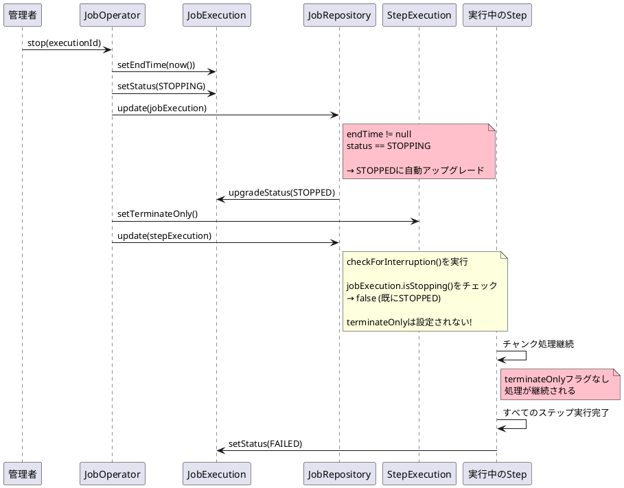
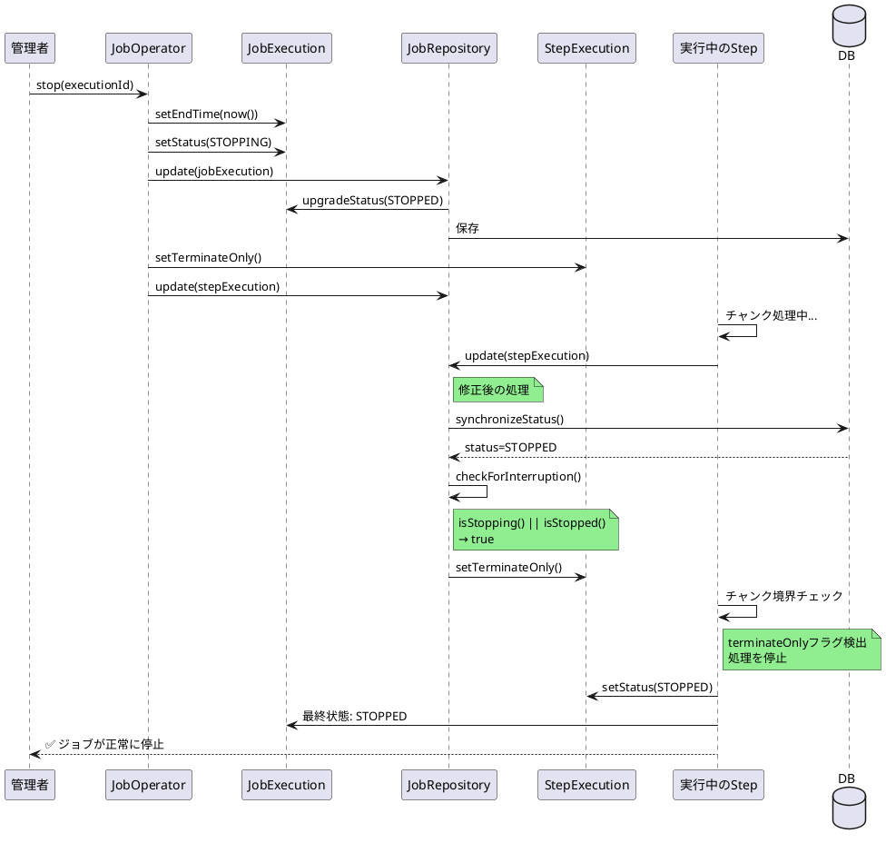

# Issue #5114: ジョブstop()がステップ実行を停止できない

**Issue URL**: https://github.com/spring-projects/spring-batch/issues/5114

**関連コミット**:
- [29f5ecf](https://github.com/spring-projects/spring-batch/commit/29f5ecf567cc21b5ce3dd9a41283d227a85c3667)
- [e5fbc2a](https://github.com/spring-projects/spring-batch/commit/e5fbc2a0387858f5f95009e3a032d2864398f9ac)
- [644d7e6](https://github.com/spring-projects/spring-batch/commit/644d7e6997c4e29822be580dab8e6f65713e17be)

**関連PR**: [#5165](https://github.com/spring-projects/spring-batch/pull/5165)

---

## 課題概要

### 問題の説明

Spring Batch 6において、`JobOperator.stop()`を呼び出してジョブを停止しようとしても、**すべてのステップが最後まで実行され続ける**という問題が発生しました。最終的にジョブステータスは`FAILED`となりますが、ステップの実行自体は停止されません。

### 背景知識の補足

**JobOperatorとは**:
- ジョブの実行を外部から制御するためのインターフェース
- 起動、停止、再起動などの操作を提供

**ジョブ停止の仕組み**:
```java
// 別スレッドから実行
long executionId = jobOperator.stop(executionId);
```

**terminateOnlyフラグ**:
- StepExecutionに設定されるフラグ
- このフラグが立つと、チャンク処理やタスクレット処理が次回のトランザクション境界で停止

**Spring Batch 5での正常な停止フロー**:
1. `STARTED` → `STOPPING` 
2. ステップ実行を`terminateOnly`としてマーク
3. 次のチャンク/トランザクション境界でステップを停止
4. `STOPPED`状態に遷移

**Spring Batch 6での異常な動作**:
1. `STARTED` → `STOPPING` → `STOPPED`（即座に遷移）
2. ステップは`terminateOnly`にマークされない
3. すべてのステップが最後まで実行される
4. `FAILED`状態に遷移

### 影響範囲

| 項目 | 内容 |
|------|------|
| **影響するバージョン** | Spring Batch 6.0.0 |
| **影響する機能** | ジョブの停止、グレースフルシャットダウン |
| **重大度** | 高（ジョブ制御が不可能） |
| **影響するステップ** | TaskletStep、ChunkOrientedStep |

---

## 原因

### 根本原因の詳細

コミット[e5fbc2a](https://github.com/spring-projects/spring-batch/commit/e5fbc2a0387858f5f95009e3a032d2864398f9ac)で導入された以下のコードが原因です:

**問題のコード（SimpleJobOperator.java:348）**:
```java
public Long stop(Long executionId) {
    JobExecution jobExecution = jobExplorer.getJobExecution(executionId);
    
    // この行が問題の原因
    jobExecution.setEndTime(LocalDateTime.now());
    jobExecution.setStatus(BatchStatus.STOPPING);
    
    jobRepository.update(jobExecution);  // ← この直後にチェックが入る
    
    // ... ステップ停止処理
}
```

**SimpleJobRepository.update()でのチェック**:
```java
public void update(JobExecution jobExecution) {
    // endTimeが設定されている場合、STOPPINGをSTOPPEDに自動アップグレード
    if (jobExecution.getStatus() == BatchStatus.STOPPING 
        && jobExecution.getEndTime() != null) {  // ← 常にtrue
        
        logger.info("Upgrading job execution status from STOPPING to STOPPED");
        jobExecution.upgradeStatus(BatchStatus.STOPPED);  // ← 即座にSTOPPED
    }
    // ...
}
```

### 問題のシーケンス図



### checkForInterruption()が機能しない理由

**SimpleJobRepository.checkForInterruption()**:
```java
private void checkForInterruption(StepExecution stepExecution) {
    JobExecution jobExecution = stepExecution.getJobExecution();
    
    // DBから最新のJobExecutionステータスを同期
    jobExecutionDao.synchronizeStatus(jobExecution);
    
    // この条件が満たされない（既にSTOPPED状態）
    if (jobExecution.isStopping()) {  // ← false
        logger.info("Parent JobExecution is stopped, setting terminateOnly");
        stepExecution.setTerminateOnly();  // ← 実行されない
    }
}
```

### 状態遷移の比較

| フェーズ | Spring Batch 5 (正常) | Spring Batch 6 (異常) |
|---------|----------------------|----------------------|
| stop()呼び出し前 | STARTED | STARTED |
| stop()実行中 | STOPPING | STOPPING → STOPPED |
| update()後 | STOPPING | STOPPED |
| checkForInterruption() | terminateOnly設定 | 何もしない |
| ステップ実行 | 停止 | 継続 |
| 最終状態 | STOPPED | FAILED |

### ChunkOrientedStepでの追加の問題

TaskletStepは各チャンク後に`jobRepository.update(stepExecution)`を呼び出すため、`checkForInterruption()`が実行されます。しかし、**ChunkOrientedStepには同等の呼び出しがありません**。

```java
// TaskletStep.doExecute() - 正しい実装
while (stepExecution.getStatus() == BatchStatus.STARTED) {
    tasklet.execute();
    
    // これによりcheckForInterruption()が呼ばれる
    getJobRepository().update(stepExecution);
}

// ChunkOrientedStep - update()呼び出しがない
protected void doExecute(StepExecution stepExecution) {
    while (chunkProvider.provide(contribution)) {
        chunkProcessor.process(contribution, chunk);
        
        // JobRepository.update()の呼び出しがない!
        getJobRepository().updateExecutionContext(stepExecution);
    }
}
```

---

## 対応方針

### 修正内容

PR [#5165](https://github.com/spring-projects/spring-batch/pull/5165)で以下の修正を実施:

#### 1. getStepExecution()による停止検出

外部から停止されたStepExecutionを検出し、`isStopped()`ステータスをチェックします。

```java
private void checkForInterruption(StepExecution stepExecution) {
    JobExecution jobExecution = stepExecution.getJobExecution();
    jobExecutionDao.synchronizeStatus(jobExecution);
    
    // 修正: STOPPEDステータスも考慮
    if (jobExecution.isStopping() || jobExecution.isStopped()) {
        logger.info("Parent JobExecution is stopped, setting terminateOnly");
        stepExecution.setTerminateOnly();
    }
}
```

#### 2. バージョン同期の追加

`JobRepository.update(StepExecution)`でバージョンを同期し、楽観的ロック例外を防ぎます。

```java
public void update(StepExecution stepExecution) {
    // DBから最新のバージョンを取得して同期
    StepExecution persisted = 
        stepExecutionDao.getStepExecution(stepExecution.getId());
    stepExecution.setVersion(persisted.getVersion());
    
    checkForInterruption(stepExecution);
    stepExecutionDao.updateStepExecution(stepExecution);
}
```

#### 3. ChunkOrientedStepへのupdate()追加

TaskletStepの動作に合わせて、`JobRepository.update(stepExecution)`呼び出しを追加:

```java
// ChunkOrientedStep - 修正後
protected void doExecute(StepExecution stepExecution) {
    while (chunkProvider.provide(contribution)) {
        chunkProcessor.process(contribution, chunk);
        
        // 追加: StepExecutionの更新とinterruptionチェック
        getJobRepository().update(stepExecution);
    }
}
```

### 修正後のシーケンス図



### 修正の効果

| 項目 | 修正前 | 修正後 |
|------|-------|-------|
| **stop()呼び出し後** | すべてのステップが継続 | 次のチャンク境界で停止 |
| **ジョブ最終状態** | FAILED | STOPPED |
| **terminateOnlyフラグ** | 設定されない | 正しく設定される |
| **ChunkOrientedStep** | interruption未チェック | interruption正常チェック |
| **楽観的ロック例外** | 発生可能 | バージョン同期で回避 |

### 関連する修正課題

この修正は[Issue #5120](https://github.com/spring-projects/spring-batch/issues/5120)（OptimisticLockingFailureException）も同時に解決します。

### 変更の影響

| 項目 | 内容 |
|------|------|
| **互換性** | 後方互換性あり（Spring Batch 5の動作に戻る） |
| **パフォーマンス** | わずかなオーバーヘッド（DB同期処理） |
| **リリース** | Spring Batch 6.0.1 |

### 使用例

修正後は以下のコードが正常に動作します:

```java
@RestController
public class JobController {
    
    @Autowired
    private JobOperator jobOperator;
    
    @PostMapping("/jobs/{executionId}/stop")
    public ResponseEntity<String> stopJob(@PathVariable Long executionId) {
        try {
            // ジョブを停止
            jobOperator.stop(executionId);
            
            // 実行中のステップは次のチャンク境界で停止
            return ResponseEntity.ok("Job stop requested");
        } catch (Exception e) {
            return ResponseEntity.status(500).body("Failed to stop job");
        }
    }
}
```

**グレースフルシャットダウンの例**:
```java
@Component
public class GracefulShutdown {
    
    @Autowired
    private JobOperator jobOperator;
    
    @PreDestroy
    public void shutdown() {
        Set<Long> runningExecutions = jobOperator.getRunningExecutions("myJob");
        
        for (Long executionId : runningExecutions) {
            // アプリケーション停止前にジョブを停止
            jobOperator.stop(executionId);
        }
    }
}
```
