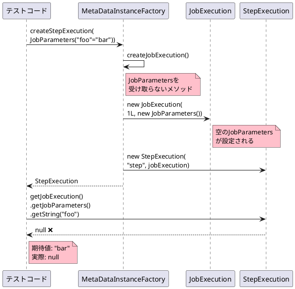
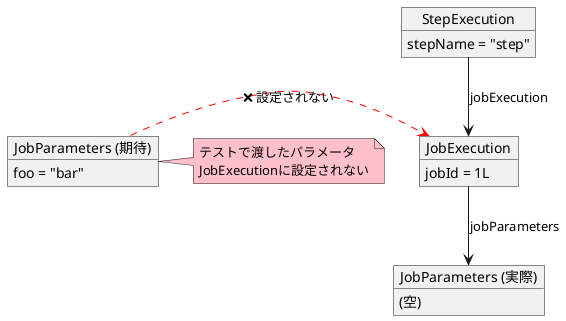
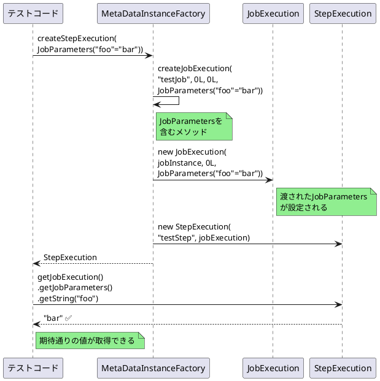

# Issue #5115: MetaDataInstanceFactoryがJobParametersを伝播しない

**Issue URL**: https://github.com/spring-projects/spring-batch/issues/5115

**関連コミット**:
- [1a5b8d0](https://github.com/spring-projects/spring-batch/commit/1a5b8d0321fd6efd02c589b0711260f93fe9315f)
- [da16f6b](https://github.com/spring-projects/spring-batch/commit/da16f6b92ecc1b4d5ed0acb947df1dad923e590a)
- [8264ab1](https://github.com/spring-projects/spring-batch/commit/8264ab11b9fa1905da648f454a050dd058b3fda0)

---

## 課題概要

### 問題の説明

テスト用のユーティリティクラス`MetaDataInstanceFactory`の`createStepExecution(JobParameters)`メソッドを使用して作成した`StepExecution`インスタンスが、渡した`JobParameters`を保持しません。

この問題により、テストコードで`JobParameters`に依存する処理が正しくテストできなくなりました。

### 背景知識の補足

**MetaDataInstanceFactoryとは**:
- テストコードで使用するユーティリティクラス
- `JobExecution`、`StepExecution`などのテストデータを簡単に作成
- Spring Batchのテストを簡略化

**JobParametersとは**:
```java
// ジョブ実行時のパラメータ
JobParameters params = new JobParametersBuilder()
    .addString("inputFile", "/data/input.csv")
    .addLong("timestamp", System.currentTimeMillis())
    .toJobParameters();
```

**StepExecution内でのJobParameters参照**:
```java
// ステップ内でJobParametersにアクセス
@StepScope
@Bean
public ItemReader<String> reader(@Value("#{jobParameters['inputFile']}") String file) {
    return new FlatFileItemReaderBuilder<String>()
        .name("reader")
        .resource(new FileSystemResource(file))
        .build();
}
```

### 影響範囲

| 項目 | 内容 |
|------|------|
| **影響するバージョン** | Spring Batch 6.0.0 |
| **影響する領域** | テストコード |
| **重大度** | 中（テスト作成が困難） |
| **機能領域** | spring-batch-test |

---

## 原因

### 根本原因の詳細

コミット[90d8959](https://github.com/spring-projects/spring-batch/commit/90d895955d951156849ba6fa018676273fdbe2c4)で、`createStepExecution(JobParameters)`メソッドの内部実装が変更されました。

**問題のコード（Spring Batch 6.0.0）**:
```java
public class MetaDataInstanceFactory {
    
    public static StepExecution createStepExecution(JobParameters jobParameters) {
        // 新しいJobExecutionを作成
        JobExecution jobExecution = createJobExecution();
        
        // StepExecutionを作成
        StepExecution stepExecution = new StepExecution("step", jobExecution);
        
        // 問題: jobParametersがJobExecutionに設定されていない!
        return stepExecution;
    }
    
    private static JobExecution createJobExecution() {
        // JobParametersなしでJobExecutionを作成
        return new JobExecution(1L, new JobParameters());
    }
}
```

**正しい実装（Spring Batch 5.2.x）**:
```java
public static StepExecution createStepExecution(JobParameters jobParameters) {
    // JobParametersを含むJobExecutionを作成
    JobExecution jobExecution = createJobExecution(
        "testJob", 1L, 1L, jobParameters
    );
    
    return new StepExecution("step", jobExecution);
}
```

### 問題のシーケンス図



### テストの失敗例

```java
@Test
void testCreateStepExecutionJobParameters() {
    // JobParametersを準備
    JobParameters parameters = new JobParametersBuilder()
        .addString("foo", "bar")
        .toJobParameters();

    // StepExecutionを作成
    StepExecution stepExecution = 
        MetaDataInstanceFactory.createStepExecution(parameters);
    
    // JobParametersにアクセス
    String paramValue = stepExecution
        .getJobExecution()
        .getJobParameters()
        .getString("foo");

    // 失敗: paramValue == null
    assertEquals("bar", paramValue);  // ❌ AssertionError
}
```

### オブジェクト関係図



---

## 対応方針

### 修正内容

`createStepExecution(JobParameters)`内で、渡された`JobParameters`を持つ`JobExecution`を作成するように修正しました。

**修正後のコード**:
```java
public class MetaDataInstanceFactory {
    
    public static StepExecution createStepExecution(JobParameters jobParameters) {
        // 修正: JobParametersを含むJobExecutionを作成
        JobExecution jobExecution = createJobExecution(
            "testJob",
            0L,
            0L,
            jobParameters  // ← 渡されたパラメータを使用
        );
        
        return createStepExecution(jobExecution, "testStep", 0L);
    }
    
    public static JobExecution createJobExecution(
            String jobName,
            Long jobInstanceId,
            Long executionId,
            JobParameters jobParameters) {
        
        JobInstance jobInstance = new JobInstance(jobInstanceId, jobName);
        JobExecution jobExecution = new JobExecution(jobInstance, executionId, jobParameters);
        
        return jobExecution;
    }
}
```

### 修正後の動作フロー



### Spring Batch 6での回避策

修正版がリリースされるまでの回避策:

```java
// 修正前の回避策
JobExecution jobExecution = MetaDataInstanceFactory.createJobExecution(
    "testJob", 0L, 0L, jobParameters
);
StepExecution stepExecution = MetaDataInstanceFactory.createStepExecution(
    jobExecution, "testStep", 0L
);

// 修正後（Spring Batch 6.0.1以降）
StepExecution stepExecution = 
    MetaDataInstanceFactory.createStepExecution(jobParameters);
```

### テストケースの追加

リグレッション防止のためのテスト:

```java
@Test
void createStepExecutionShouldPropagateJobParameters() {
    // Given
    JobParameters parameters = new JobParametersBuilder()
        .addString("foo", "bar")
        .addLong("timestamp", 123L)
        .addDouble("rate", 1.5)
        .toJobParameters();

    // When
    StepExecution stepExecution = 
        MetaDataInstanceFactory.createStepExecution(parameters);
    
    // Then
    JobParameters actualParams = stepExecution
        .getJobExecution()
        .getJobParameters();
    
    assertThat(actualParams.getString("foo")).isEqualTo("bar");
    assertThat(actualParams.getLong("timestamp")).isEqualTo(123L);
    assertThat(actualParams.getDouble("rate")).isEqualTo(1.5);
}
```

### 変更の影響

| 項目 | 内容 |
|------|------|
| **互換性** | 後方互換性あり |
| **パフォーマンス** | 影響なし |
| **テストコード** | 修正前の回避策も継続動作 |
| **リリース** | Spring Batch 6.0.1 |

### 使用例

修正後は以下のテストコードが正常に動作します:

```java
@ExtendWith(SpringExtension.class)
@ContextConfiguration(classes = {TestConfig.class})
class MyStepTest {

    @Test
    void testStepWithJobParameters() {
        // JobParametersを設定
        JobParameters params = new JobParametersBuilder()
            .addString("inputFile", "/data/test.csv")
            .addString("outputFile", "/data/output.csv")
            .toJobParameters();
        
        // StepExecutionを作成
        StepExecution stepExecution = 
            MetaDataInstanceFactory.createStepExecution(params);
        
        // Stepを実行
        Step step = applicationContext.getBean(Step.class);
        step.execute(stepExecution);
        
        // StepScope内でJobParametersが参照できる
        assertThat(stepExecution.getStatus()).isEqualTo(BatchStatus.COMPLETED);
    }
}
```

**StepScope Beanのテスト**:
```java
@Configuration
class TestConfig {
    
    @Bean
    @StepScope
    public ItemReader<String> reader(
            @Value("#{jobParameters['inputFile']}") String inputFile) {
        
        return new FlatFileItemReaderBuilder<String>()
            .name("reader")
            .resource(new FileSystemResource(inputFile))
            .lineMapper(new PassThroughLineMapper())
            .build();
    }
}

@Test
void testStepScopeBeanWithJobParameters() {
    JobParameters params = new JobParametersBuilder()
        .addString("inputFile", "/data/test.csv")
        .toJobParameters();
    
    StepExecution stepExecution = 
        MetaDataInstanceFactory.createStepExecution(params);
    
    // StepScopeを有効化
    StepSynchronizationManager.register(stepExecution);
    
    try {
        // StepScope BeanがJobParametersを参照できる
        ItemReader<String> reader = applicationContext.getBean(ItemReader.class);
        assertThat(reader).isNotNull();
    } finally {
        StepSynchronizationManager.close();
    }
}
```
