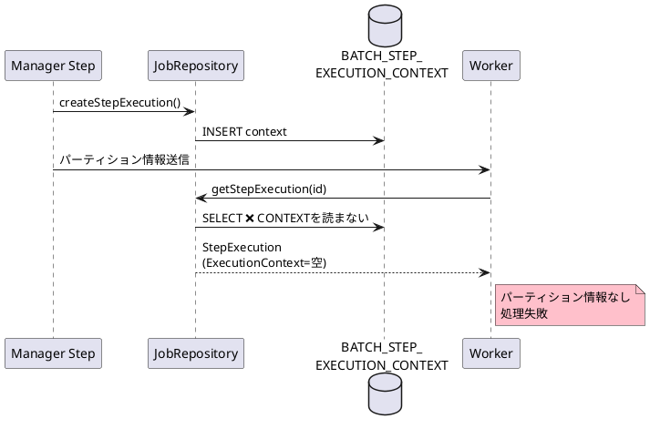
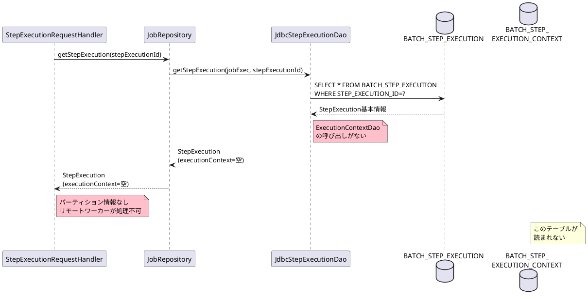
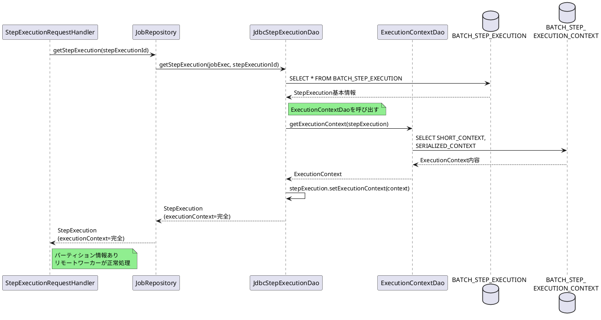

# Issue #5117: JobRepositoryからのStepExecution取得でExecutionContextが読み込まれない

**Issue URL**: https://github.com/spring-projects/spring-batch/issues/5117

**関連PR**: [#5147](https://github.com/spring-projects/spring-batch/pull/5147)

---

## 課題概要

### 問題の説明

Spring Batch 6.0.0において、`JobRepository`から`StepExecution`を取得した際に、`ExecutionContext`が読み込まれない問題が発生しました。Spring Batch 5.2.xでは、`SimpleJobExplorer`から取得した`StepExecution`には完全な`ExecutionContext`が含まれていましたが、6.0.0では空の状態になります。

この問題により、**リモートパーティション化されたバッチジョブ**が失敗します。

### 背景知識の補足

**ExecutionContextとは**:
- ジョブ/ステップ実行時の状態情報を保存するキーバリューストア
- チャンク処理の進捗、カーソル位置、処理済み件数などを保存
- リスタート時に前回の状態から再開するために必要

**ExecutionContextの保存先**:
| テーブル名 | 保存内容 |
|-----------|---------|
| BATCH_JOB_EXECUTION_CONTEXT | JobExecutionのコンテキスト |
| BATCH_STEP_EXECUTION_CONTEXT | StepExecutionのコンテキスト |

**JobRepositoryとJobExplorerの違い**:

| クラス | 用途 | 操作 |
|--------|------|------|
| JobRepository | ジョブ実行の永続化 | 読み書き |
| JobExplorer | ジョブ実行の照会 | 読み取り専用 |

**リモートパーティション化**:
- マスター/ワーカー構成で並列処理
- ワーカーが`StepExecution`を取得してパーティション処理
- `ExecutionContext`にパーティション範囲などの情報が含まれる



### 影響範囲

| 項目 | 内容 |
|------|------|
| **影響するバージョン** | Spring Batch 6.0.0 |
| **影響する機能** | リモートパーティション、StepExecution取得 |
| **重大度** | 高（リモートパーティション不可） |
| **影響範囲** | spring-batch-integration |

---

## 原因

### 根本原因の詳細

`JdbcStepExecutionDao.getStepExecution()`メソッドが、`BATCH_STEP_EXECUTION_CONTEXT`テーブルから`ExecutionContext`を読み込む処理を実行していませんでした。

**問題のコード（JdbcStepExecutionDao.java:299）**:
```java
public StepExecution getStepExecution(JobExecution jobExecution, Long stepExecutionId) {
    String sql = getQuery(GET_STEP_EXECUTION);
    
    // BATCH_STEP_EXECUTIONテーブルからStepExecutionを取得
    StepExecution stepExecution = jdbcTemplate.queryForObject(
        sql,
        new StepExecutionRowMapper(jobExecution),
        stepExecutionId
    );
    
    // 問題: ExecutionContextを読み込む処理がない!
    // getExecutionContext(stepExecutionId)の呼び出しが欠けている
    
    return stepExecution;  // ExecutionContextが空のまま
}
```

**実行されるSQL**:
```sql
-- BATCH_STEP_EXECUTIONのみ読み取り
SELECT 
    STEP_EXECUTION_ID,
    STEP_NAME,
    STATUS,
    READ_COUNT,
    WRITE_COUNT,
    ...
FROM BATCH_STEP_EXECUTION
WHERE STEP_EXECUTION_ID = ?;

-- BATCH_STEP_EXECUTION_CONTEXTは読み取られない
-- ↓このクエリが実行されていない
SELECT SHORT_CONTEXT, SERIALIZED_CONTEXT
FROM BATCH_STEP_EXECUTION_CONTEXT
WHERE STEP_EXECUTION_ID = ?;
```

### Spring Batch 5.2.xとの比較

**Spring Batch 5.2.x（SimpleJobExplorer）**:
```java
public StepExecution getStepExecution(Long jobExecutionId, Long stepExecutionId) {
    JobExecution jobExecution = getJobExecution(jobExecutionId);
    
    StepExecution stepExecution = 
        stepExecutionDao.getStepExecution(jobExecution, stepExecutionId);
    
    // ExecutionContextを明示的に読み込み
    ExecutionContext context = 
        executionContextDao.getExecutionContext(stepExecution);
    stepExecution.setExecutionContext(context);  // ← これがあった
    
    return stepExecution;
}
```

**Spring Batch 6.0.0（JobRepository）**:
```java
// StepExecutionRequestHandler.java:48
public StepExecution handle(StepExecutionRequest request) {
    Long stepExecutionId = request.getStepExecutionId();
    
    // JobRepositoryを使用してStepExecutionを取得
    StepExecution stepExecution = 
        jobRepository.getStepExecution(stepExecutionId);
    
    // ExecutionContextが空のまま返される
    return stepExecution;
}
```

### 問題のシーケンス図



### リモートパーティション失敗の例

```java
// Manager Step
@Bean
public Step managerStep(PartitionHandler partitionHandler) {
    return stepBuilderFactory.get("managerStep")
        .partitioner("workerStep", partitioner())
        .partitionHandler(partitionHandler)
        .build();
}

@Bean
public Partitioner partitioner() {
    return gridSize -> {
        Map<String, ExecutionContext> partitions = new HashMap<>();
        
        // パーティション情報をExecutionContextに設定
        for (int i = 0; i < gridSize; i++) {
            ExecutionContext context = new ExecutionContext();
            context.putInt("partitionId", i);
            context.putInt("startRow", i * 1000);
            context.putInt("endRow", (i + 1) * 1000);
            partitions.put("partition" + i, context);
        }
        
        return partitions;
    };
}

// Worker Step
@Bean
@StepScope
public ItemReader<Data> reader(
        @Value("#{stepExecutionContext['startRow']}") Integer startRow,
        @Value("#{stepExecutionContext['endRow']}") Integer endRow) {
    
    // startRow, endRowがnullになる（ExecutionContextが空）
    // ❌ NullPointerException
    return new JdbcCursorItemReaderBuilder<Data>()
        .sql("SELECT * FROM data WHERE id BETWEEN ? AND ?")
        .preparedStatementSetter((ps) -> {
            ps.setInt(1, startRow);   // ❌ NPE
            ps.setInt(2, endRow);     // ❌ NPE
        })
        .build();
}
```

---

## 対応方針

### 修正内容

`JdbcStepExecutionDao.getStepExecution()`メソッドに、`ExecutionContext`を読み込む処理を追加しました。

**修正後のコード**:
```java
public StepExecution getStepExecution(JobExecution jobExecution, Long stepExecutionId) {
    String sql = getQuery(GET_STEP_EXECUTION);
    
    // BATCH_STEP_EXECUTIONからStepExecutionを取得
    StepExecution stepExecution = jdbcTemplate.queryForObject(
        sql,
        new StepExecutionRowMapper(jobExecution),
        stepExecutionId
    );
    
    // 修正: ExecutionContextを読み込む
    ExecutionContext executionContext = 
        ecDao.getExecutionContext(stepExecution);
    stepExecution.setExecutionContext(executionContext);
    
    return stepExecution;
}
```

### 修正後の動作フロー



### ResourcelessJobRepositoryでの動作

**注意**: `ResourcelessJobRepository`（インメモリ実装）では問題が発生しません。

```java
// ResourcelessJobRepositoryの実装
public class ResourcelessJobRepository implements JobRepository {
    
    private Map<Long, StepExecution> stepExecutions = new ConcurrentHashMap<>();
    
    @Override
    public StepExecution getStepExecution(Long stepExecutionId) {
        // インメモリから取得（ExecutionContext含む）
        return stepExecutions.get(stepExecutionId);
    }
}
```

| リポジトリ実装 | ExecutionContext | 備考 |
|--------------|------------------|------|
| **JdbcJobRepository** | ❌ 読み込まれない（修正前） | データベース永続化 |
| **ResourcelessJobRepository** | ✅ 正常に取得 | インメモリ |

### 変更の影響

| 項目 | 内容 |
|------|------|
| **互換性** | 後方互換性あり（Spring Batch 5の動作に戻る） |
| **パフォーマンス** | わずかなオーバーヘッド（1回のSELECT追加） |
| **リリース** | Spring Batch 6.0.1 |

### 使用例

修正後は以下のリモートパーティション構成が正常に動作します:

```java
@Configuration
public class RemotePartitioningConfig {
    
    @Bean
    public Step managerStep(PartitionHandler partitionHandler) {
        return stepBuilderFactory.get("managerStep")
            .partitioner("workerStep", partitioner())
            .partitionHandler(partitionHandler)
            .build();
    }
    
    @Bean
    public Partitioner partitioner() {
        return gridSize -> {
            Map<String, ExecutionContext> partitions = new HashMap<>();
            
            for (int i = 0; i < gridSize; i++) {
                ExecutionContext context = new ExecutionContext();
                context.putInt("partitionId", i);
                context.putInt("minValue", i * 100);
                context.putInt("maxValue", (i + 1) * 100);
                partitions.put("partition" + i, context);
            }
            
            return partitions;
        };
    }
    
    // Worker側
    @Bean
    @StepScope
    public ItemReader<Customer> reader(
            @Value("#{stepExecutionContext['minValue']}") Integer minValue,
            @Value("#{stepExecutionContext['maxValue']}") Integer maxValue) {
        
        // 修正後: minValue, maxValueが正しく取得できる
        return new JdbcPagingItemReaderBuilder<Customer>()
            .name("customerReader")
            .dataSource(dataSource)
            .queryProvider(queryProvider(minValue, maxValue))
            .pageSize(100)
            .build();
    }
}
```

**デモアプリケーション**: https://github.com/ruudkenter/spring-batch-6-demo
