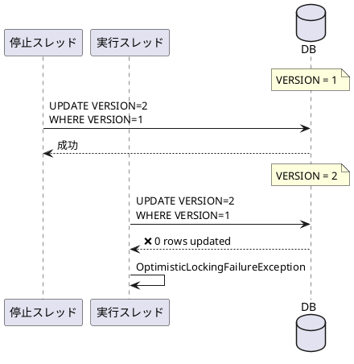
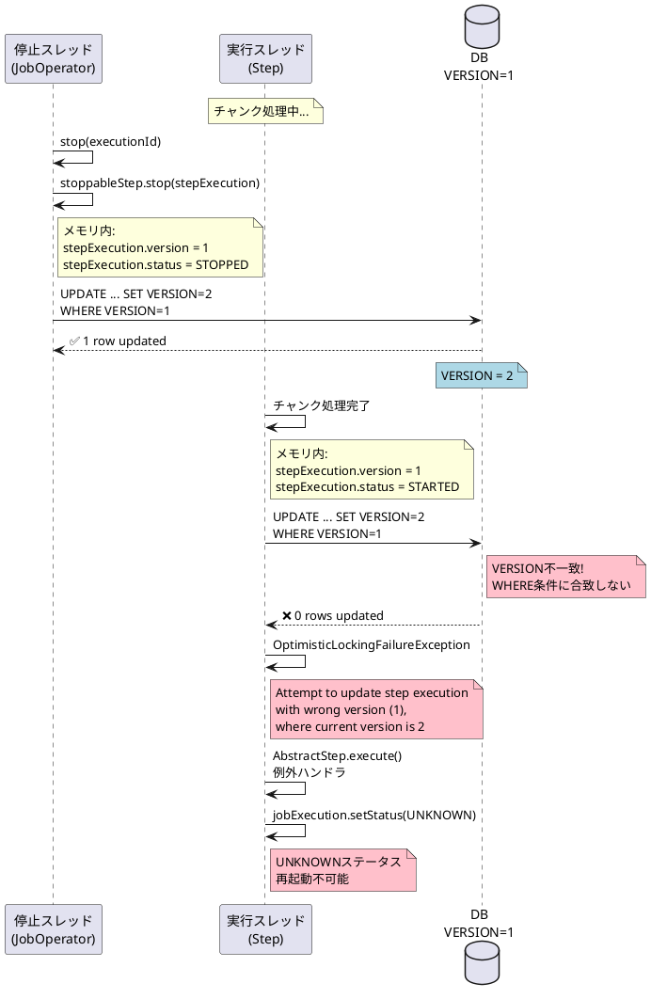
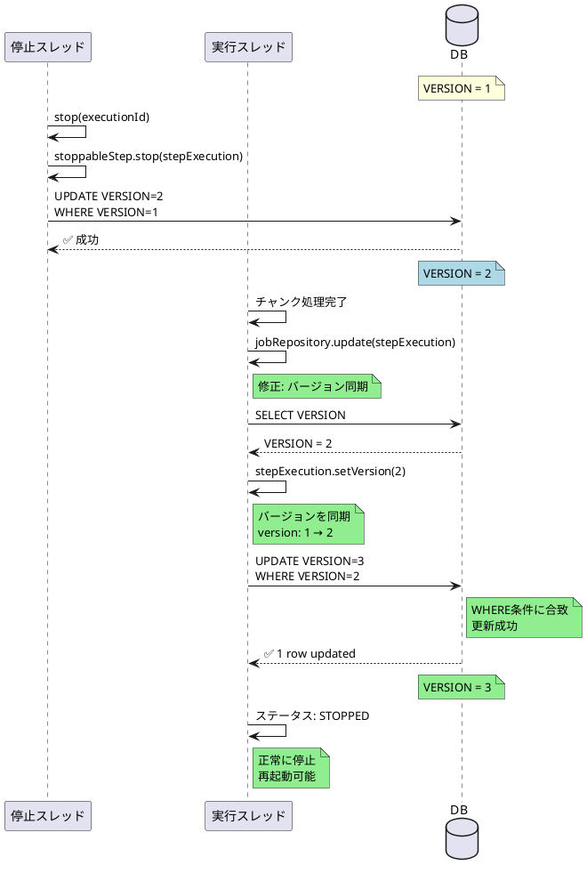
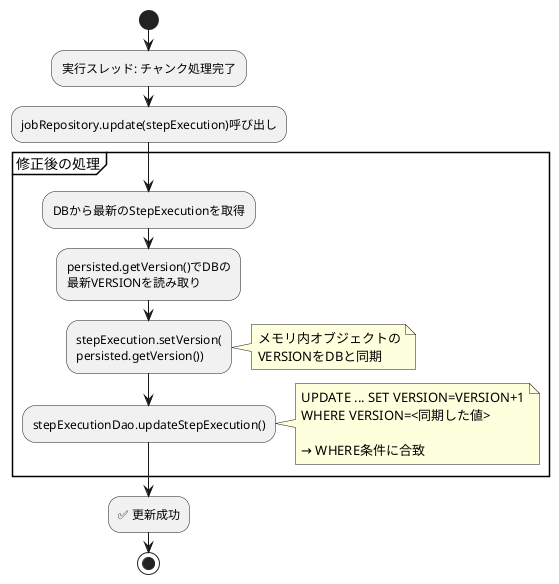

# Issue #5120: SimpleJobOperator.stop()の楽観的ロック例外

**Issue URL**: https://github.com/spring-projects/spring-batch/issues/5120

**関連コミット**:
- [29f5ecf](https://github.com/spring-projects/spring-batch/commit/29f5ecf567cc21b5ce3dd9a41283d227a85c3667)
- [f62da2b](https://github.com/spring-projects/spring-batch/commit/f62da2bd6a7a9459d809e86065877ac440130b70)
- [78ba896](https://github.com/spring-projects/spring-batch/commit/78ba896caa7020f1f7f972ae7b3dd469699a4922)
- [984a057](https://github.com/spring-projects/spring-batch/commit/984a057f86c92b326782b964f949c0eb0eb805d4)
- [0feafa1](https://github.com/spring-projects/spring-batch/commit/0feafa15a73c4be4f990b627c914bb918118e96e)
- [09b0783](https://github.com/spring-projects/spring-batch/commit/09b07834ed86f4a11a51e118e665dc20156352c9)
- [644d7e6](https://github.com/spring-projects/spring-batch/commit/644d7e6997c4e29822be580dab8e6f65713e17be)

**関連PR**: [#5165](https://github.com/spring-projects/spring-batch/pull/5165)

---

## 課題概要

### 問題の説明

Spring Batch 6.0.0において、実行中の`ChunkOrientedStep`に対して`JobOperator.stop()`を呼び出すと、`OptimisticLockingFailureException`（楽観的ロック例外）が発生し、ジョブステータスが`UNKNOWN`になる問題が発生しました。

この問題により、**ジョブが再起動不可能**になります。

### 背景知識の補足

**楽観的ロックとは**:
- データベースで同時更新を制御する仕組み
- バージョン番号を使用して更新競合を検出
- 更新時にバージョンが異なると例外をスロー

**Spring Batchの楽観的ロック**:
```sql
-- BATCH_STEP_EXECUTIONテーブル
CREATE TABLE BATCH_STEP_EXECUTION (
    STEP_EXECUTION_ID BIGINT PRIMARY KEY,
    VERSION BIGINT NOT NULL,  -- ← 楽観的ロック用
    STEP_NAME VARCHAR(100),
    STATUS VARCHAR(10),
    ...
);
```

**更新時のSQL**:
```sql
UPDATE BATCH_STEP_EXECUTION
SET 
    STATUS = ?,
    VERSION = VERSION + 1,  -- バージョンをインクリメント
    ...
WHERE 
    STEP_EXECUTION_ID = ?
    AND VERSION = ?;  -- 現在のバージョンと一致する場合のみ更新
```

**マルチスレッドでの競合**:



### 影響範囲

| 項目 | 内容 |
|------|------|
| **影響するバージョン** | Spring Batch 6.0.0 |
| **影響する機能** | グレースフルストップ、ジョブ停止 |
| **重大度** | 高（ジョブがUNKNOWN状態、再起動不可） |
| **影響するステップ** | ChunkOrientedStep、TaskletStep |

---

## 原因

### 根本原因の詳細

`SimpleJobOperator.stop()`メソッドが、`StepExecution`を更新する際に、実行中のステップスレッドと**バージョン競合**を引き起こしていました。

**問題のコード（SimpleJobOperator.java:374-375）**:
```java
public Long stop(Long executionId) {
    JobExecution jobExecution = jobExplorer.getJobExecution(executionId);
    
    // JobExecutionを停止状態に
    jobExecution.setStatus(BatchStatus.STOPPING);
    jobRepository.update(jobExecution);
    
    // 実行中のステップを停止
    Collection<StepExecution> stepExecutions = jobExecution.getStepExecutions();
    
    for (StepExecution stepExecution : stepExecutions) {
        if (stepExecution.getStatus().isRunning()) {
            Step step = registry.getStep(stepExecution.getStepName());
            
            if (step instanceof StoppableStep stoppableStep) {
                // 374行目: StepExecutionを停止
                stoppableStep.stop(stepExecution);
                
                // 375行目: 問題 - DBを更新してVERSIONをインクリメント
                jobRepository.update(stepExecution);
                // VERSION: 1 → 2
            }
        }
    }
    
    return executionId;
}
```

**StoppableStep.stop()のデフォルト実装**:
```java
default void stop(StepExecution stepExecution) {
    stepExecution.setTerminateOnly();
    stepExecution.setStatus(BatchStatus.STOPPED);
    stepExecution.setExitStatus(ExitStatus.STOPPED);
    stepExecution.setEndTime(LocalDateTime.now());
}
```

### バージョン競合のシーケンス図



### 問題の詳細タイムライン

| 時刻 | 停止スレッド | 実行スレッド | DB VERSION |
|------|------------|------------|-----------|
| T0 | - | チャンク処理中 | 1 |
| T1 | stop()呼び出し | チャンク処理中 | 1 |
| T2 | stoppableStep.stop() | チャンク処理中 | 1 |
| T3 | jobRepository.update() | チャンク処理中 | **2** ← インクリメント |
| T4 | 完了 | チャンク完了 | 2 |
| T5 | - | jobRepository.update() | 2 |
| T6 | - | ❌ **例外発生** | 2 |
| T7 | - | status=**UNKNOWN** | 2 |

### 実際のスタックトレース

```java
org.springframework.dao.OptimisticLockingFailureException: 
    Attempt to update step execution id=9 with wrong version (1), 
    where current version is 2
    
	at org.springframework.batch.core.repository.dao.jdbc
	    .JdbcStepExecutionDao.updateStepExecution(JdbcStepExecutionDao.java:254)
	at org.springframework.batch.core.repository.support
	    .SimpleJobRepository.update(SimpleJobRepository.java:154)
	at org.springframework.batch.core.step
	    .AbstractStep.execute(AbstractStep.java:327)
	at org.springframework.batch.core.job
	    .SimpleStepHandler.handleStep(SimpleStepHandler.java:131)
	...
```

### ChunkOrientedStepとTaskletStepの比較

**AbstractStep.execute()での最終更新**:
```java
public void execute(StepExecution stepExecution) {
    try {
        // ステップ実行
        doExecute(stepExecution);
    } catch (Exception e) {
        // 例外ハンドリング
    } finally {
        // 最終的なステータス保存
        // ここでバージョン競合が発生
        getJobRepository().update(stepExecution);  // ❌ 例外
    }
}
```

**TaskletStep**:
- チャンクごとに`jobRepository.update(stepExecution)`呼び出し
- 各呼び出しでVERSIONがインクリメント
- 停止スレッドとの競合リスク高

**ChunkOrientedStep**:
- `JobRepository.updateExecutionContext()`のみ呼び出し
- VERSIONは更新されない
- しかし最終的に`AbstractStep.execute()`で競合

### 関連する問題

この問題は[Issue #5114](https://github.com/spring-projects/spring-batch/issues/5114)（ジョブ停止がステップ実行を停止できない）と密接に関連しています。

---

## 対応方針

### 修正内容

PR [#5165](https://github.com/spring-projects/spring-batch/pull/5165)で以下の修正を実施:

#### 1. バージョン同期の追加

`JobRepository.update(StepExecution)`でDBから最新のバージョンを取得し、メモリ内オブジェクトに同期します。

**修正後のコード**:
```java
public void update(StepExecution stepExecution) {
    // 修正: DBから最新のバージョンを取得
    StepExecution persisted = 
        stepExecutionDao.getStepExecution(
            stepExecution.getJobExecution(),
            stepExecution.getId()
        );
    
    // バージョンを同期
    stepExecution.setVersion(persisted.getVersion());
    
    checkForInterruption(stepExecution);
    stepExecutionDao.updateStepExecution(stepExecution);
}
```

#### 2. 外部停止の検出

`getStepExecution()`を使用して、外部から停止された`StepExecution`を検出します。

**修正後のcheckForInterruption()**:
```java
private void checkForInterruption(StepExecution stepExecution) {
    JobExecution jobExecution = stepExecution.getJobExecution();
    
    // DBから最新の状態を取得
    jobExecutionDao.synchronizeStatus(jobExecution);
    
    // 修正: STOPPEDステータスも考慮
    if (jobExecution.isStopping() || jobExecution.isStopped()) {
        logger.info("Parent JobExecution is stopped, setting terminateOnly");
        stepExecution.setTerminateOnly();
    }
}
```

#### 3. ChunkOrientedStepへのupdate()追加

TaskletStepと同様に、`JobRepository.update(stepExecution)`を追加します（[Issue #5114](https://github.com/spring-projects/spring-batch/issues/5114)と共通の修正）。

### 修正後のシーケンス図



### 修正の効果

| 項目 | 修正前 | 修正後 |
|------|-------|-------|
| **バージョン競合** | 発生 | 発生しない（同期） |
| **楽観的ロック例外** | スロー | スローされない |
| **ジョブステータス** | UNKNOWN | STOPPED |
| **再起動可能性** | 不可 | 可能 |
| **TaskletStep** | 影響あり | 正常動作 |
| **ChunkOrientedStep** | 影響あり | 正常動作 |

### 修正の技術的な仕組み

**バージョン同期のフロー**:



### 変更の影響

| 項目 | 内容 |
|------|------|
| **互換性** | 後方互換性あり |
| **パフォーマンス** | わずかなオーバーヘッド（1回のSELECT追加） |
| **関連課題** | Issue #5114も同時に解決 |
| **リリース** | Spring Batch 6.0.1 |

### 使用例

修正後は以下のコードが正常に動作します:

```java
@Service
public class JobControlService {
    
    @Autowired
    private JobOperator jobOperator;
    
    @Autowired
    private JobExplorer jobExplorer;
    
    /**
     * 実行中のジョブをグレースフルに停止
     */
    public void stopRunningJob(String jobName) {
        Set<Long> runningExecutions = jobOperator.getRunningExecutions(jobName);
        
        for (Long executionId : runningExecutions) {
            try {
                // グレースフルストップ
                jobOperator.stop(executionId);
                
                // ステータス確認
                JobExecution execution = jobExplorer.getJobExecution(executionId);
                
                // 修正後: STOPPEDステータスになる（UNKNOWNにならない）
                while (execution.getStatus() == BatchStatus.STOPPING) {
                    Thread.sleep(100);
                    execution = jobExplorer.getJobExecution(executionId);
                }
                
                // ✅ STOPPED状態
                assert execution.getStatus() == BatchStatus.STOPPED;
                
                // ✅ 再起動可能
                jobOperator.restart(executionId);
                
            } catch (Exception e) {
                logger.error("Failed to stop job", e);
            }
        }
    }
}
```

**REST APIでの停止**:
```java
@RestController
@RequestMapping("/api/jobs")
public class JobController {
    
    @Autowired
    private JobOperator jobOperator;
    
    @PostMapping("/{executionId}/stop")
    public ResponseEntity<JobStatus> stopJob(@PathVariable Long executionId) {
        try {
            jobOperator.stop(executionId);
            
            // 停止完了を待機
            JobExecution execution = waitForStop(executionId);
            
            // 修正後: STOPPED（UNKNOWNにならない）
            return ResponseEntity.ok(new JobStatus(
                execution.getId(),
                execution.getStatus(),
                execution.isRestartable()  // ✅ true
            ));
            
        } catch (OptimisticLockingFailureException e) {
            // 修正後: この例外は発生しない
            return ResponseEntity.status(500).build();
        }
    }
}
```
