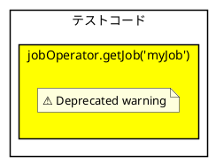
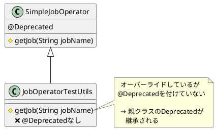

# Issue #5123: JobOperatorTestUtilsの不正確な非推奨警告

**Issue URL**: https://github.com/spring-projects/spring-batch/issues/5123

**関連コミット**:
- [4216a0a](https://github.com/spring-projects/spring-batch/commit/4216a0a5834d90f0063cfe6ec32bc45c1e9d260b)

---

## 課題概要

### 問題の説明

`JobOperatorTestUtils`クラスが親クラス`SimpleJobOperator`の`getJob(String)`メソッドをオーバーライドしていますが、親クラスで付けられた`@Deprecated`アノテーションを「非推奨解除」していませんでした。

この問題により、テストコードで`JobOperatorTestUtils.getJob()`を使用すると、**不必要な非推奨警告**が表示されます。

### 背景知識の補足

**JobOperatorTestUtilsとは**:
- テストコードでジョブ操作を簡略化するユーティリティクラス
- `SimpleJobOperator`を継承し、テスト向けに拡張

**非推奨アノテーション（@Deprecated）**:
- メソッドやクラスが将来削除予定であることを示す
- 使用すると警告が表示される
- `@SuppressWarnings("deprecation")`で抑制可能

**Spring Batch 6での変更**:
- `SimpleJobOperator.getJob(String)`が`@Deprecated`に
- テスト向けの`JobOperatorTestUtils`では継続使用を意図

### 影響範囲

| 項目 | 内容 |
|------|------|
| **影響するバージョン** | Spring Batch 6.0.0 |
| **影響する領域** | spring-batch-test |
| **重大度** | 低（警告のみ、動作には影響なし） |
| **影響** | IDEやコンパイラで警告表示 |

---

## 原因

### 根本原因の詳細

`SimpleJobOperator`の`getJob(String)`メソッドが`@Deprecated`でマークされていますが、`JobOperatorTestUtils`でオーバーライドした際に、アノテーションを再定義していませんでした。

**親クラス（SimpleJobOperator）**:
```java
public class SimpleJobOperator implements JobOperator {
    
    @Deprecated(since = "6.0", forRemoval = true)
    protected Job getJob(String jobName) throws NoSuchJobException {
        // JobRegistryからジョブを取得
        return jobRegistry.getJob(jobName);
    }
}
```

**子クラス（JobOperatorTestUtils）**:
```java
public class JobOperatorTestUtils extends SimpleJobOperator {
    
    // 問題: @Deprecatedアノテーションがない
    @Override
    protected Job getJob(String jobName) throws NoSuchJobException {
        // テスト用の実装
        return super.getJob(jobName);
    }
}
```

### 警告の発生例

```java
@SpringBatchTest
@ContextConfiguration(classes = TestConfig.class)
class JobOperatorTest {
    
    @Autowired
    private JobOperatorTestUtils jobOperator;
    
    @Test
    void testJobExecution() throws Exception {
        // ここで警告が表示される
        Job job = jobOperator.getJob("myJob");
        // 警告: 'getJob(String)' is deprecated
        
        assertThat(job).isNotNull();
    }
}
```

**コンパイラ警告**:
```
Warning:(15, 30) 'getJob(java.lang.String)' is deprecated
```

### IDEでの表示



### 継承関係の図



---

## 対応方針

### 修正内容

`JobOperatorTestUtils.getJob()`メソッドに`@SuppressWarnings("deprecation")`アノテーションを追加し、非推奨警告を抑制します。

**修正後のコード**:
```java
public class JobOperatorTestUtils extends SimpleJobOperator {
    
    // 修正: @SuppressWarningsを追加
    @Override
    @SuppressWarnings("deprecation")
    protected Job getJob(String jobName) throws NoSuchJobException {
        return super.getJob(jobName);
    }
}
```

### 修正の理由

| アプローチ | 説明 | 採用理由 |
|----------|------|---------|
| **@SuppressWarnings** | 警告を抑制 | ✅ テスト用途では継続使用を意図 |
| **@Deprecated削除** | 親クラスのDeprecatedを削除 | ❌ 本番コードでは非推奨のまま |
| **メソッド名変更** | 別のメソッドに置き換え | ❌ APIの互換性を損なう |

### 修正後の動作

```java
@SpringBatchTest
@ContextConfiguration(classes = TestConfig.class)
class JobOperatorTest {
    
    @Autowired
    private JobOperatorTestUtils jobOperator;
    
    @Test
    void testJobExecution() throws Exception {
        // 修正後: 警告が表示されない
        Job job = jobOperator.getJob("myJob");
        
        assertThat(job).isNotNull();
        assertThat(job.getName()).isEqualTo("myJob");
    }
}
```

### 親クラスのDeprecation理由

**SimpleJobOperatorでのDeprecation**:
```java
public class SimpleJobOperator implements JobOperator {
    
    @Deprecated(since = "6.0", forRemoval = true)
    protected Job getJob(String jobName) throws NoSuchJobException {
        // 理由: JobRegistryへの直接アクセスを推奨
        return jobRegistry.getJob(jobName);
    }
}
```

**推奨される代替方法（本番コード）**:
```java
@Service
public class JobService {
    
    @Autowired
    private JobRegistry jobRegistry;  // ← 直接使用を推奨
    
    public void executeJob(String jobName) throws Exception {
        // SimpleJobOperator.getJob()の代わり
        Job job = jobRegistry.getJob(jobName);
        
        // ジョブ実行処理...
    }
}
```

### テストコードでの使用

**JobOperatorTestUtilsの用途**:
- テスト専用のユーティリティクラス
- `getJob()`メソッドは内部的に使用
- テストコードでは警告を抑制して継続使用

```java
@SpringBatchTest
class MyJobTest {
    
    @Autowired
    private JobOperatorTestUtils jobOperator;
    
    @Test
    void testJobLaunch() throws Exception {
        // JobOperatorTestUtils経由で起動
        Long executionId = jobOperator.startNextInstance("myJob");
        
        // 内部でgetJob()が呼ばれる（警告なし）
        
        JobExecution execution = jobOperator.waitForJobExecution(executionId);
        assertThat(execution.getStatus()).isEqualTo(BatchStatus.COMPLETED);
    }
}
```

### 変更の影響

| 項目 | 内容 |
|------|------|
| **互換性** | 後方互換性あり |
| **警告** | 抑制される |
| **動作** | 変更なし |
| **リリース** | Spring Batch 6.0.1 |

### @SuppressWarningsの使い方

**適切な使用例**:
```java
public class JobOperatorTestUtils extends SimpleJobOperator {
    
    // テスト用途のため警告を抑制
    @Override
    @SuppressWarnings("deprecation")
    protected Job getJob(String jobName) throws NoSuchJobException {
        return super.getJob(jobName);
    }
    
    // 他のメソッドも同様
    @SuppressWarnings("deprecation")
    public Job waitForJob(String jobName, long timeout) throws Exception {
        Job job = getJob(jobName);  // 警告なし
        // ...
        return job;
    }
}
```

**不適切な使用例（本番コード）**:
```java
// ❌ 本番コードで警告を抑制するべきではない
@Service
public class ProductionJobService {
    
    @Autowired
    private SimpleJobOperator jobOperator;
    
    @SuppressWarnings("deprecation")  // ❌ 非推奨
    public void runJob(String jobName) {
        // 代わりにJobRegistryを直接使用すべき
        Job job = jobOperator.getJob(jobName);
    }
}
```

### 推奨される本番コードパターン

```java
@Service
public class JobExecutionService {
    
    @Autowired
    private JobRegistry jobRegistry;
    
    @Autowired
    private JobLauncher jobLauncher;
    
    public JobExecution launchJob(String jobName, JobParameters params) 
            throws Exception {
        
        // ✅ 推奨: JobRegistryを直接使用
        Job job = jobRegistry.getJob(jobName);
        
        return jobLauncher.run(job, params);
    }
}
```

### まとめ

| 対象 | 使用方法 | 非推奨警告 |
|------|---------|-----------|
| **本番コード** | `JobRegistry`を直接使用 | なし |
| **テストコード** | `JobOperatorTestUtils`使用 | 抑制される（修正後） |
