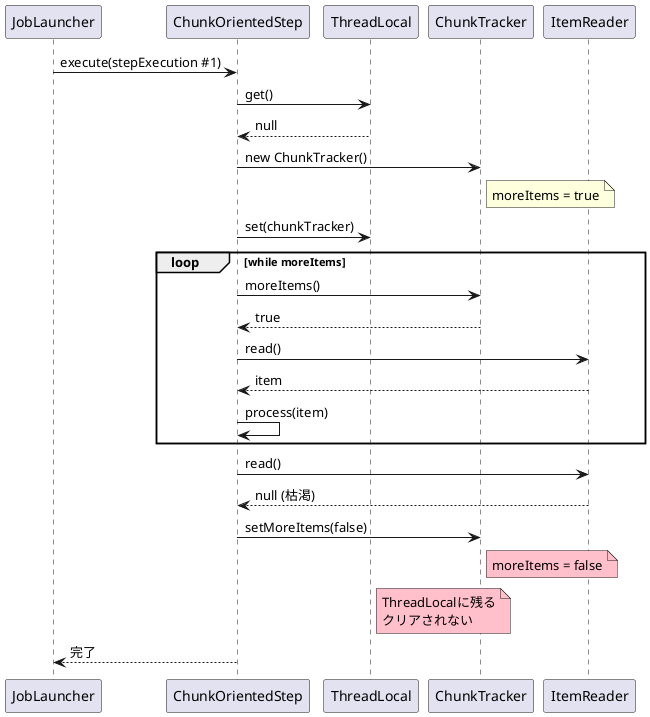
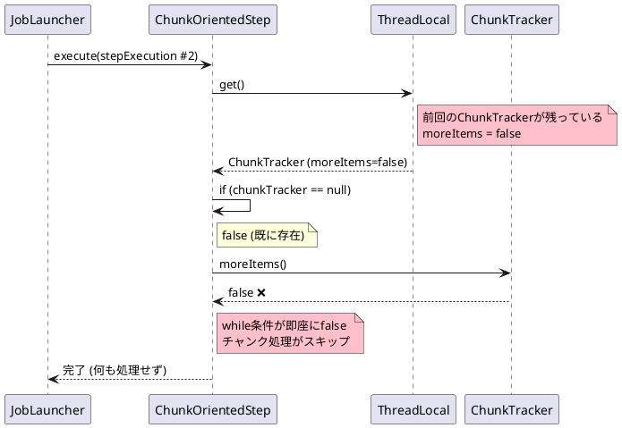
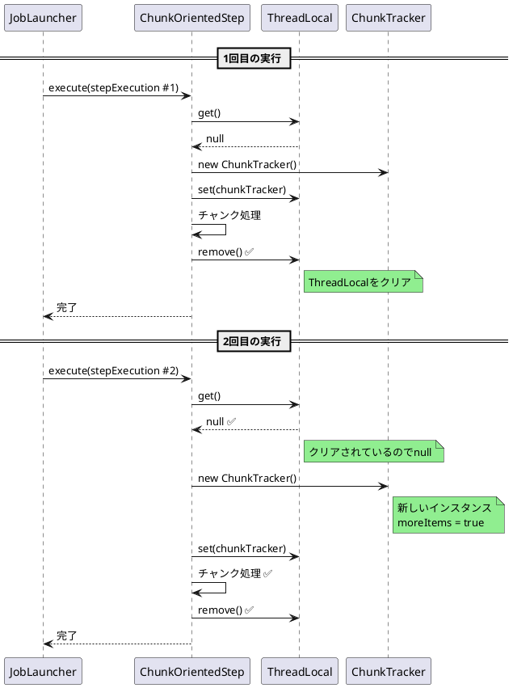

# Issue #5126: ChunkTrackerのリセット漏れで2回目以降の実行がスキップ

**Issue URL**: https://github.com/spring-projects/spring-batch/issues/5126

**関連コミット**:
- [69665d8](https://github.com/spring-projects/spring-batch/commit/69665d83d8556d9c23a965ee553972a277221d83)

---

## 課題概要

### 問題の説明

`ChunkOrientedStep`の`ChunkTracker`がステップ実行後にリセットされないため、**同じステップの2回目以降の実行が何も処理せずに終了**する問題が発生しました。

この問題により、ジョブを複数回実行する場合、最初の実行以外はチャンク処理がスキップされます。

### 背景知識の補足

**ChunkTrackerとは**:
- `ChunkOrientedStep`内でチャンク処理の状態を追跡するクラス
- `moreItems()`メソッドでまだアイテムがあるかを判定
- `ItemReader`が枯渇すると`false`に切り替わる

**ChunkOrientedStepの処理フロー**:
```java
protected void doExecute(StepExecution stepExecution) {
    while (chunkTracker.moreItems()) {  // ← この条件をチェック
        // チャンク処理
        Chunk chunk = chunkProvider.provide();
        chunkProcessor.process(chunk);
    }
}
```

**想定される動作**:
1. 1回目の実行: リーダーがアイテムを読み込み、処理
2. リーダー枯渇: `chunkTracker.moreItems()` → `false`
3. **ステップ完了後にリセット**
4. 2回目の実行: `chunkTracker.moreItems()` → `true`に戻る

**実際の動作（バグ）**:
1. 1回目の実行: 正常に処理
2. リーダー枯渇: `chunkTracker.moreItems()` → `false`
3. ❌ **リセットされない**
4. 2回目の実行: `chunkTracker.moreItems()` → `false`のまま
5. ❌ **チャンク処理がスキップ**

### 影響範囲

| 項目 | 内容 |
|------|------|
| **影響するバージョン** | Spring Batch 6.0.0 |
| **影響する機能** | チャンク指向ステップの複数実行 |
| **重大度** | 高（2回目以降の実行が無効） |
| **関連Issue** | [#5099](https://github.com/spring-projects/spring-batch/issues/5099) |

---

## 原因

### 根本原因の詳細

Issue [#5099](https://github.com/spring-projects/spring-batch/issues/5099)で導入された`ThreadLocal<ChunkTracker>`が、ステップ実行後にクリアされていませんでした。

**問題のコード（ChunkOrientedStep.java:359-375）**:
```java
public class ChunkOrientedStep extends AbstractStep {
    
    // ChunkTrackerをThreadLocalで管理
    private static final ThreadLocal<ChunkTracker> chunkTrackerHolder = 
        new ThreadLocal<>();
    
    @Override
    protected void doExecute(StepExecution stepExecution) {
        // 初回はnullなので新しいChunkTrackerを作成
        ChunkTracker chunkTracker = chunkTrackerHolder.get();
        if (chunkTracker == null) {
            chunkTracker = new ChunkTracker();
            chunkTrackerHolder.set(chunkTracker);
        }
        
        // チャンク処理ループ
        while (chunkTracker.moreItems()) {
            Chunk chunk = chunkProvider.provide(chunkTracker);
            
            if (chunk == null) {
                // リーダー枯渇
                chunkTracker.setMoreItems(false);  // ← falseに設定
                break;
            }
            
            chunkProcessor.process(chunk);
        }
        
        // 問題: ThreadLocalがクリアされない!
        // chunkTrackerHolder.remove(); ← これがない
    }
}
```

### 1回目の実行



### 2回目の実行



### ログの比較

**1回目の実行**:
```
Job: [SimpleJob: [name=job]] launched with parameters: [{batch.random=7960112850225085599}]
Executing step: [step]
Reader was called, returning item      ← アイテム読み込み
Reader was called, returning null      ← 枯渇
Writing chunk: [items=[item], skips=[]]  ← チャンク書き込み
Step: [step] executed in 5ms
Job: [SimpleJob: [name=job]] completed with status: [COMPLETED] in 22ms
```

**2回目の実行**:
```
Job: [SimpleJob: [name=job]] launched with parameters: [{batch.random=-1299334786035736075}]
Executing step: [step]
Step: [step] executed in              ← 即座に終了
Job: [SimpleJob: [name=job]] completed with status: [COMPLETED] in 6ms
```

### 副次的な問題

ログに表示されるステップ実行時間が欠落:
```
Step: [step] executed in       ← 時間が表示されない
```

これは[Issue #5037](https://github.com/spring-projects/spring-batch/issues/5037)に関連します。

---

## 対応方針

### 修正内容

`doExecute()`メソッドの最後で`ThreadLocal`をクリアするように修正しました。

**修正後のコード**:
```java
public class ChunkOrientedStep extends AbstractStep {
    
    private static final ThreadLocal<ChunkTracker> chunkTrackerHolder = 
        new ThreadLocal<>();
    
    @Override
    protected void doExecute(StepExecution stepExecution) {
        try {
            // ChunkTrackerの初期化
            ChunkTracker chunkTracker = chunkTrackerHolder.get();
            if (chunkTracker == null) {
                chunkTracker = new ChunkTracker();
                chunkTrackerHolder.set(chunkTracker);
            }
            
            // チャンク処理ループ
            while (chunkTracker.moreItems()) {
                Chunk chunk = chunkProvider.provide(chunkTracker);
                
                if (chunk == null) {
                    chunkTracker.setMoreItems(false);
                    break;
                }
                
                chunkProcessor.process(chunk);
            }
            
        } finally {
            // 修正: ThreadLocalをクリア
            chunkTrackerHolder.remove();
        }
    }
}
```

### 修正後の動作フロー



### 修正前後の比較

| 項目 | 修正前 | 修正後 |
|------|-------|-------|
| **1回目の実行** | 正常に処理 | 正常に処理 |
| **ThreadLocalクリア** | ❌ されない | ✅ される |
| **2回目の実行** | スキップ | 正常に処理 |
| **ChunkTracker状態** | 前回のまま | 新規作成 |

### 回避策（修正前）

修正前の回避策として、すべてのJobとStepをprototypeスコープで宣言:

```java
@Configuration
public class JobConfig {
    
    @Bean
    @Scope(ConfigurableBeanFactory.SCOPE_PROTOTYPE)  // ← Prototype
    public Job myJob(JobRepository jobRepository, Step step) {
        return new JobBuilder("myJob", jobRepository)
                .start(step)
                .build();
    }
    
    @Bean
    @Scope(ConfigurableBeanFactory.SCOPE_PROTOTYPE)  // ← Prototype
    public Step myStep(JobRepository jobRepository, 
                       PlatformTransactionManager transactionManager) {
        return new StepBuilder("myStep", jobRepository)
                .<String, String>chunk(10, transactionManager)
                .reader(reader())
                .writer(writer())
                .build();
    }
}

// BeanFactoryから毎回新しいインスタンスを取得
@Service
public class JobLauncher {
    
    @Autowired
    private BeanFactory beanFactory;
    
    public void launchJob() {
        // 毎回新しいJobインスタンスを取得
        Job job = beanFactory.getBean(Job.class);
        // ...
    }
}
```

### finally句を使用する理由

```java
@Override
protected void doExecute(StepExecution stepExecution) {
    try {
        // チャンク処理
        while (chunkTracker.moreItems()) {
            // ...
        }
    } catch (Exception e) {
        // 例外が発生してもクリア
        throw e;
    } finally {
        // 必ず実行される
        chunkTrackerHolder.remove();
    }
}
```

**finally句の利点**:
- 例外発生時でもThreadLocalがクリアされる
- メモリリークを防ぐ
- スレッドプールでの再利用に対応

### 変更の影響

| 項目 | 内容 |
|------|------|
| **互換性** | 後方互換性あり |
| **パフォーマンス** | 影響なし（むしろ改善） |
| **メモリ** | ThreadLocalクリアでメモリリーク防止 |
| **リリース** | Spring Batch 6.0.1 |

### 使用例

修正後は以下のテストコードが正常に動作します:

```java
@SpringBatchTest
@ContextConfiguration(classes = TestConfig.class)
class MultipleExecutionTest {
    
    @Autowired
    private Job job;
    
    @Autowired
    private JobLauncher jobLauncher;
    
    @Test
    void testMultipleExecutions() throws Exception {
        // 1回目の実行
        JobParameters params1 = new JobParametersBuilder()
            .addLong("timestamp", 1L)
            .toJobParameters();
        JobExecution execution1 = jobLauncher.run(job, params1);
        
        assertThat(execution1.getStatus()).isEqualTo(BatchStatus.COMPLETED);
        assertThat(execution1.getStepExecutions())
            .hasSize(1)
            .first()
            .satisfies(step -> {
                // ✅ 1回目はアイテムを処理
                assertThat(step.getReadCount()).isGreaterThan(0);
                assertThat(step.getWriteCount()).isGreaterThan(0);
            });
        
        // 2回目の実行
        JobParameters params2 = new JobParametersBuilder()
            .addLong("timestamp", 2L)
            .toJobParameters();
        JobExecution execution2 = jobLauncher.run(job, params2);
        
        assertThat(execution2.getStatus()).isEqualTo(BatchStatus.COMPLETED);
        assertThat(execution2.getStepExecutions())
            .hasSize(1)
            .first()
            .satisfies(step -> {
                // ✅ 修正後: 2回目もアイテムを処理
                assertThat(step.getReadCount()).isGreaterThan(0);
                assertThat(step.getWriteCount()).isGreaterThan(0);
            });
    }
}
```

**統合テストでの使用**:
```java
@SpringBootTest
class JobIntegrationTest {
    
    @Autowired
    private JobLauncherTestUtils jobLauncherTestUtils;
    
    @RepeatedTest(3)  // 3回実行
    void testRepeatedJobExecution() throws Exception {
        JobExecution execution = jobLauncherTestUtils.launchJob();
        
        // ✅ 修正後: すべての実行で正常に処理
        assertThat(execution.getStatus()).isEqualTo(BatchStatus.COMPLETED);
        
        StepExecution stepExecution = execution.getStepExecutions()
            .iterator().next();
        
        // ✅ すべての実行でアイテムが処理される
        assertThat(stepExecution.getReadCount()).isEqualTo(100);
        assertThat(stepExecution.getWriteCount()).isEqualTo(100);
    }
}
```
