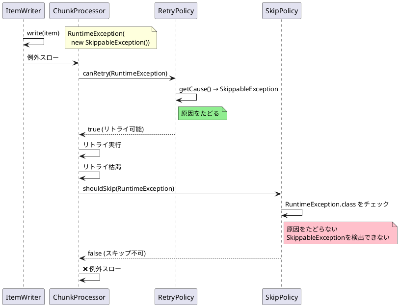
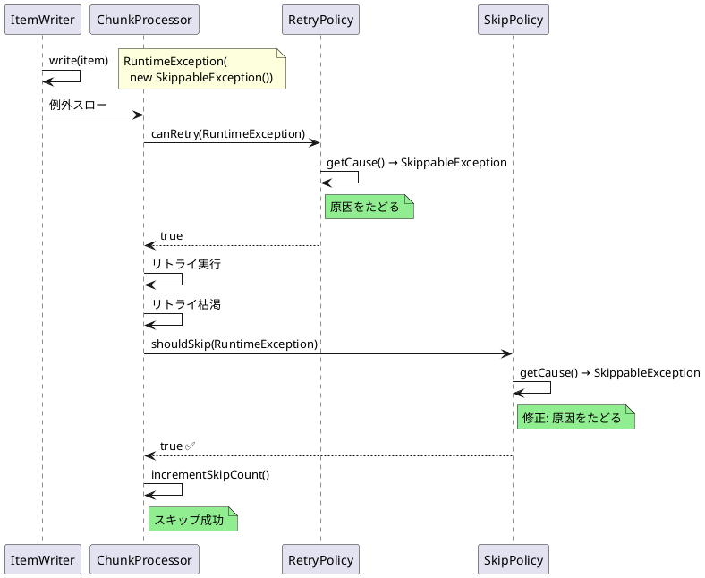

# Issue #5127: skip()とretry()の例外判定の不整合

**Issue URL**: https://github.com/spring-projects/spring-batch/issues/5127

**関連コミット**:
- [5edb62f](https://github.com/spring-projects/spring-batch/commit/5edb62f0c818f4505804b46b45f5843556e6e826)
- [2c57f8d](https://github.com/spring-projects/spring-batch/commit/2c57f8d13e6f8fda7b89cfaa9b9668209bc6ee54)
- [8cade4d](https://github.com/spring-projects/spring-batch/commit/8cade4d656f79646ed99ba68cd6e8b77ee0fe862)

---

## 課題概要

### 問題の説明

フォールトトレラントステップにおいて、`retry(Class)`と`skip(Class)`で例外マッチングの挙動が異なります。

- **retry()**: 例外の原因(cause)を**たどる**
- **skip()**: 例外の原因を**たどらない**

この不整合により、`throw new RuntimeException(new SkippableException())`のようなラップされた例外が、リトライされてもスキップされないという問題が発生します。

### 背景知識の補足

**フォールトトレラント処理**:
- `retry()`: 例外発生時に処理を再試行
- `skip()`: 例外発生時にアイテムをスキップして次へ

**例外のcause chain（原因チェーン）**:
```java
try {
    throw new RuntimeException(new SkippableException());
} catch (Exception e) {
    // e.getClass() → RuntimeException
    // e.getCause() → SkippableException
}
```

**Spring Frameworkのリトライサポート**:
- Spring Framework 6.2で導入された新しいリトライ機能
- 常に例外の原因をたどる設計

### 影響範囲

| 項目 | 内容 |
|------|------|
| **影響するバージョン** | Spring Batch 6.0.0 |
| **影響する機能** | フォールトトレラント処理 |
| **重大度** | 中（リトライ後のスキップが機能しない） |
| **原因** | Spring Frameworkリトライ統合 |

---

## 原因

### 根本原因の詳細

Spring Batch 6.0.0でSpring Frameworkの新しいリトライサポートに移行した際、`RetryPolicy`は原因をたどるようになりましたが、`SkipPolicy`は従来のまま原因をたどらない実装になっていました。

**LimitCheckingExceptionHierarchySkipPolicy（問題のコード）**:
```java
public class LimitCheckingExceptionHierarchySkipPolicy implements SkipPolicy {
    
    private final Map<Class<? extends Throwable>, Boolean> skippableExceptionClasses;
    
    @Override
    public boolean shouldSkip(Throwable t, long skipCount) {
        if (skipCount < this.skipLimit) {
            // 問題: 原因をたどらず、直接の型だけをチェック
            for (Map.Entry<Class<? extends Throwable>, Boolean> entry : 
                    skippableExceptionClasses.entrySet()) {
                
                // t.getClass()とクラスの直接比較のみ
                if (entry.getKey().isAssignableFrom(t.getClass())) {
                    return entry.getValue();  // スキップ可能ならtrue
                }
            }
        }
        return false;
    }
}
```

**RetryPolicy（Spring Framework統合後）**:
```java
// Spring FrameworkのRetryPolicyは原因をたどる
public boolean canRetry(Throwable t) {
    // 例外チェーンを再帰的にたどる
    return isRetryable(t) || isRetryable(t.getCause());
}
```

### 問題の動作シーケンス



### 逆転した論理

さらに、`ChunkOrientedStep`に論理が逆転している箇所があります:

**問題のコード（ChunkOrientedStep.java:688-702）**:
```java
private void handleException(Throwable e, StepExecution stepExecution) {
    // 問題: shouldSkip()の結果を否定している
    if (!this.skipPolicy.shouldSkip(e, skipCount)) {  // ← 否定
        logger.error("Encountered an error executing step", e);
        throw new SkipLimitExceededException("Skip limit exceeded", e);
    }
    
    // スキップ可能な場合の処理
    stepExecution.incrementSkipCount();
}
```

**エラーメッセージも逆**:
```java
logger.error("Encountered an error executing step", e);
// このエラーは shouldSkip() == true の時に記録されるべき
```

---

## 対応方針

### 修正内容

#### 1. SkipPolicyで原因をたどる

`LimitCheckingExceptionHierarchySkipPolicy`を修正し、例外の原因チェーンをたどるように変更しました。

**修正後のコード**:
```java
public class LimitCheckingExceptionHierarchySkipPolicy implements SkipPolicy {
    
    @Override
    public boolean shouldSkip(Throwable t, long skipCount) {
        if (skipCount < this.skipLimit) {
            // 修正: 例外チェーンをたどる
            return isSkippable(t);
        }
        return false;
    }
    
    // 再帰的に原因をたどる
    private boolean isSkippable(Throwable t) {
        if (t == null) {
            return false;
        }
        
        for (Map.Entry<Class<? extends Throwable>, Boolean> entry : 
                skippableExceptionClasses.entrySet()) {
            
            if (entry.getKey().isAssignableFrom(t.getClass())) {
                return entry.getValue();
            }
        }
        
        // 原因をたどる
        return isSkippable(t.getCause());
    }
}
```

#### 2. ChunkOrientedStepの論理を修正

`handleException()`メソッドの否定を修正し、正しいロジックに変更しました。

**修正後のコード**:
```java
private void handleException(Throwable e, StepExecution stepExecution) {
    // 修正: 否定を削除
    if (this.skipPolicy.shouldSkip(e, skipCount)) {
        // スキップ可能な場合
        stepExecution.incrementSkipCount();
        logger.debug("Skipping item due to exception", e);
    } else {
        // スキップ不可能な場合
        logger.error("Encountered an error executing step", e);
        throw new SkipLimitExceededException("Skip limit exceeded", e);
    }
}
```

### 修正後の動作フロー



### RetryとSkipの統一された挙動

| 例外 | Retry判定 | Skip判定 | 結果 |
|------|----------|---------|------|
| `SkippableException` | ✅ リトライ | ✅ スキップ | 正常 |
| `RuntimeException(SkippableException)` | ✅ リトライ（修正前から） | ✅ スキップ（修正後） | 正常 |
| `UnknownException` | ❌ リトライしない | ❌ スキップしない | 正常 |

### 変更の影響

| 項目 | 内容 |
|------|------|
| **互換性** | 後方互換性あり（正しい動作に修正） |
| **パフォーマンス** | わずかなオーバーヘッド（cause走査） |
| **リリース** | Spring Batch 6.0.1 |

### 使用例

修正後は以下のコードが正常に動作します:

```java
@Configuration
public class FaultTolerantJobConfig {
    
    @Bean
    public Step step(JobRepository jobRepository,
                     PlatformTransactionManager transactionManager) {
        return new StepBuilder("step", jobRepository)
                .<String, String>chunk(5, transactionManager)
                .reader(reader())
                .writer(writer())
                .faultTolerant()
                .retry(SkippableException.class)
                .retryLimit(3)
                .skip(SkippableException.class)
                .skipLimit(5)
                .build();
    }
    
    @Bean
    public ItemWriter<String> writer() {
        return items -> {
            for (String item : items) {
                if ("badItem".equals(item)) {
                    // ラップされた例外
                    throw new RuntimeException(new SkippableException());
                }
                System.out.println("Writing: " + item);
            }
        };
    }
}

class SkippableException extends RuntimeException {}
```

**動作**:
1. `badItem`に到達
2. `RuntimeException(SkippableException)`がスロー
3. RetryPolicyがcauseをたどってリトライ判定 → リトライ
4. 3回リトライ後、再度例外
5. SkipPolicyがcauseをたどってスキップ判定 → **スキップ** ✅
6. 処理継続

修正前は5の段階でスキップされずにジョブが失敗していました。
