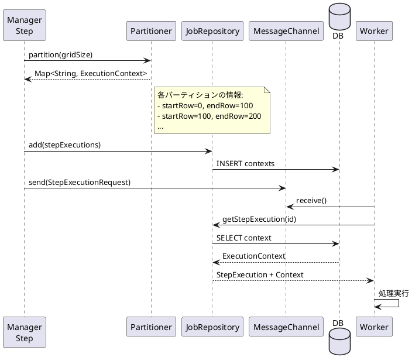
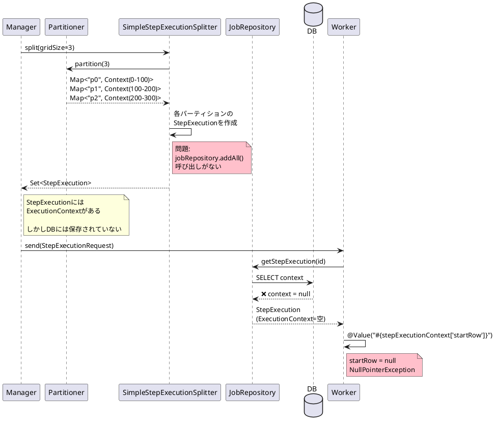
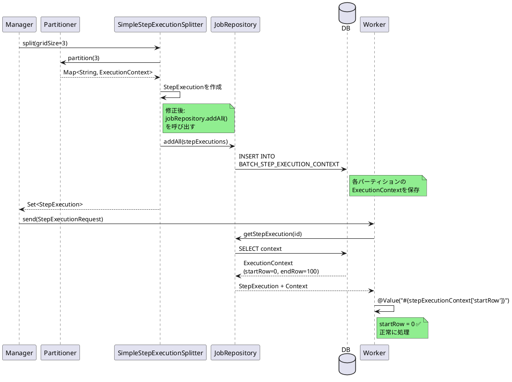

# Issue #5138: パーティショナー作成のExecutionContextが永続化されない

**Issue URL**: https://github.com/spring-projects/spring-batch/issues/5138

**関連コミット**:
- [a8961a6](https://github.com/spring-projects/spring-batch/commit/a8961a6770a78cf94eee2f5d270f280751d2092d) ほか7件

---

## 課題概要

### 問題の説明

コミット[90d8959](https://github.com/spring-projects/spring-batch/commit/90d895955d951156849ba6fa018676273fdbe2c4)の変更により、`SimpleStepExecutionSplitter`内でパーティショナーが作成した`ExecutionContext`がデータベースに永続化されなくなりました。

この問題により、**リモートパーティション化**されたバッチジョブで、ワーカーがパーティション情報を読み込めず、処理が失敗します。

### 背景知識の補足

**パーティション化の仕組み**:



### 影響範囲

| 項目 | 内容 |
|------|------|
| **影響するバージョン** | Spring Batch 6.0.0 |
| **影響する機能** | リモートパーティション化 |
| **重大度** | 高（パーティション処理不可） |
| **技術スタック** | Spring Boot 4.0, spring-batch-integration |

---

## 原因

### 根本原因の詳細

**修正前のコード（Spring Batch 5.x）**:
```java
public class SimpleStepExecutionSplitter implements StepExecutionSplitter {
    
    @Override
    public Set<StepExecution> split(StepExecution stepExecution, int gridSize) {
        // パーティショナーから ExecutionContext を取得
        Map<String, ExecutionContext> contexts = 
            partitioner.partition(gridSize);
        
        Set<StepExecution> stepExecutions = new HashSet<>();
        
        for (Map.Entry<String, ExecutionContext> entry : contexts.entrySet()) {
            StepExecution partitionExecution = 
                createStepExecution(stepExecution, entry.getKey());
            
            // ExecutionContextを設定
            partitionExecution.setExecutionContext(entry.getValue());
            
            stepExecutions.add(partitionExecution);
        }
        
        // 重要: JobRepositoryに永続化
        jobRepository.addAll(stepExecutions);  // ← これがあった
        
        return stepExecutions;
    }
}
```

**修正後のコード（Spring Batch 6.0.0 - 問題）**:
```java
public Set<StepExecution> split(StepExecution stepExecution, int gridSize) {
    Map<String, ExecutionContext> contexts = 
        partitioner.partition(gridSize);
    
    Set<StepExecution> stepExecutions = new HashSet<>();
    
    for (Map.Entry<String, ExecutionContext> entry : contexts.entrySet()) {
        StepExecution partitionExecution = 
            createStepExecution(stepExecution, entry.getKey());
        
        partitionExecution.setExecutionContext(entry.getValue());
        stepExecutions.add(partitionExecution);
    }
    
    // 問題: addAll()の呼び出しがない!
    // ExecutionContextが永続化されない
    
    return stepExecutions;
}
```

### 問題のシーケンス



---

## 対応方針

### 修正内容

`SimpleStepExecutionSplitter.split()`メソッドに`jobRepository.addAll()`の呼び出しを追加しました。

**修正後のコード**:
```java
public Set<StepExecution> split(StepExecution stepExecution, int gridSize) {
    Map<String, ExecutionContext> contexts = 
        partitioner.partition(gridSize);
    
    Set<StepExecution> stepExecutions = new HashSet<>();
    
    for (Map.Entry<String, ExecutionContext> entry : contexts.entrySet()) {
        StepExecution partitionExecution = 
            createStepExecution(stepExecution, entry.getKey());
        
        partitionExecution.setExecutionContext(entry.getValue());
        stepExecutions.add(partitionExecution);
    }
    
    // 修正: ExecutionContextを永続化
    jobRepository.addAll(stepExecutions);
    
    return stepExecutions;
}
```

### 修正後の動作フロー



### 変更の影響

| 項目 | 内容 |
|------|------|
| **互換性** | 後方互換性あり（Spring Batch 5の動作に戻る） |
| **パフォーマンス** | わずかなオーバーヘッド（DB INSERT） |
| **リリース** | Spring Batch 6.0.1 |

### 使用例

修正後は以下のリモートパーティション構成が正常に動作します:

```java
@Configuration
public class RemotePartitionConfig {
    
    @Bean
    public Step managerStep(PartitionHandler partitionHandler) {
        return stepBuilderFactory.get("managerStep")
            .partitioner("workerStep", partitioner())
            .partitionHandler(partitionHandler)
            .build();
    }
    
    @Bean
    public Partitioner partitioner() {
        return gridSize -> {
            Map<String, ExecutionContext> result = new HashMap<>();
            
            int min = 0;
            int max = 1000;
            int targetSize = (max - min) / gridSize + 1;
            
            for (int i = 0; i < gridSize; i++) {
                ExecutionContext context = new ExecutionContext();
                
                int start = min + i * targetSize;
                int end = Math.min(start + targetSize - 1, max);
                
                context.putInt("minValue", start);
                context.putInt("maxValue", end);
                
                result.put("partition" + i, context);
            }
            
            return result;
        };
    }
    
    // Worker側
    @Bean
    @StepScope
    public ItemReader<Customer> reader(
            @Value("#{stepExecutionContext['minValue']}") Integer minValue,
            @Value("#{stepExecutionContext['maxValue']}") Integer maxValue) {
        
        // 修正後: minValue, maxValueが正しく取得できる
        return new JdbcPagingItemReaderBuilder<Customer>()
            .name("reader")
            .dataSource(dataSource)
            .queryProvider(queryProvider(minValue, maxValue))
            .pageSize(100)
            .build();
    }
}
```

**デモアプリケーション**: https://github.com/brian-mcnamara/SpringBatch6
