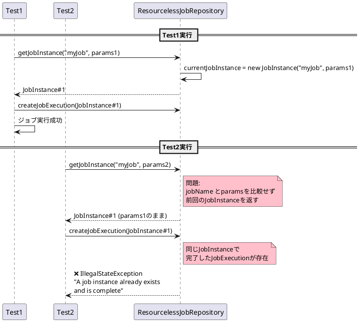
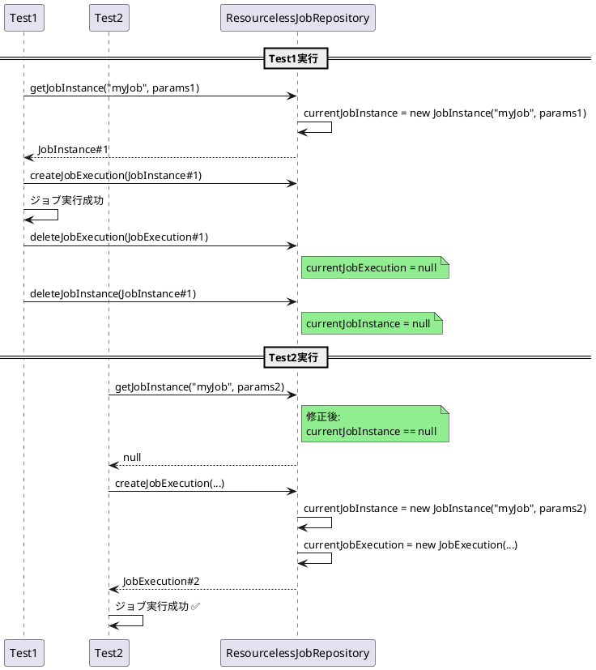

# Issue #5139: ResourcelessJobRepositoryのテスト機能強化

**Issue URL**: https://github.com/spring-projects/spring-batch/issues/5139

**関連PR**: [#5140](https://github.com/spring-projects/spring-batch/pull/5140)

---

## 課題概要

### 問題の説明

`ResourcelessJobRepository`はテスト用のインメモリ実装ですが、単一のアプリケーションコンテキストで**同じジョブを複数回実行できない**という制限があります。

この制限により、異なる`JobParameters`で複数のテストを実行する際に`A job instance already exists`エラーが発生します。

### 背景知識の補足

**ResourcelessJobRepositoryとは**:
- テスト用のインメモリ`JobRepository`実装
- データベース不要で高速
- Spring Batch 6で強化

**JobInstanceの一意性**:
```java
// JobInstanceはジョブ名 + JobParametersで一意
JobInstance instance = jobRepository.getJobInstance(
    "myJob", 
    new JobParameters()
);
```

**テストでの使用**:
```java
@SpringBatchTest
@ContextConfiguration
class MyJobTest {
    
    @Autowired
    JobOperatorTestUtils testUtils;
    
    @Test
    void test1() {
        testUtils.startJob(params1);  // ✅ 1回目成功
    }
    
    @Test
    void test2() {
        testUtils.startJob(params2);  // ❌ エラー
        // A job instance already exists
    }
}
```

### 影響範囲

| 項目 | 内容 |
|------|------|
| **影響するバージョン** | Spring Batch 6.0.0 |
| **影響する領域** | spring-batch-test |
| **重大度** | 中（テストの利便性低下） |
| **回避策** | @DirtiesContext、prototypeスコープ |

---

## 原因

### 根本原因の詳細

`ResourcelessJobRepository`が単一の`JobInstance`と`JobExecution`のみを保持する設計のため、異なる`JobParameters`でも同じインスタンスを返していました。

**問題のコード**:
```java
public class ResourcelessJobRepository implements JobRepository {
    
    private JobInstance currentJobInstance;
    private JobExecution currentJobExecution;
    
    @Override
    public JobInstance getJobInstance(String jobName, JobParameters jobParameters) {
        // 問題: jobNameとjobParametersを無視
        // FIXME should return null if the id is not matching
        return currentJobInstance;  // 常に同じインスタンス
    }
    
    @Override
    public JobExecution getLastJobExecution(String jobName, JobParameters jobParameters) {
        // 問題: 常に同じJobExecutionを返す
        return currentJobExecution;
    }
}
```

### 問題のシーケンス



---

## 対応方針

### 修正内容

#### 1. ジョブ名とパラメータによるフィルタリング

各取得メソッドで、保持している値と引数を比較し、一致しない場合は`null`を返すように修正しました。

**修正後のコード**:
```java
public class ResourcelessJobRepository implements JobRepository {
    
    private JobInstance currentJobInstance;
    private JobExecution currentJobExecution;
    
    @Override
    public JobInstance getJobInstance(String jobName, JobParameters jobParameters) {
        // 修正: jobNameとjobParametersを比較
        if (currentJobInstance != null
                && currentJobInstance.getJobName().equals(jobName)
                && Objects.equals(
                    currentJobExecution.getJobParameters(), 
                    jobParameters)) {
            return currentJobInstance;
        }
        return null;  // 一致しない場合はnull
    }
    
    @Override
    public JobInstance getJobInstance(long instanceId) {
        // 修正: IDを比較
        if (currentJobInstance != null 
                && currentJobInstance.getInstanceId() == instanceId) {
            return currentJobInstance;
        }
        return null;
    }
    
    @Override
    public JobExecution getJobExecution(long executionId) {
        // 修正: IDを比較
        if (currentJobExecution != null 
                && currentJobExecution.getId() == executionId) {
            return currentJobExecution;
        }
        return null;
    }
}
```

#### 2. 削除メソッドの実装

`JobInstance`と`JobExecution`を削除するメソッドを追加しました。

**修正後のコード**:
```java
@Override
public void deleteJobInstance(JobInstance jobInstance) {
    if (currentJobInstance != null 
            && currentJobInstance.getId().equals(jobInstance.getId())) {
        currentJobInstance = null;
    }
}

@Override
public void deleteJobExecution(JobExecution jobExecution) {
    if (currentJobExecution != null 
            && currentJobExecution.getId().equals(jobExecution.getId())) {
        currentJobExecution = null;
    }
}
```

### 修正後の動作フロー



### 使用例

**修正後のテストコード**:
```java
@SpringBatchTest
@ContextConfiguration(classes = TestConfig.class)
class HelloParamJobTest {

    @Autowired
    JobOperatorTestUtils testUtils;
    
    @Autowired
    JobRepository repository;

    @BeforeEach
    void prepareTestUtils(@Autowired @Qualifier("helloParamJob") Job job) {
        testUtils.setJob(job);
    }

    @Test
    void startJob() throws Exception {
        JobParameters params = testUtils.getUniqueJobParametersBuilder()
            .addLocalDate("helloDate", LocalDate.of(2025, 7, 28))
            .toJobParameters();
        
        JobExecution execution = testUtils.startJob(params);
        
        assertThat(execution.getExitStatus()).isEqualTo(ExitStatus.COMPLETED);
        
        // 修正後: 明示的にクリア（オプション）
        repository.deleteJobExecution(execution);
        repository.deleteJobInstance(execution.getJobInstance());
    }

    @Test
    void startJobWithDifferentParams() throws Exception {
        // 修正後: 2回目のテストも成功
        JobParameters params = testUtils.getUniqueJobParametersBuilder()
            .addLocalDate("helloDate", LocalDate.of(2025, 8, 1))
            .toJobParameters();
        
        JobExecution execution = testUtils.startJob(params);
        
        assertThat(execution.getStatus()).isEqualTo(BatchStatus.COMPLETED);
    }
}
```

**JobRepositoryTestUtilsとの組み合わせ**:
```java
@SpringBatchTest
class IntegrationTest {
    
    @Autowired
    JobRepositoryTestUtils testUtils;
    
    @Autowired
    JobOperatorTestUtils operatorTestUtils;
    
    @AfterEach
    void cleanup() {
        // すべてのJobExecutionをクリア
        testUtils.removeJobExecutions();
    }
    
    @RepeatedTest(5)
    void repeatedTest() throws Exception {
        JobExecution execution = operatorTestUtils.launchJob();
        
        // 毎回クリーンな状態でテスト
        assertThat(execution.getStatus()).isEqualTo(BatchStatus.COMPLETED);
    }
}
```

### ResourcelessJobRepositoryの設計意図

| 用途 | 推奨度 | 理由 |
|------|-------|------|
| **単一ジョブ実行** | ✅ 推奨 | 本来の設計意図 |
| **複数テスト（修正後）** | ✅ 可能 | deleteメソッドで対応 |
| **本番環境** | ❌ 非推奨 | 永続化なし |
| **並行実行** | ❌ 非推奨 | スレッドセーフでない |

### プロトタイプスコープでの使用

```java
@Configuration
class TestConfig {
    
    @Bean
    @Scope(ConfigurableBeanFactory.SCOPE_PROTOTYPE)
    public JobRepository jobRepository() {
        return new ResourcelessJobRepository();
    }
}
```

### 変更の影響

| 項目 | 内容 |
|------|------|
| **互換性** | 後方互換性あり |
| **パフォーマンス** | 影響なし（インメモリのまま） |
| **テストの利便性** | 大幅向上 |
| **リリース** | Spring Batch 6.0.1 |

### 修正前の回避策

1. **@DirtiesContext使用**:
```java
@DirtiesContext(classMode = DirtiesContext.ClassMode.AFTER_EACH_TEST_METHOD)
class MyTest { }
```
デメリット: テスト実行が遅くなる

2. **インメモリDB使用**:
```java
spring.datasource.url=jdbc:h2:mem:testdb
```
デメリット: 追加の設定が必要

3. **プロトタイプスコープ**:
```java
@Scope("prototype")
@Bean
JobRepository jobRepository() { }
```
デメリット: 配線が複雑
